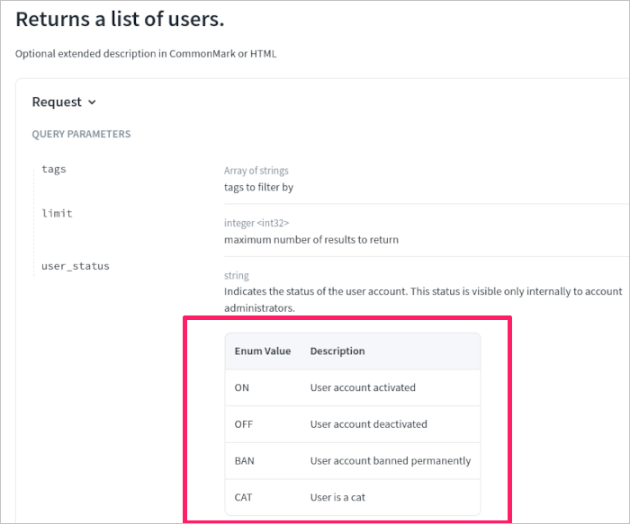

# x-enumDescriptions


This specification extension is supported only in Reference docs, but not in Redoc Community Edition.



## Usage

Use `x-enumDescriptions` to add an individual description for each of the `enum` values in your schemas. Add it to the `schema` OpenAPI object.

To map an `enum` value to a description, use the following format:

`enum value name`: `your description text`

Markdown formatting is supported in the description text.

In the documentation, the `enum` values and their descriptions are displayed as a table in the schema, in the same order as they are listed in the API definition. The table contents are partially hidden and can be expanded on click if there are more `enum` values than specified by the `maxDisplayedEnumValues` configuration option.

## Examples

```yaml
openapi: '3.0'
info: ...
components:
  schemas:
    user_status:
      type: string
      enum:
        - ON
        - OFF
        - BAN
        - CAT
      title: Status indicator
      description: 'Indicates the status of the user account. This status is visible only internally to account administrators.'
      x-enumDescriptions:
        ON: User account **activated**
        OFF: User account deactivated
        BAN: User account **banned** permanently
        CAT: User is a _cat_
```
```json
{
  "openapi": "3.0",
  "components": {
    "schemas": {
      "user_status": {
        "type": "string",
        "enum": ["ON", "OFF", "BAN", "CAT"],
        "title": "Status indicator",
        "description": "Indicates the status of the user account. This status is visible only internally to account administrators.",
        "x-enumDescriptions": {
          "ON": "User account **activated**",
          "OFF": "User account deactivated",
          "BAN": "User account **banned** permanently",
          "CAT": "User is a _cat_"
        }
      }
    }
  }
}
```

### In Reference docs


