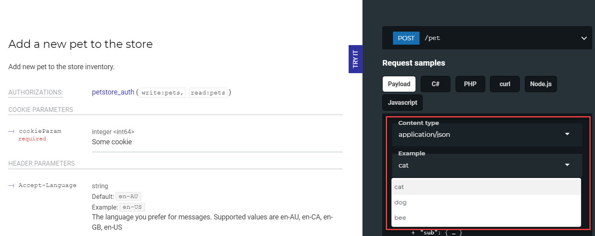

# x-example and x-examples


These specification extensions are supported only in OpenAPI 2.0.


## Usage

Use `x-example` and `x-examples` to add custom examples to a request. Add them to the `parameter` OpenAPI object. When specified, the content of the extensions is rendered in the JSON tab in the right panel of the API documentation.

| Field Name |                               Type                               | Description                                                                                                    |
| :--------- | :--------------------------------------------------------------: | :------------------------------------------------------------------------------------------------------------- |
| x-examples | [Example Object](http://swagger.io/specification/#exampleObject) | Object that contains examples for the request. Applies when `in` is `body` and mime-type is `application/json` |

## Examples

The difference between these extensions is in the content they support (single example value or an entire example object).

`x-example` - maps the MIME type to an example value (any JSON):

```yaml
x-example:
  application/json:
    message: OK
    type: success
  text/plain: 'OK'
```

`x-examples` - maps the MIME type to a whole example object with a custom name. It's possible to include multiple objects for the same type:

```yaml
x-examples:
  application/json:
    my-example-name:
      summary: Some Example
      value:
        message: OK
        type: success
    another-example:
      summary: Another Example
      value:
        message: Something went wrong
        type: error
```

### In Reference docs


