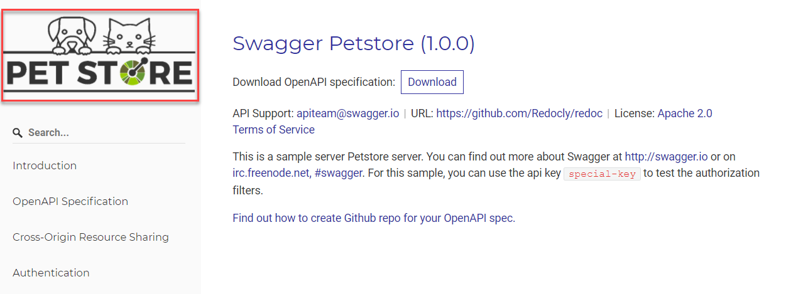

# x-logo

## Usage

Use `x-logo` to add a custom logo image to your API reference documentation. Add it to the `info` OpenAPI object.

When specified, the logo image is displayed above the navigation sidebar, on the left side of the API documentation page.

| Field Name |            Type             | Description                         |
| :--------- | :-------------------------: | :---------------------------------- |
| x-logo     | [Logo Object](#logo-object) | The information about the API logo. |

### Logo Object

| Field Name      |  Type  | Description                                                                                                                                            |
| :-------------- | :----: | :----------------------------------------------------------------------------------------------------------------------------------------------------- |
| url             | string | The URL pointing to the logo. MUST be in the format of a URL. It SHOULD be an absolute URL so your API definition is usable from any location.         |
| backgroundColor | string | Optional background color to use with the logo image. MUST be RGB color in [hexadecimal format](https://en.wikipedia.org/wiki/Web_colors#Hex_triplet). |
| altText         | string | Optional text to use for the `alt` HTML tag on the logo image. Defaults to 'logo' if nothing is provided.                                              |
| href            | string | Optional URL pointing to the contact page. Defaults to 'info.contact.url' field from the API definition.                                               |

## Examples

```yaml
openapi: '3.0.3'
info:
  version: '1.0.0'
  title: 'Redocly Example API'
  x-logo:
    url: 'https://redocly.github.io/redoc/example-logo.png'
    backgroundColor: '#FFFFFF'
    altText: 'Example logo'
```
```json
{
  "info": {
    "version": "1.0.0",
    "title": "Redocly Example API",
    "x-logo": {
      "url": "https://redocly.github.io/redoc/example-logo.png",
      "backgroundColor": "#FFFFFF",
      "altText": "Example logo"
    }
  }
}
```

### In Reference docs


