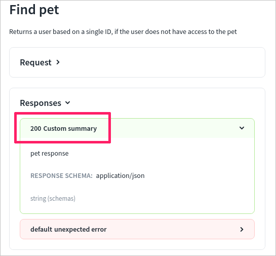

# x-summary

## Usage

Use `x-summary` to add a short custom text to describe the response in the API documentation. Add it to the `response` OpenAPI object.

If specified, `x-summary` is used as the response button text, and the description is rendered under the button.

| Field Name |  Type  | Description                    |
| :--------- | :----: | :----------------------------- |
| x-summary  | string | Short summary of the response. |

## Examples

```yaml
openapi: '3.0'
info:
  ...
tags: [...]
components:
  responses:
   '400':
      description: "Bad Request. The request could not be understood by the server due to malformed syntax. A possible reason might be that the request contains Unicode characters that cannot be processed."
      x-summary: Bad request
      content:
        application/json:
          schema:
            type: array
              items:
                $ref: '#/components/schemas/example'
```

### In Reference docs


