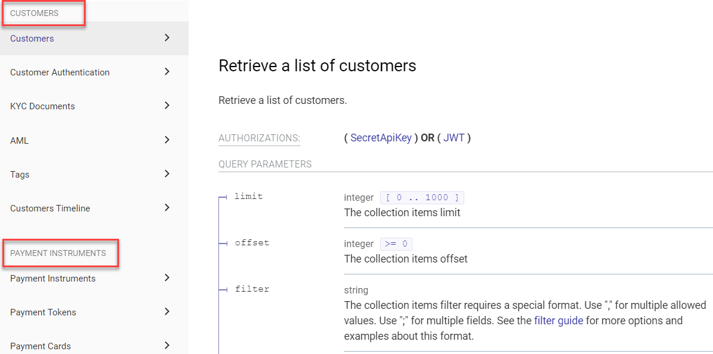

# x-tagGroups

## Usage

Use `x-tagGroups` to group tags in the Reference docs navigation sidebar. Add it to the root OpenAPI object.


When using `x-tagGroups`, **a tag that is not in a group is not displayed** at all. You must add every tag to at least one group.


| Field Name  |                   Type                    | Description           |
| :---------- | :---------------------------------------: | :-------------------- |
| x-tagGroups | [ [Tag Group Object](#tag-group-object) ] | A list of tag groups. |

### Tag group object

| Field Name |    Type    | Description                            |
| :--------- | :--------: | :------------------------------------- |
| name       |   string   | The group name.                        |
| tags       | [ string ] | List of tags to include in this group. |

## Examples

```yaml YAML
openapi: '3.0'
info: ...
tags:
  - name: Customers
  - name: Customer Authentication
  - name: AML
  - name: Customers Timeline
  - name: Payment Instruments
  - name: Payment Tokens
  - name: Payment Cards
x-tagGroups:
  - name: Customers
    tags:
      - Customers
      - Customer Authentication
      - AML
      - Customers Timeline
  - name: Payment Instruments
    tags:
      - Payment Instruments
      - Payment Tokens
      - Payment Cards
```
```json JSON
{
  "x-tagGroups": [
    {
      "name": "Customers",
      "tags": ["Customers", "Customer Authentication", "AML", "Customers Timeline"]
    },
    {
      "name": "Payment Instruments",
      "tags": ["Payment Instruments", "Payment Tokens", "Payment Cards"]
    }
  ]
}
```

### In Reference docs




Use [x-displayName](x-display-name.md) and [x-traitTag](x-trait-tag.md) to further customize tags.

