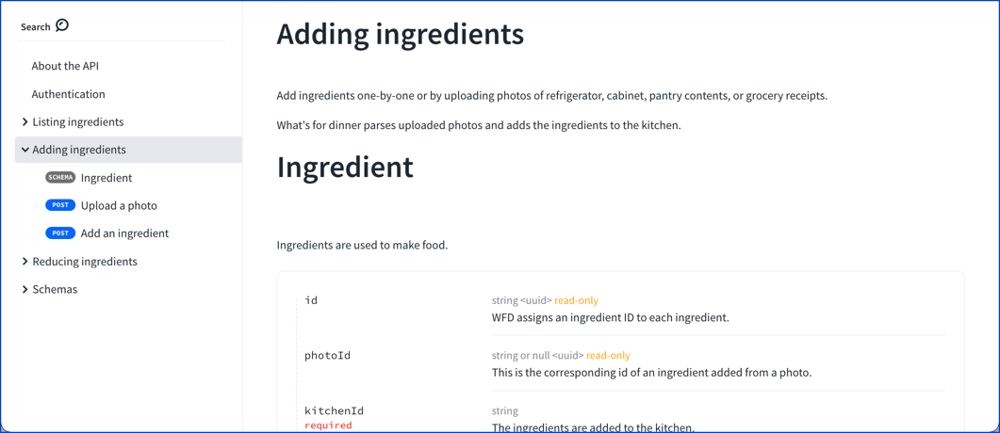
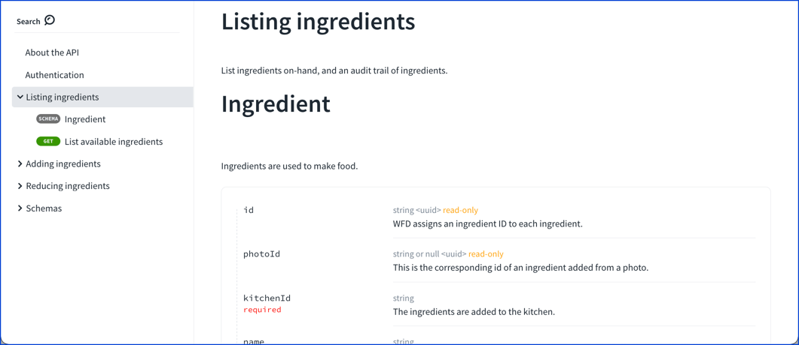
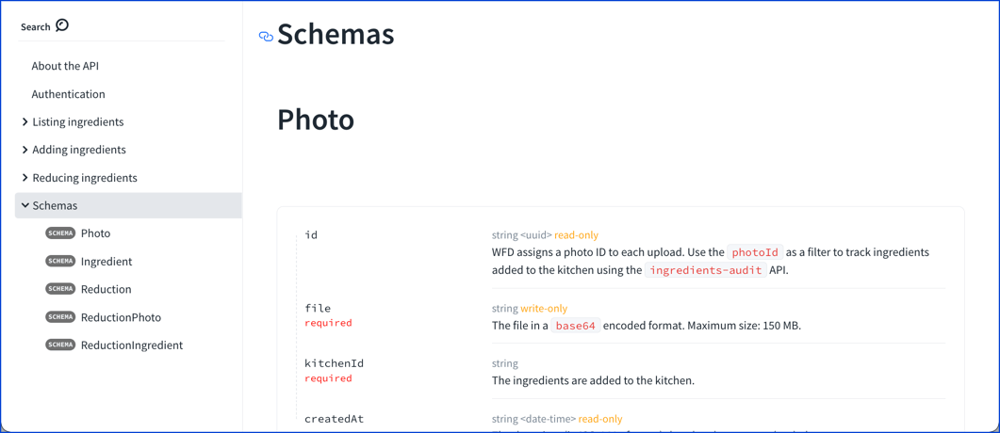

# x-tags

## Usage

Use `x-tags` to associate schemas to tags in the navigation sidebar. Add it to the OpenAPI schemas object.

| Field Name |   Type   | Description                                     |
| :--------- | :------: | :---------------------------------------------- |
| x-tags     | [string] | A list of tag names associated with the schema. |

## Examples

```yaml YAML
openapi: '3.0.3'
info: ...
tags:
  - name: Listing ingredients
    description: List ingredients on-hand, and an audit trail of ingredients.
  - name: Adding ingredients
    description: |
      Add ingredients one-by-one or by uploading photos of refrigerator,
      cabinet, pantry contents, or grocery receipts.

      What's for dinner parses uploaded photos and adds the ingredients to the
      kitchen.
  - name: Reducing ingredients
    description: Cook, eat, donate, or discard ingredients.

compomnents:
  schemas:
    Ingredient:
      x-tags:
        - Listing ingredients
        - Adding ingredients
      description: Ingredients are used to make food.
      type: object
      properties:
        id:
          readOnly: true
          type: string
          description: WFD assigns an ingredient ID to each ingredient.
          format: uuid
        photoId:
          readOnly: true
          type: string
          nullable: true
          description: This is the corresponding id of an ingredient added from a photo.
          format: uuid
```
```json
{
  "info": {
    "title": "Sample",
    "version": "v1"
  },
  "components": {
    "schemas": {
      "Ingredient": {
        "x-tags": ["Listing ingredients", "Adding ingredients"],
        "type": "object",
        "properties": {
          "id": {
            "type": "string"
          },
          "email": {
            "type": "string",
            "format": "email"
          }
        }
      }
    }
  }
}
```

### Visuals

The schema displays in the sidebar navigation for each tag listed in `x-tags`.

```yaml
Ingredient:
  x-tags:
    - Listing ingredients
    - Adding ingredients
```





### Alternative

An alternative to `x-tags` is to automatically tag each schema using a [feature `schemaDefinitionsTagName`](../../api-reference-docs/configuration/functionality.md).

```yaml
schemaDefinitionsTagName: Schemas
```


