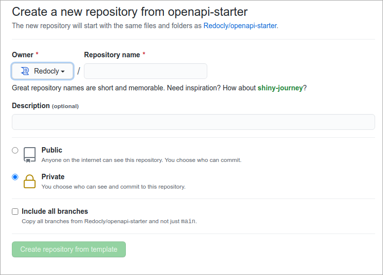
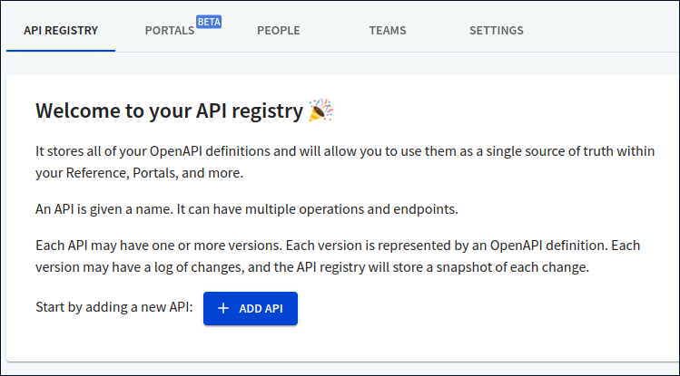
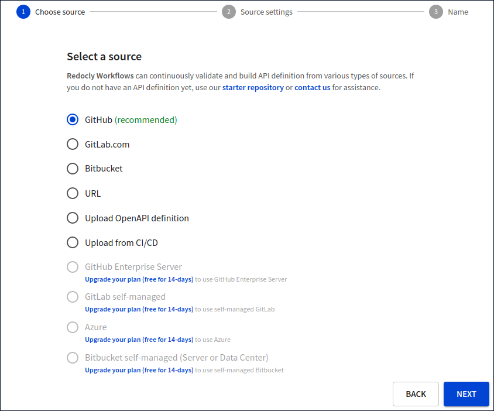
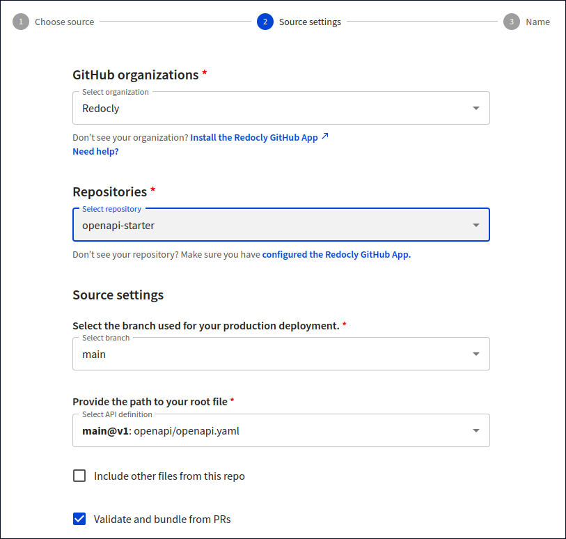
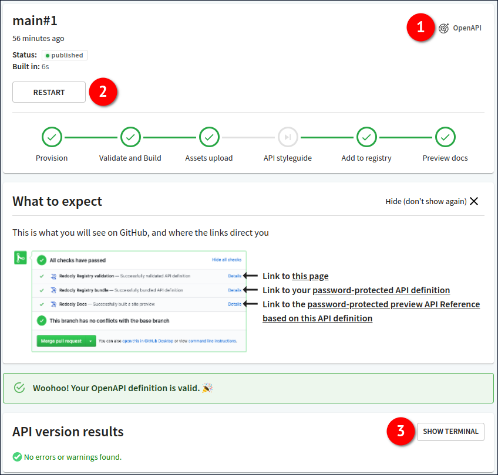

# Redocly API registry quickstart


**This quickstart is for users who want to try the Redocly API registry in less than 5 minutes.**

In this quickstart, you will learn how to add your first API to the registry, validate it, and preview API docs.

If you prefer watching a video, here's the link to our [API registry tutorial](https://www.youtube.com/watch?v=V0zOcl-l8ZM).

To learn more about how the API registry works, start from the [Overview](../overview.md) page.


## Before you start

Make sure you fulfill the following prerequisites for working with the API registry:

- **Create an account in Redocly Workflows**. You can register for an account [directly on the Workflows page](https://app.redocly.com/signup) or by using the invitation link from an existing Workflows user. Depending on the registration method you chose, you will either create a new organization or join an existing one. Your account in the organization must have the permission to add APIs to the registry.

- **Create an account with a version control service provider** such as GitHub or GitLab. We recommend GitHub, and we use it in the examples throughout this guide.


You may need to install and configure the Redocly app for your version control service if it has not been done by the Workflows organization owner. Check our [source control documentation](../../workflows/sources/index.md) for instructions.


## Step 1 - Set up your API definition project

In this step, you will use our template GitHub repository to set up an API definition project.

1. Log into GitHub and access the Redocly [openapi-starter](https://github.com/Redocly/openapi-starter) repository.

2. On the repository page, select **Use this template**. This opens the dialog to create a new repository from the template.

3. In the **Create a new repository from...** dialog, select your account as the **Owner** and set a custom name for your repository under **Repository name**. Choose whether you want the repository to be public or private. Leave the **Include all branches** checkbox unselected.

4. Select **Create repository from template** to complete the action and exit the dialog.


You should now be able to access your newly created repository. An example API definition called `openapi.yaml` is in the `openapi` folder.


## Step 2 - Add your API definition to the registry

In this step, you will connect your new repository to the API registry and add the example API definition.

1. Log into [Redocly Workflows](https://app.redocly.com/) and access the API registry page.

2. On the API registry page, select **Add API**.

3. The dialog for adding a new API definition opens. In the **Choose source** step, choose **GitHub (recommended)** and select **Next**.

4. In the **Source settings** step under **GitHub organizations**, select the GitHub organization associated with your GitHub account. The Redocly app must be installed and configured for this organization.

- Under **Repositories**, select the repository you have created from our template.

- Under **Source settings**, select the `main` branch. Provide the path to the API definition root file (in our case, it's the `openapi/openapi.yaml` file) and select **Next**.

5. In the **Name** step, set a custom name and version for the API, and select **Finish** to close the dialog.


Your API definition should now be added to the API registry. You will be redirected to the API version **Overview** page, where the first build will automatically start. The build process validates and bundles your API definition, produces a snapshot, and generates API documentation.


## Step 3 - Validate your API definition

In this step, you will check the validation status of your API definition in the API registry, and start a new build.

1. On the **Overview** page of your API version, find the **Logs** section. It should contain a single record of your first build. Select this record to view details about the build.

2. On the log details page, look for validation status messages. If the API definition is valid, there will be no errors or warnings in the build output. You can view the output by selecting **Show terminal** (3). When the terminal is active, select **Show issues** to display errors and warnings if there are any.


Select **OpenAPI** (1) to access some handy options, like downloading your API definition snapshot as a JSON or YAML file, and copying the direct link to the snapshot.


3. To start a new build and validate the API definition again, select **Restart** (2).


You have successfully added an API definition to the API registry and validated it.


## Step 4 - Read your API docs

In this step, you will preview the automatically generated API documentation for your API.

1. On the **Overview** page of your API version, find the **Primary branch** section. It should contain the **API docs** button. Select this button to access the API docs for your API version.

2. You may be prompted to log in, so use the same credentials you used to log into Redocly Workflows. Your API documentation will open in a new browser tab.


You have successfully created an API with corresponding documentation in the API registry. The link to your API documentation will always be available on the API version **Overview** page.


## Next steps

- [Create your own API definition and add it to the API registry](/learn/openapi/learning-openapi.md)
- [Learn about the basic API registry concepts](../resources/index.md)
- [Configure your API version and customize docs](../../settings/index.md)
