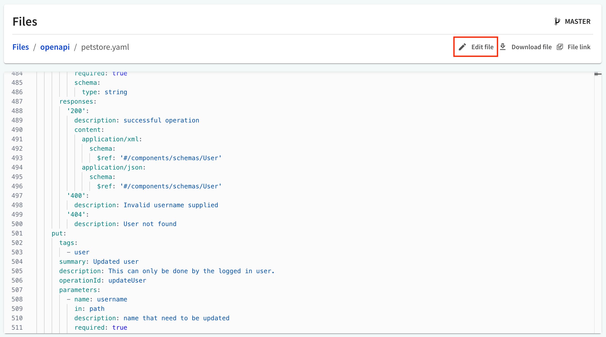
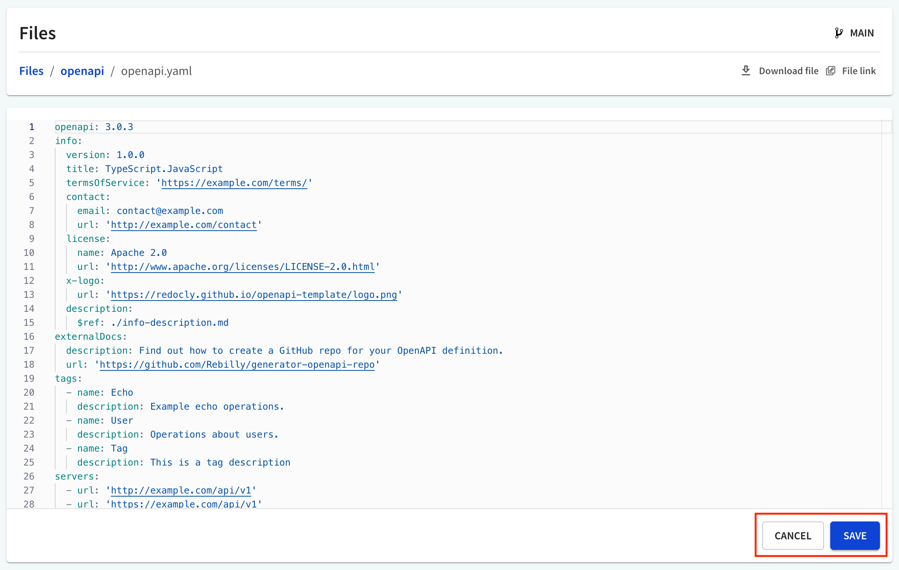
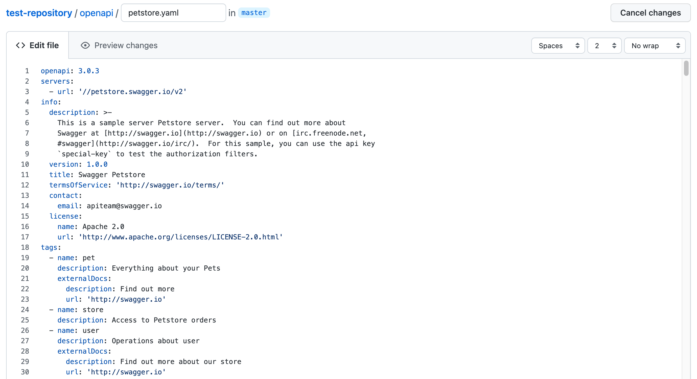

# Edit files

After [adding your files](./add-registry-assets.md) to the API registry, you can modify their contents.

[Access the files](./view-download-assets.md) added to an API version by selecting the *Files* tab.

## Change file contents from your browser


Inline file editing is available only for APIs connected to the API registry with the **File upload** or the **CICD** source.


To edit the contents of a file, select it in the list. This opens the file preview.

The **Edit file** button is visible if you have selected a text file.
You can recognize a text file by its extension.
Common text file extensions are **.txt**, **.md**, **.html**, **.xml**, **.json**, **.yaml**.

Select **Edit file** to edit the file inline (directly in your browser).

Make changes to the file and select **Save** when you are done. This will automatically validate and bundle the API definition associated with this API version.

To exit the file editing mode without saving any changes, select **Cancel** at any time.

## Change file contents in your repository

If your files have been added to the API registry from a git-based source, selecting **Edit file** redirects you to the respective file in your git repository.

For example, for files connected with the **GitHub** source, you will be redirected to the `github.com` page. You can continue editing the file there. When you save your changes to the file, they are automatically synchronized back to the API registry, and your API definition is validated and bundled.


The **URL** source and some of the **git-based** file sources currently do not support file editing.

