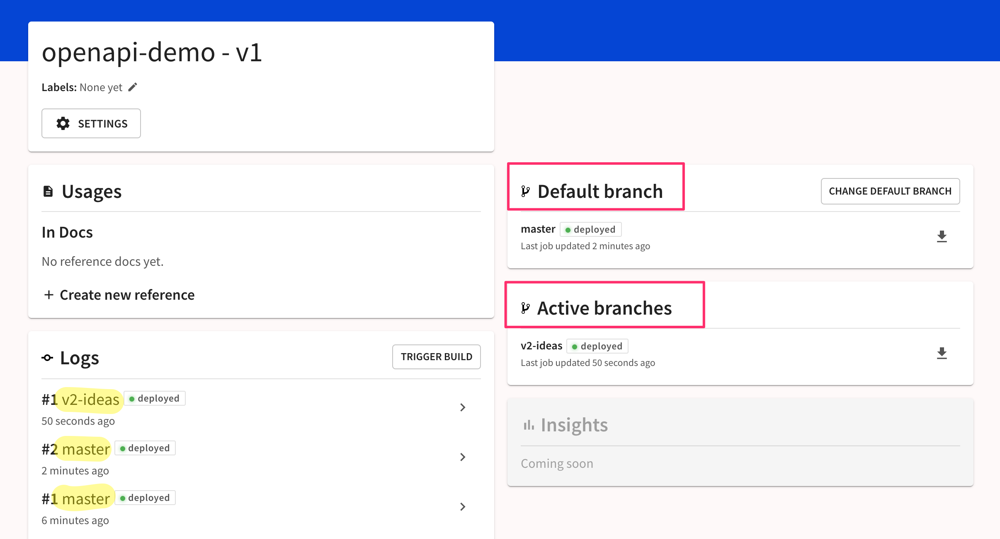

# Manage API versions

## Add a version

When you add an API in Redocly, you connect it to a source. You can create a version when you are adding an API, or add a new version to an existing API.

You can use the same source for multiple versions.

Follow the [API registry quickstart guide](/docs-legacy/api-registry/guides/api-registry-quickstart.md) for the fastest way to add a new API to the registry.

The procedure is similar when adding a new version to an existing API.

1. Select the **Add API** button on the API registry page, then choose and configure the source in the dialog.
2. When you get to the **Name** step, instead of giving a new name to the API, select one of the existing APIs' names to associate your new version with it.
3. Select **Finish** to add the new API version to the registry.

### All supported sources

Learn more about the [version sources](/docs-legacy/workflows/sources/index.md) supported in the Redocly API registry.

## Edit version name

You can edit the API version name on the **Settings > API info** page. For more information, refer to the [API info](/docs-legacy/api-registry/settings/api-info.md) page.

## Delete a version

Delete a version and its API docs from the registry on the **Settings > Delete** page. For more information, refer to the [Delete version](/docs-legacy/api-registry/settings/delete-version.md) page.

## View version history

A version can change. It has its own history shown in the logs on the **Overview** page.

The **Logs** section on the _Overview_ page shows the recent builds from any branches associated with the version.

## Manage version branches

A version can have one or more branches. It will have one default branch that is set when you connect your source.

For more information, refer to the [Branches](/docs-legacy/api-registry/settings/branches.md) page.

## Use version environment variables

You can use environment variables to set up different configuration options for different builds, or to define conditions under which specific content appears in a particular build.

For every version added to Redocly Workflows, you can create custom environment variables from the **Settings > Environment variables** page.

Select **Add variable** and provide the name and value for the variable in the dialog that opens. To encrypt the variable and prevent it from being included in the logs, select the optional **Secret** checkbox before saving changes.


You can configure environment variables for developer portals via the Redocly Workflows interface in **Developer portal > Settings > Environment variables** (for production builds) page, or by creating an environment file in your developer portal project repository (for non-production builds).

Environment files are used only for building developer portals. Any existing `.env.` files in your project don't apply to API versions or docs in Redocly Workflows.

More details about supported environment variables and their usage are available in the [Developer portal section](/docs-legacy/developer-portal/guides/environment-variables.md) of the documentation.

Note that environment variables cannot be used within the OpenAPI definitions themselves. They are supported within custom plugins, rules, and decorators.


