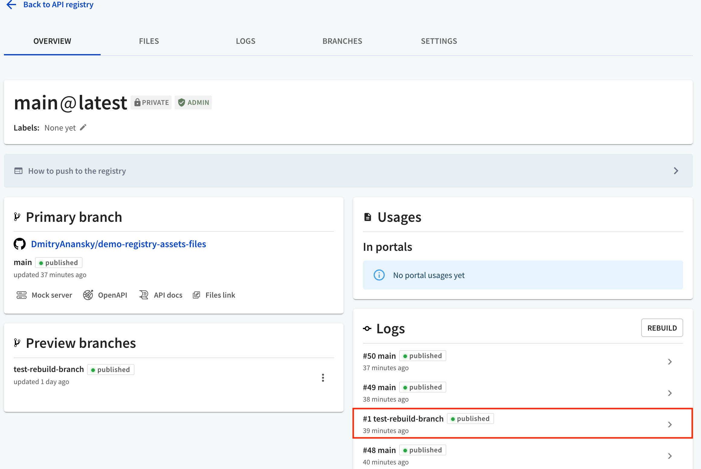
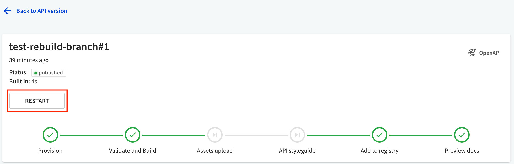
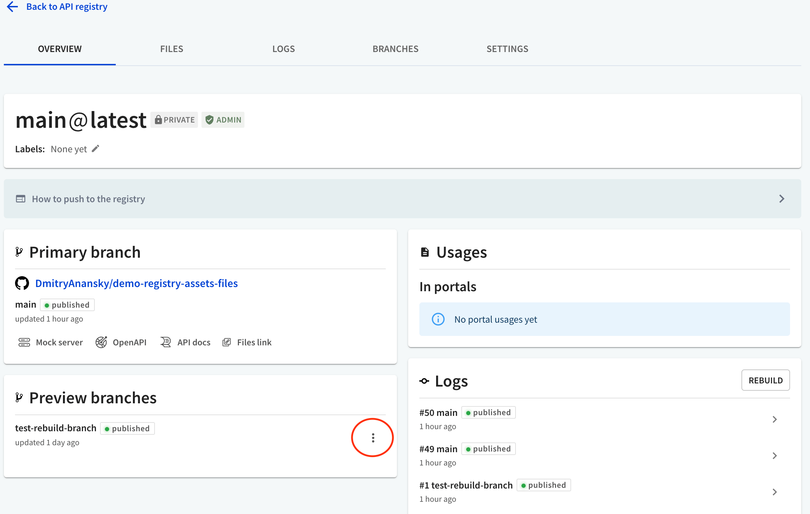
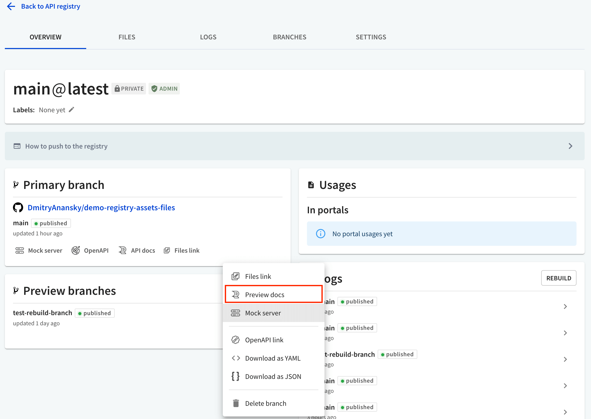

# Restart preview branch builds

Follow this guide when you need to restart API registry preview branch builds to apply new configuration settings.

## Step 1: Find your preview branch build

Go to API registry **Overview** tab and select your preview branch build in the logs.
For example, `test-rebuild-branch` is the preview branch build in the following image.

## Step 2: Restart your build

Select **RESTART** to trigger a new preview branch build.

## Step 3: Preview your build

After the build finishes you can preview it by selecting `Back to API Registry`, then the `Overview` tab and selecting `Preview Docs` in preview branches menu.

