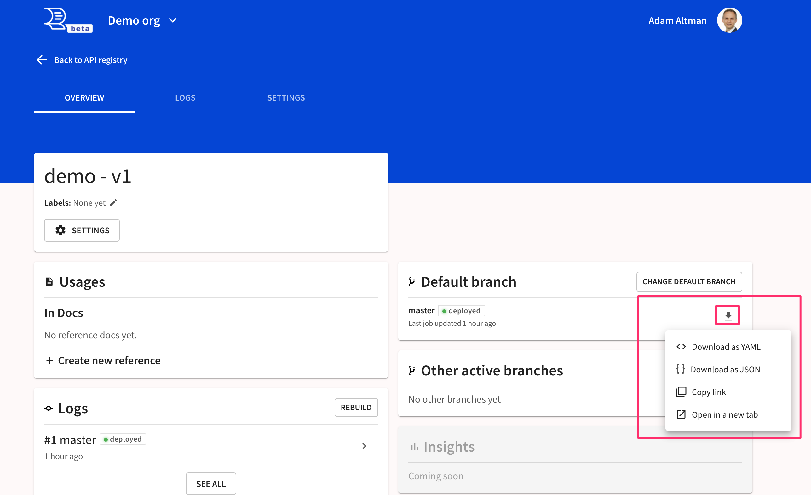
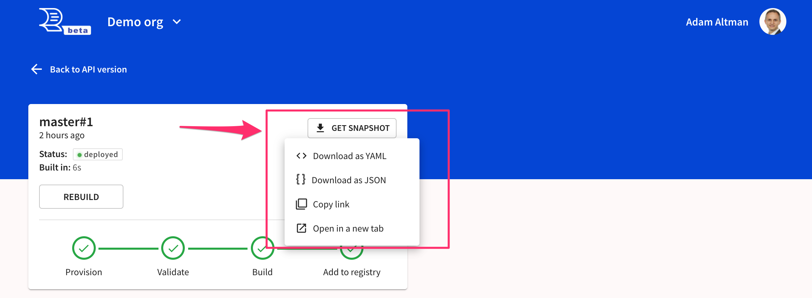
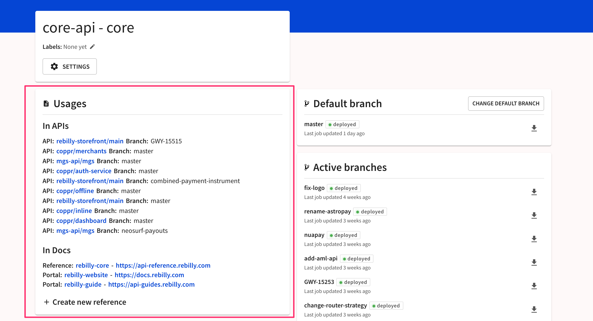
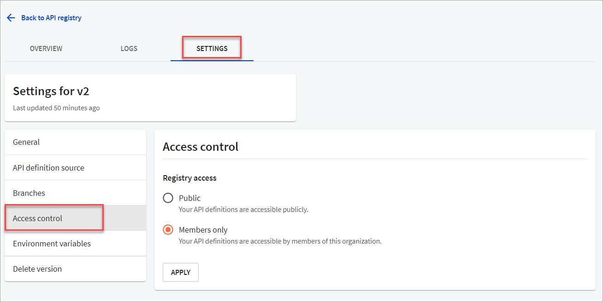

---
seo:
  title: Snapshots
---

# Snapshots

A snapshot is a link to your bundled OpenAPI definition.
When a snapshot link is used in any other registered OpenAPI definition, reference docs, or developer portal, it is recorded as a dependency.

## Point-in-time and latest-branch snapshots

There are point-in-time snapshots as well as latest-branch snapshots.
A point-in-time snapshot link will always reference the same document.
A latest-branch snapshot will reference the more recent bundle associated with that given branch.

An example of a (non-functional) latest-branch snapshot:
`https://api.redoc.ly/registry/demo-org/bundle/demo/v1/master/openapi.yaml`

An example of a (non-functional) point-in-time snapshot:
`https://api.redoc.ly/registry/demo-org/bundle/demo/v1/master/fcd5cee8-8ca2-11ea-94db-0f808cf10d8e/openapi.yaml`

Notice the extra path segment for the point-in-time snapshot.

## Formats

You may access a snapshot in JSON or YAML format.

The format may be selected from the user-interface.

You may also change the last four letters of the snapshot URL to control the format (`.yaml` or `.json`)

## How to find your snapshot links

Your latest-branch snapshot links for any given branch will be accessible from the version overview.

Your point-in-time snapshot links will be found in the build logs.

## Usages

Use your link like you would any other URL from within other API definitions, reference docs or developer portals.

You can launch new references docs from the button underneath usages.

If your snapshot is protected by access control, you will need to be logged in to access it.
To access it from our Redocly CLI tool, use the [redocly login](/docs/cli/commands/login) command.

## Access control

The snapshots may be protected by [access control](../../settings/access-control.md) on a version-level.
In other words, access may be restricted to all snapshots for any given API version.

Control the access from the version's **Settings > Access control** screen.

