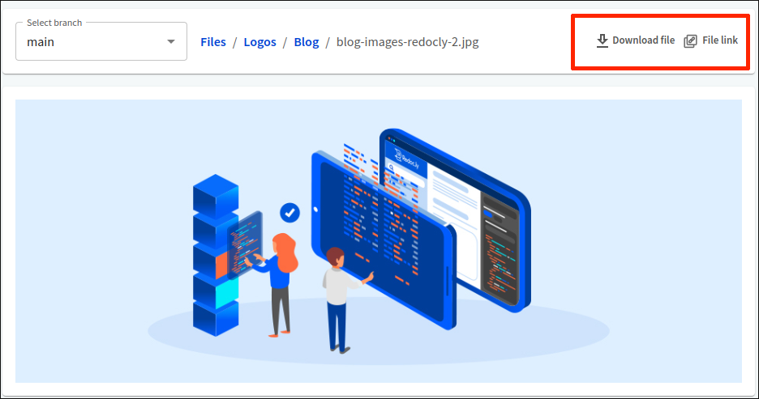

# Manage files

After adding files to the API registry, you and your collaborators can preview files or download them to the local storage from your browser.

## Access uploaded files

1. Log into your organization in [Workflows](https://app.redocly.com/) and select **API registry**.

2. Select the API version for which you want to view the files. On the **Overview** page that opens, select **Files**.

3. The **Files** page shows the list of uploaded files associated with the API version.

Your files are sorted by name and extension in alphabetical order.
If you use folders to organize files, they are always listed first on the page.

To access and display the contents of a folder, select it in the list.
You can switch between (sub)folders with the breadcrumb navigation next to the branch name, or select the back arrow above the file list to return from the current folder to the previous one.

Folder URLs are transparent, and you can share them with anyone who has access to your API in the Workflows organization. When you navigate to a folder, copy the URL from your browser address bar, or select the **Folder link** button on the _Files_ page.


You can't download entire folder contents directly from the browser. You can only use integrate them into your developer portal projects.


4. The API registry keeps track of files added to branches associated with the API version. Use the `Select branch` dropdown to view files added to another branch.
When you switch to a different branch, this change is automatically reflected in the folder link (the branch name gets appended to the link).


For version control sources, you can only access files from other branches if the **Validate and bundle from PRs** option is selected in the source settings.


## Preview individual file contents

To preview file contents, select a file in the list. Full preview is supported for textual file formats and images. For most textual file formats, syntax highlighting is also supported.

If the preview is not supported for the selected file, the page displays an error message. Similarly, if you switch to a different branch while previewing a file, the page displays a warning message if the file doesn't exist in that branch.

Regardless of the preview support, selecting a file gives you access to the **Download file** and **File link** options.

## Download individual files

To download a file to your local storage, select it in the list.
Then, select the **Download file** button.
Depending on your browser settings, the file will either be automatically saved to your local storage, or you will be prompted to manually confirm it through a _Save as_ dialog.

To share a link to a file, select it in the list.
Then, select the **File link** button.
This copies the direct link to the file in the registry, allowing you to share it with other people in your Workflows organization, preview it in another browser or tab, or use it in other projects.

