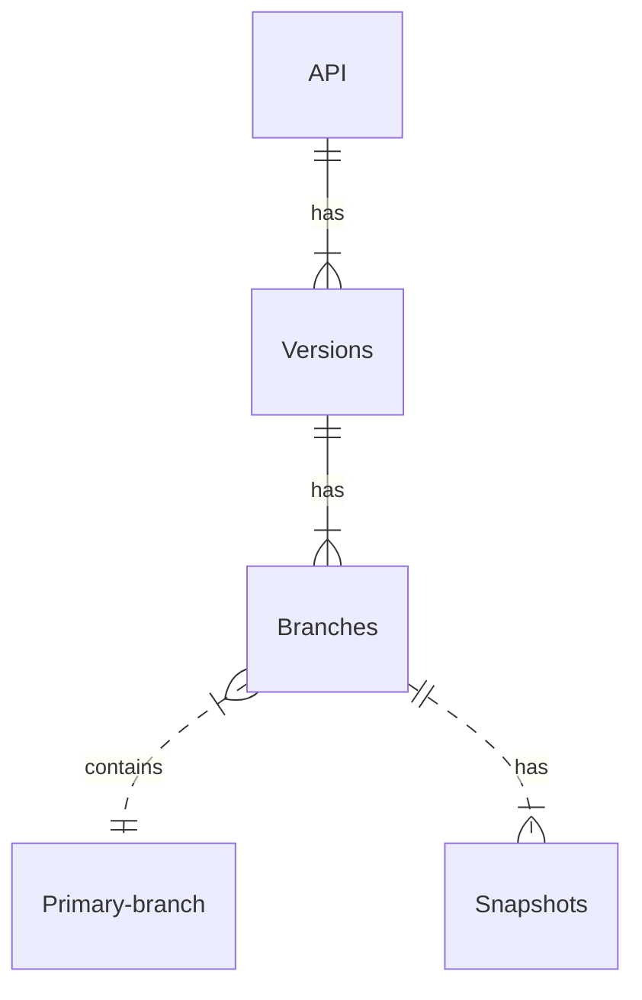

---
seo:
  title: Understanding the API registry basics
---

# API registry overview

The API registry serves as a single-source of truth for API definitions.

## API

Add an API.
An API is represented by a "name" and is a concept that represents the set of use cases the underlying API will offer.
An API will have one or more versions.

## Versions

An API version maps to a specific OpenAPI definition.
A version may have more than one branch.
A branch loosely mimics a branch in git, where you may prepare a change.

A version will be connected to a source (such as GitHub).

A version has history. The version history logs and bundled versions are available.

## Primary branch

Each version must specify the primary branch.
The primary branch maps to the production build.
Other branches map to preview builds.

When a change occurs in the primary branch, it will trigger the validation, bundling, and then subsequent building of any connected OpenAPI definitions, API docs, and developer portal projects to production.

When a change occurs in another active branch, it will trigger the validation, bundling, and then subsequent building of any connected OpenAPI definitions, API docs, and developer portal projects to a preview location.

When an active branch is deleted from the connected source, it will be removed from the active branches list.

### Change primary branch

You may change the primary branch at any time from the version settings page.

## Snapshots

A snapshot refers to a bundled OpenAPI definition.
There may be many snapshots for any given branch.

## API registry links

Link to your bundled API definition (snapshot) from the registry in other API definitions or developer portals.
This helps to use your API definitions as a single-source-of-truth.

You may link to a branch's latest snapshot, or a specific point-in-time snapshot.
Doing this will register the usage and dependency linkage.
That will automate previews and deployments upon changes to the dependency.
A specific "point-in-time" snapshot will not change, and therefore will not trigger further updates as a dependency.
A "latest" branch snapshot may change, and will trigger updates as a dependency.

### Access controls

API registry links to snapshots may be protected by access controls or available to the public.
Control access to your API registry links for each specific version from the settings.
