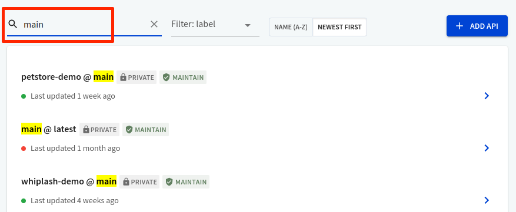
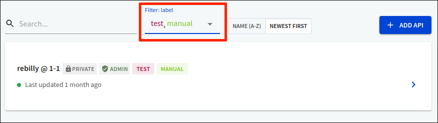

# How to discover APIs in the registry

The API registry serves as a single-source of truth for your APIs. You can use the API registry to store your API definitions and manage multiple versions of each API.

The API registry also provides these methods to make your APIs discoverable for development efficiency, reuse and easy organization.

- Search
- Pagination
- Filter by labels
- Sort

## Search

Search allows you to find APIs and versions stored in the API registry quickly. Start typing into the `Search` field. All APIs and versions matching the search criteria are highlighted and displayed.


When you type in a search term, it looks for matches in:

- API name
- Version identifier



## Pagination

Pagination allows you to organize and display specific results on a page. Page numbers are displayed at the bottom of the API list.

Be default, the API registry displays 10 results per page.


Page numbers are only displayed when you have more than 10 results on a page.


## Filter by labels

**Labels** allow you to organize and tag your API versions so that you can track and find API versions efficiently.

For more information on how to add, delete and assign labels, read the [labels](../../settings/labels.md) topic.

Filtering by labels allows you to narrow down the search results to the most relevant API versions. Select one or more labels to filter on, and matching API versions are displayed.

## Sort

Sorting allows you to quickly organize the APIs in the registry:

- Alphabetically (A to Z)
- Newest first
