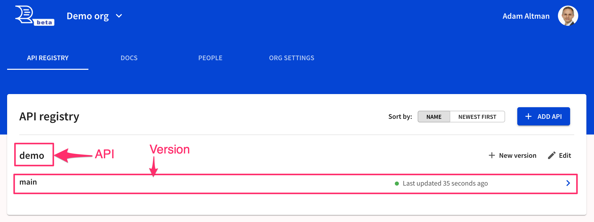
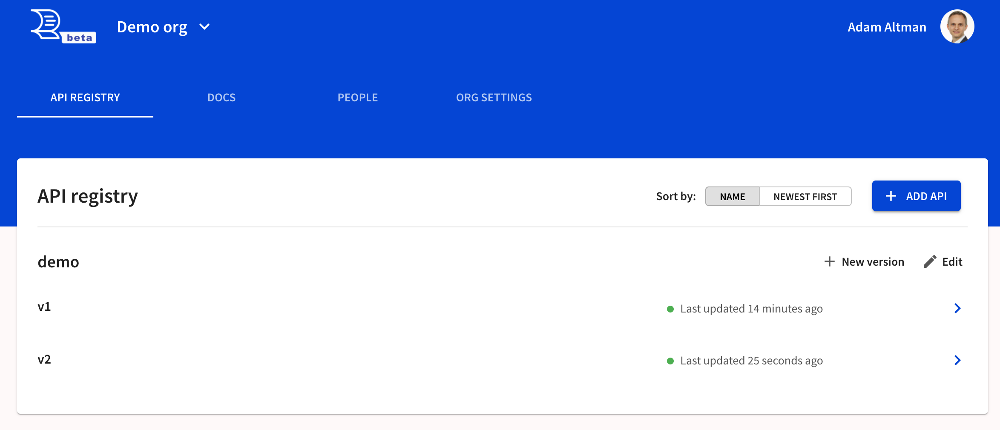
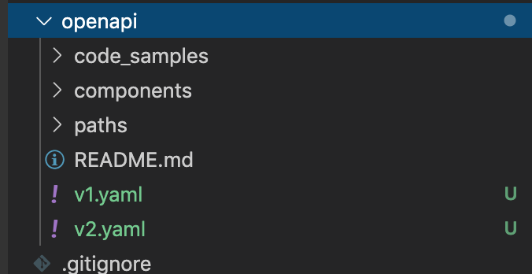
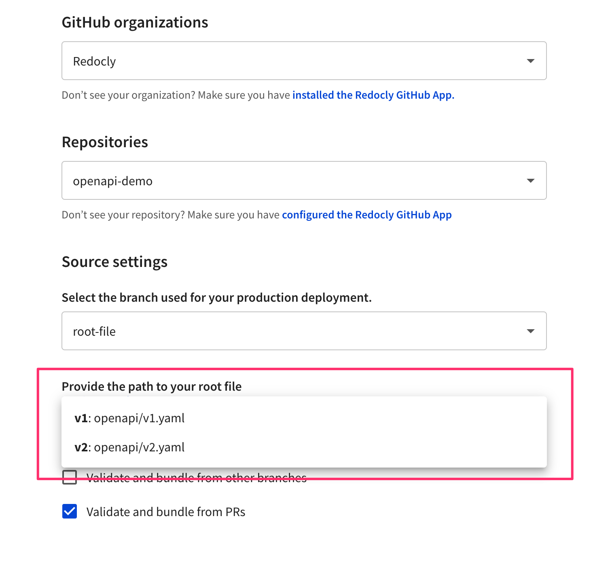
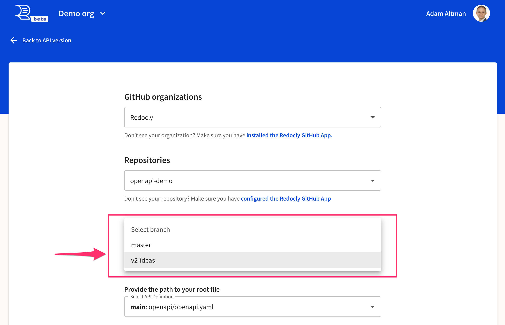
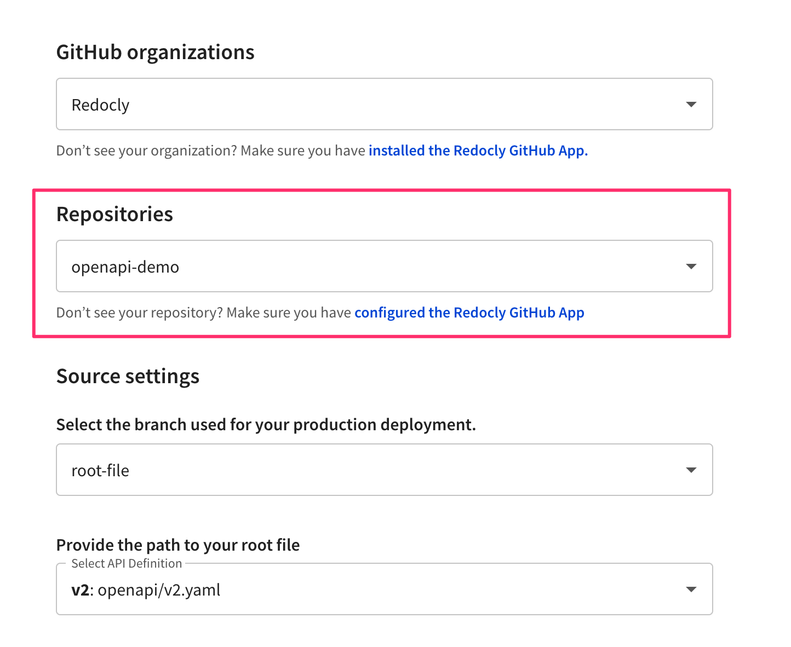

---
seo:
  title: Versioning strategies
---

# What versioning strategy do I use?

An API has one or more versions.

But what is a version?

It refers to a specific OpenAPI definition.

## API evolution strategy

If you follow API evolution practices, which means your API will only have one version and evolve over time.
Most changes are non-breaking changes.
A traditionally breaking change will be introduced as a new API operation.
Then usage will be migrated away from the deprecated API to the new API operation.
Then, the deprecated API can be removed without consequence when there is no usage.

API evolution is awesome because supporting one version of an API is much easier than supporting multiple versions.
Sometimes, API evolution is impossible, because clients refuse or are unable to migrate to the new API operations.

If you follow an API evolution strategy, your API will have one version only.

## Other versioning strategies

Other organizations may have a different versioning strategy.
This involves publishing concrete and discrete different versions available to clients simultaneously.
This may be done in many ways, including designating the version in:

- server (base URL)
- path
- headers
- credentials

Stripe follows a blend of evolution and traditional versioning.
Each version of the API can evolve until there is a breaking change.
At that point, a new version is created, and tagged to the release date of that version.
The API credentials are pinned to a specific version.
The user may change the pin to the most recent version at any time.

Other organizations may follow a periodic release cycle.
For example, release a new version of the API on March 15th every year.
And create a new development version which will undergo breaking changes throughout the year.
They may even release that development version to a limited set of clients as a beta.

Whichever way you version outside of API evolution, it requires making multiple "versions" in Redocly API registry.

## Version sources

Whether you utilize server, path, headers or even credentials versioning, you will be publishing a specific OpenAPI definition tied to each version.
Redocly gives you freedom to decide how to do that.

You may:

- Add another root-file to your existing OpenAPI definition repository.
  We call this the root-file versioning.
- Create an entirely new repository.
  We call this the new-repo versioning.
- Add a new long-lived branch in an OpenAPI definition repository (branched-repo or forked-repo).
  We call this branch-based versioning.

There are pros and cons to each approach.
You will find the best strategy by considering your API's development history and expected future change patterns.

If multiple versions are actively under development and mostly share the same schema, a root document per version in a single repository may be the best approach.

If versions are mostly treated as a history of breaking changes, with few or no changes made after a newer version is created, then a forking or branching approach may work best.

### Root-file versioning

The root is the entrypoint of the OpenAPI definition.
It may contain the entire definition or use `$ref` to refer to other files (or URLs).

Root-file versioning is using a different root-file to represent each version of the API.

When you set up (or edit) your source, you may select your the root file.

Indications root-file versioning may be right for you:

- Multiple versions supported in production for extended periods
- Evolution of more than version expected
- Overlapping components (schema, parameter definitions, etc).

### Branch-based versioning

Branch-based versioning describes keeping different versions of the API definitions in different Git branches.

This may be difficult to manage when multiple branches diverge with no expectation to converge.

However, it's a good fit if the versions are sequential and "mostly done" when the next version is branched.

### Repo-based versioning

Repo-based versioning describes keeping different versions of the API definitions in different Git repositories.

This may be a good idea when a new version is a complete reinvention, usually with:

- no shared schemas
- no shared team members
- still addressing the same underlying use cases

If an API is addressing different use cases, then perhaps it should be organized as a separate API instead of a separate version.

