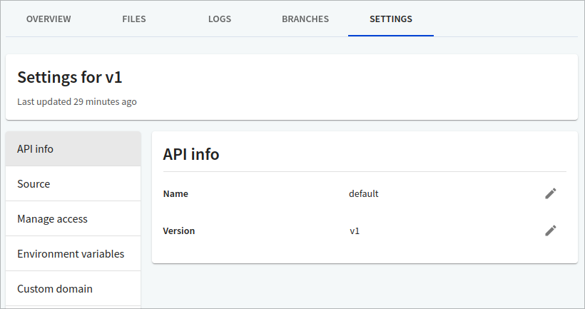

# API info

You can edit an API name and version using the API info page. The name/version is used to identify the API in the API registry in Workflows. It does not affect the name and version in your API definition files.

## Edit API name

1. Navigate to the **Settings > API Info** page for the API version you want to change.
2. Select the Edit (pencil) icon next to the name. The _Change Name_ dialog displays.
3. Enter a name and select **Change Name** to save your changes.


Any change you make to the API name will be automatically updated across all versions for that API, and any docs and Portals associated with the API.


## Edit version

1. Navigate to the **Settings > API Info** page for the API version you want to change.
2. Select the Edit (pencil) icon next to the version. The _Change version_ dialog displays.
3. Enter a version name and select **Change Version** to save your changes.
