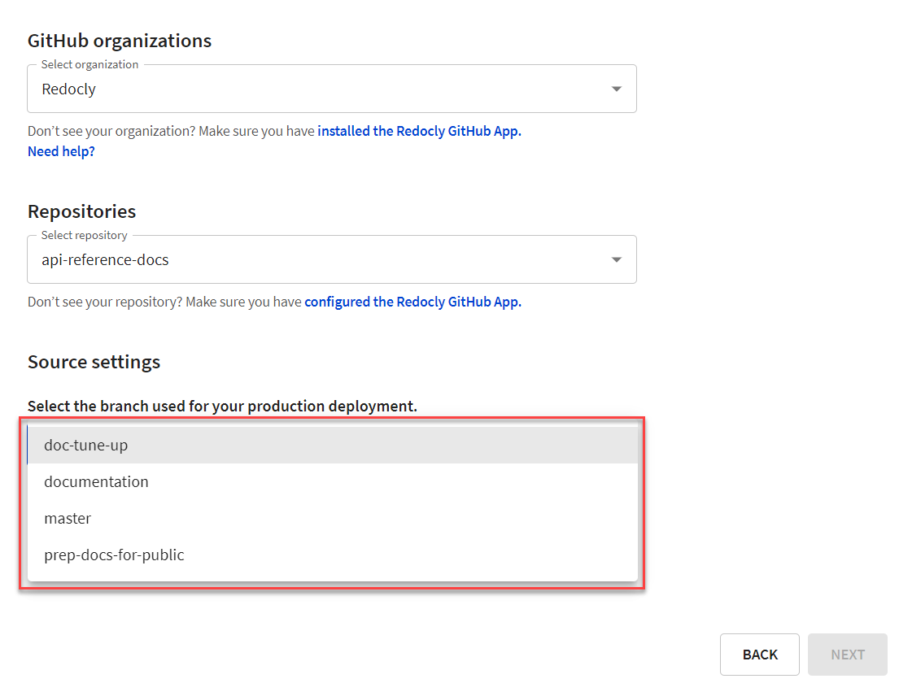
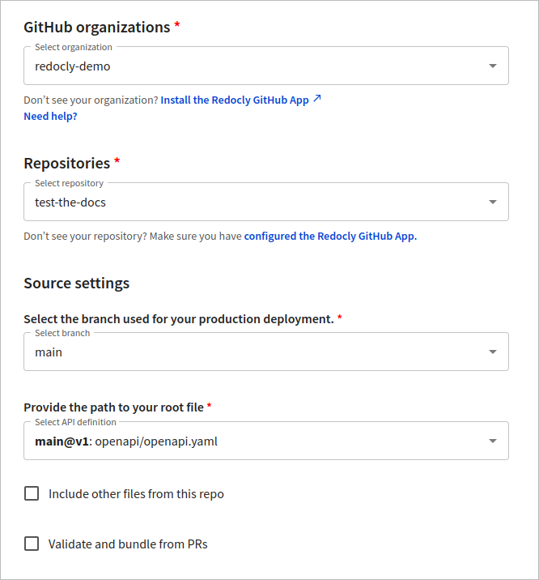

# Manage branches

An API version can have one or more branches. Apart from the primary branch, which is mandatory, you can have other active branches (preview branches) associated with the API version.

The **Overview** page for each version shows the primary branch and up to five preview branches.

The **Branches** page lets you:

- View the primary and all preview branches
- Access additional options for each branch
- Delete active branches associated with the version

## Set primary branch

The primary branch is set when you connect your source.

- For Git-based sources, the primary branch is the same as the selected Git branch name.
- If you use the file upload source, you will be asked to select a branch name.
- If you use the URL source, you are assigned a primary branch name, as this source does not support branches.
- If you use the CICD source, you can provide a primary branch name. Otherwise, a default branch name is assigned automatically.

## Enable preview branches

To enable preview branches for Git-based sources, you must select the **Validate and bundle from PRs** checkbox when connecting your source.
When this option is selected, any pull request (PR) created in your source repository will generate a preview build. The branch from which the PR is created will be listed under **Preview branches**.

For the file upload source, you can choose to create a new branch when uploading new files to the registry.
The new branch automatically becomes the primary, and any other existing branches are listed under **Preview branches**.

## View primary branch

On the API registry page, select your version.
The **Overview** page for the version shows your primary branch.

Next to the branch name is an indicator of the build status and the last time the branch was updated.
Alongside this information, the **Primary branch** box on the page contains the following:

- **OpenAPI menu** with options to copy the snapshot link and download the API definition as YAML or JSON
- **Preview docs** button that opens the API docs generated from the API definition
- **Files link** button that copies the link to the root folder with all uploaded files (if there are any for the primary branch)
- **Mock server** button to copy the mock server URL (if the feature is enabled for the API version)

The same options are available for the primary branch on the **Branches** page, and for every preview branch in the _Branch menu_ (three-vertical-dots menu).

## Change primary branch

To change the primary branch to any other active branch, you must edit the source.
From your API version **Overview** page, access the **Settings > Source** page.

In the **Version source** section, select the **Edit source** button.
In the dialog that opens, select a different branch in the dropdown under **Source settings**.
The following screenshot shows the dialog for the GitHub source.

Save your changes in the dialog and return to the API version **Overview** page.
The branch name in the **Primary branch** box should match the branch you configured as the primary.


Changing the primary branch may result in the **Preview docs** option becoming unavailable for preview branches.
To resolve this issue, rebuild each preview branch and refresh the page in your browser.


## Delete other active branches

To delete any preview branch, open the _Branch menu_ (three-vertical-dots menu) and select **Delete branch**.
You can do this either from the **Overview** page or from the **Branches** page.

The deleted branch is immediately removed from the list of preview branches.
However, any builds created for that branch will remain visible in the build history on the **Logs** page.

You can't delete the primary branch from the registry.


If you delete a branch in your connected source (for example, GitHub), it will also be deleted from the API registry.

If you delete a branch in the registry, it is not automatically deleted from your connected source.

