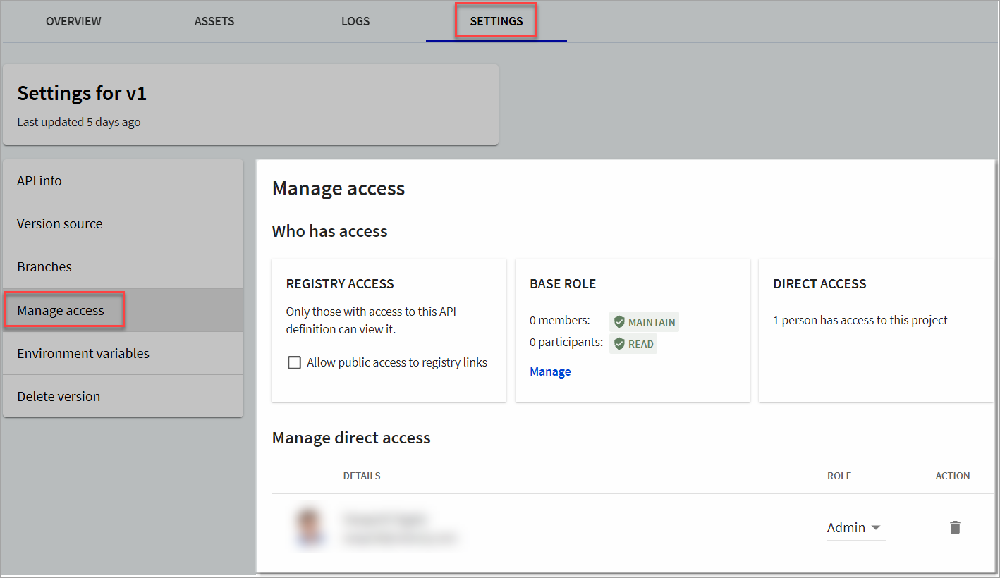
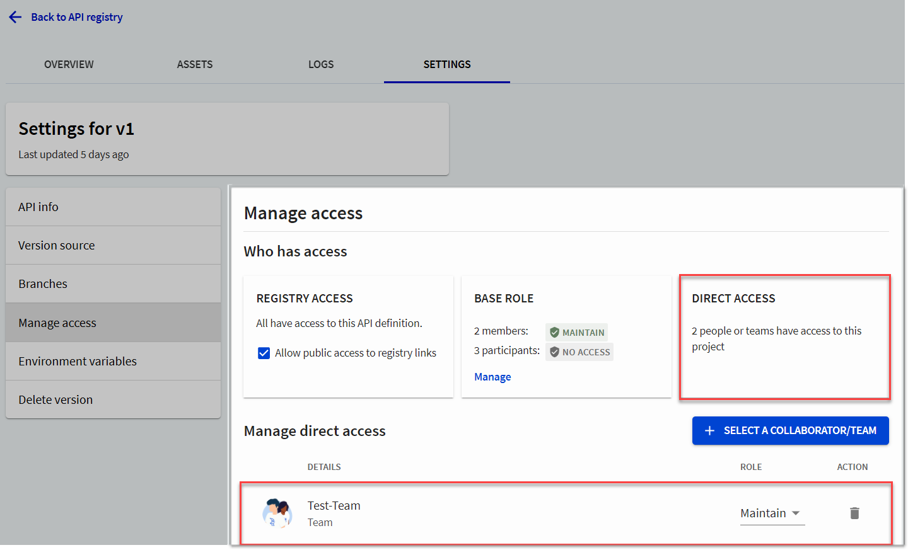
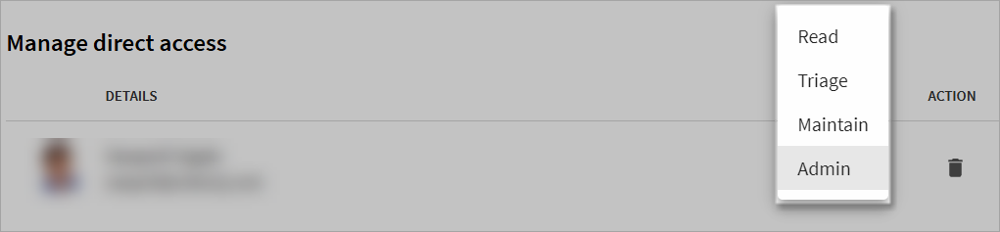

# Manage access

Depending on your plan (and [role](../../people/roles-permissions.md), people with the `Owner` role (at the organization level) or `Admin` role (at the project level) can control access to API registry versions.

## Set up access to API registry

1. Log in to your organization in [Workflows](https://app.redocly.com/) and select **API registry**.
2. From the **API registry** page, select the [API version](../guides/manage-versions.md) for which you want to control access. The selected API details display.
3. Select the **Settings** tab to view the API registry settings for that version.
4. From the left menu, select **Manage access**.
   

The _Manage Access_ page displays the following information:

- **Registry access**: Indicates whether the API registry version is protected by access controls or available to the public.
- **Base role**: You can set base permissions that apply to all members of an organization when accessing any of the organization's API registry versions. By default, members of an organization will have `Maintainer` permissions to the organization's API registry versions.
- **Direct access**: Displays who outside your organization has access to your API registry version. You can invite a member (not currently part of your organization) to collaborate on your API registry.
- **Manage direct access**: You can use this section to add, remove or edit collaborators for the selected API registry version.

## Manage collaborators

People with the `Owner` role for an organization (or `Admin` role on a project) can add outside collaborators or teams to a project, unless an organization `Owner` has restricted the ability to invite collaborators.

When you select a collaborator or a team, they will get direct access to the API registry version.


When you select a team for collaboration, all users that are part of the team will automatically become collaborators on the selected project unless they have a lower role such as `Read` or `Triage`. A person's base role overrides any team roles.




- The member details are now displayed in the **Manage access** section.
- The **Direct access** tile is updated to display the number of people who have direct access to the API version.
  

### Add a collaborator not currently in your organization

If you want to add a collaborator who is not currently a part of your organization, you will need to **add/invite a new member to your organization**. Once they have accepted your invitation and logged in using the invitation link, you can add them as a collaborator, and assign them a relevant project-level role.

To invite a new member to your organization, see the [Managing access to Workflows](../../workflows/manage-access.md) topic.

### Update collaborator role

People with the `Owner` role for an organization (or `Admin` role on a project) can update a collaborator's role on a project in the **Manage access** section.

Under the **Manage access** section, select the collaborator whose role you want to update, and under Role, select the role you want to assign to the collaborator.

The collaborator role and permissions are immediately updated for the selected project.

### Delete collaborators from version projects

People with the `Owner` role for an organization (or `Admin` role on a project) can delete collaborators to a project in the **Manage access** section.

1. Under the **Manage access** section, select the collaborator you want to delete, and select the **Delete** icon.
   A confirmation dialog displays.
2. In the _Remove collaborator_ dialog, select **Delete**.
   - The collaborator details are removed from the **Manage access** section.
   - The **Direct access** tile is updated to display the number of people who have direct access to the version project.
