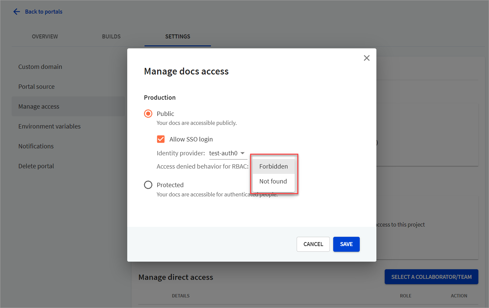

# Role-based access control (RBAC)




The RBAC feature is supported starting with version 1.0.0-beta.90 of the Developer portal.


The role-based access control feature is available in the Developer portal to Enterprise customers.

With RBAC, you can define permissions for specific parts of your Developer portal. Permissions are actions that a user with a particular role is allowed to perform (for example: read, modify, or delete data). You can make some content on your portal completely private, or make it visible only to a restricted group (for example: partners, developers, or administrators).

To achieve this, your developer portal must integrate with an identity provider (IdP) that lets you map user identities to roles and permissions on the portal.

## Introduction to roles and permissions

Roles usually correspond to positions within an organization (for example: administrator, employee, contractor). In other words, a role is a set of permissions that applies to a specific type of user. It's possible to assign more than one role to a user.

Roles can relate to each other, and these relationships between roles are represented as a hierarchy. This allows a role to inherit all permissions of its "subordinate" roles in the hierarchy. In practice, this means that a role can contain other roles and their permissions, in addition to its own permissions.

Role names and permission names are not predefined in the portal configuration, and you can set them to any custom name. For example, you can configure the following roles:

- `User`
- `developer`
- `Partner`
- `page-editor`

and set custom names for permissions:

- `read-partner-docs`
- `read:internal-docs`
- `Experimental`
- `access-secrets`

However, role names must match the user identity configuration from your IdP settings, so they are not entirely arbitrary. If a "Partner" role is configured in IdP and has permissions mapped to it in the portal configuration, users with that role can access restricted content when they log into the portal. If the "Partner" role mapping is undefined on the portal side, users with that role are not able to access restricted content.

You can define permissions globally (for all pages in the Developer portal), or for each individual page. When setting permissions for individual pages, you only have to specify the permission name, not the role name. For example, setting `permission:'read-internal-docs'` in `index.md` means that all roles with that permission are able to access the `index.md` page.

Permissions also affect search results. The search scope automatically adjusts to the user's role. In the search results, the users only get the content they are permitted to access.

## Prerequisites

To configure RBAC:

1. Your developer portal must be:
   - either [deployed using Docker](../guides/on-premise.md#host-the-portal-on-premise) on-premise
   - or [hosted in Redocly Workflows with an OIDC identity provider](../guides/on-premise.md#host-the-portal-in-redocly-workflows)

2. You must create the `rbac.yaml` configuration file in the root of your developer portal project. In this file, configure the roles and permissions hierarchy, and set the default role.

3. You need access to your identity provider settings, where you must ensure the claim names, scopes, and roles match the configuration on the developer portal side. Use this information to:
   - *[On-premise only]* configure OIDC-related settings in the `siteConfig.yaml` file
   - *[Workflows only]* set up the OIDC identity provider and access control for the portal

## Configuration steps

1. [Define roles and permissions hierarchy](#define-the-roles-and-permissions-hierarchy) in the `rbac.yaml` file. You may also want to [set per-page permissions](#set-permissions-for-pages) in your `.md(x)` and `.page.yaml` files to override the defaults and restrict access to specific content.

2. Set up the [authorization server URL](#configure-the-oidc-authorization-server) in your identity provider settings. Additional configuration may be necessary on the IdP side, such as setting up claims. Consult the relevant administrator in your enterprise for help.

3. Configure OIDC on the portal side.
   - *[On-premise only]* [Add OIDC settings](../guides/on-premise.md#host-the-portal-on-premise) to the `auth` section of the `siteConfig.yaml` file
   - *[Workflows only]* Configure OIDC on the **Org settings > Identity providers** page, then set up OIDC login on the **Portal settings > Manage access** page

4. You have to use a custom component to override the default navbar. Redocly provides the [custom login component example](https://github.com/Redocly/developer-portal-starter/pull/27/files) that you can modify and implement according to your needs. The component allows you to display a login link in the portal navbar and makes it possible for users to log into the portal via the configured identity provider.

5. *[On-premise only]* It may be necessary to provide a custom JWT (JSON Web Token) [claims preprocessor](#configure-custom-claims-preprocessing) depending on your identity provider configuration.

## Define the roles and permissions hierarchy

In the `rbac.yaml` file, define the hierarchy of roles in your portal.

Here is an example of how to set roles and permissions in the `rbac.yaml` file:

```yaml
roles:
  Trainee:
    permissions:
      - read-partner-docs
      - see-experimental-pages
  Employee:
    roles:
      - Trainee
    permissions:
      - read:internal-docs
  Admin:
    roles:
      - Employee
    permissions:
      - read-secrets
```

As shown in the example, a role can contain other roles, in which case it inherits the permissions of the containing roles.

The portal comes with the following default roles:

- `guest` - every visitor has this role with a single permission to read all public content on the portal.

- `authenticated-user` - every logged in user has this role regardless of IdP claims.


You cannot extend the `guest` role with additional permissions.


## Set permissions for pages

If a page doesn't have any specific permission, that means the page uses the default permission from the `rbac.yaml` file. By default, all pages use the permissions from the `guest` role.

When a permission is specified for a page, it is treated as a "required permission". That means all visitors must have the specified permission mapped to their role in order to access the page.

You can override the default permission on a per-page basis. This is supported in Markdown and MDX pages, as well as in reference docs pages (`.page.yaml` files).

To set permissions for Markdown and MDX pages, add `permission: your-permission` to their front matter, for example:

```md
---
title: My Getting Started Page
permission: read-partner-docs
---
```

To set permissions for reference docs pages, add the `permission: your-permission` entry to the `.page.yaml` configuration file:

```yaml
title: API Reference
type: reference-docs
definitionId: test
permission: 'read:internal-docs'
```

Note that permissions configured in this way apply to the entire API reference docs page. Setting permissions for specific operations, tags, or tag groups is not supported.

## Set permissions for directories

You can set permissions for all pages (and other files like static assets) in any directory at once. To configure permissions for all files in a directory and all its child directories, create a `permissions.rbac.yaml` file in that directory.

The file must contain the `permission: your-permission` entry like in the example:

```yaml
permission: read-partner-docs
```

Note that any per-page permissions set in files in the directory always take precedence over directory-level permissions. For example, if `read-partner-docs` is set on the directory level, but a file has `read-internal-docs`, the directory permission does not overwrite the file permission. The file keeps its `read-internal-docs` permission.

## Configure the OIDC authorization server

**On-premise**

In your OIDC identity provider settings, set the following URL for "Allowed Callback URLs":

`http://your-developer-portal.example.com/_auth/oidc`

`localhost` is supported as well:

`http://localhost/_auth/oidc`

**Workflows**

The URL for "Allowed Callback URLs" in your OIDC IdP settings should match the following pattern:

`https://your-developer-portal-project.redoc.ly/_auth/oidc`

If you have configured a custom domain for your developer portal in Workflows, the URL should match it:

`https://your-custom-domain.example.com/_auth/oidc`

You can find the exact URL in the Workflows interface on the **Settings > Access control** page of your portal project. The option **OIDC Members only** or **Public > Allow login > OIDC** must be enabled.

## Configure custom claims preprocessing


Applies only to on-premise Developer portal deployments.


Redocly uses the `roles` claim of JWT token to get a list of user roles.

In some cases, it might be necessary to preprocess JWT claims received from the IdP (for example, if `roles` claim is not returned and you need to infer it based on other claims, or if you need to map roles from IdP to internal roles).

You can provide a `claimPreprocessor` - a JavaScript function to process claims from IdP.

The function is called at runtime and accepts two arguments:

- `claims` - JST claims from your IdP provider
- `context` - contains a name of the claim Redocly uses to extract roles (`roles` by default).

Example preprocessor:

```js
const ROLES_MAP = {
  'admin': 'DocsAdmin',
  'ext': 'Partner'
}

exports.default = async (claims, { ROLES_CLAIM_NAME }) => {
  if (claims.issuer === 'auth0') {
    return {
      ...claims, # return original claims
      [ROLES_CLAIM_NAME]: ['ExternalUser'] # and roles list
    }
  }

  return {
    ...claims,
    [ROLES_CLAIM_NAME]: claims.roles.map(role => ROLES_MAP[role])
  };
};
```

Set the `claimPreprocessor` parameter in the `auth` section of your `siteConfig.yaml`.

```yaml
auth:
  claimsPreprocessor: ./claims.js
  idps:
    main:
      type: oidc
      loginWith: OIDC
      configurationUrl: https://redoc-ly.auth0.com/.well-known/openid-configuration
      clientId: your-id
      scopes:
        - openid
        - name
        - family_name
```

## Set permissions for navigation items

By default, if OIDC is enabled, navigation menu items (in navbar and footer only) are hidden if the authenticated user doesn't have access to the corresponding pages.

You can override this behavior to either hide or show a navigation menu item. Keep in mind that modifying the appearance of an item does not change its access control. In other words, permissions for menu items can be different from permissions for pages those items link to. That way, users can still see all the items in a menu, but they can't access the pages that are restricted for their role.

### Navbar item permissions

To change the navbar RBAC configuration, edit the `nav` section of your `siteConfig.yaml` as in the following example:

```yaml
nav:
  - page: getting-started.md
    permission: read-docs
```

Adding the `permission` key here overrides the permission set in the `getting-started.md` file (or the default permission) for the purpose of displaying the menu item. It does not change the permission for accessing the page, or modify the permission value if it's defined in the file.

### Footer item permissions

To change the footer RBAC configuration, edit the `footer` section of your `siteConfig.yaml` as in the following example:

```yaml
footer:
  copyrightText: © Copyright Redocly 2018. All right reserved
  columns:
    - group: Docs
      permission: read:docs
      items:
        - label: Examples
          page: md-examples.md
        - separator: Some Group
        - label: Documentation
          href: 'http://github.com'
```

In the footer, you can add the `permission` key either for the entire `group` or for individual `item` entries.

## Configure RBAC in Workflows

If your developer portal is hosted in Workflows, you can control some of the RBAC settings from the Workflows interface. The majority of the [configuration steps](#configuration-steps) are the same as for on-premise developer portals.

### Limitations

- Redocly Workflows does not support custom claims preprocessing. However, you may define the scope claim name used inside of the identity provider configuration. For example:


```json
{
   "id": "123",
   "exp": "expiration_date",
   "https://redocly.com/roles": [
   "Employee",
   ]
}
```

### Prerequisites

- An `rbac.yaml` configuration file in the developer portal repository. Redocly Workflows uses the settings and applies the permissions defined in the file. In addition, you can [set permissions for individual pages or specific directories](#set-permissions-for-pages) in the developer portal repository.

- Identity provider configured in your Redocly Workflows organization. The RBAC feature currently only supports OIDC, and organization owners can configure it on the **Org settings > Identity providers** page. Use the **RBAC roles claim name** field to set a specific claim name depending on how it's configured on the identity provider side. This allows the developer portal to map the roles configured in the identity provider to the roles and permissions configured for the RBAC feature.

### Enable RBAC in Workflows

1. Log into Workflows, and select the **Portals** tab.

2. From the list of portals, select the portal for which you want to enable RBAC.

3. Open the **Settings > Manage access** page.

4. From the docs section, for either production or previews, select **Manage** to view the corresponding *Manage docs access* dialog.

5. Set the value to "Protected" with **SSO login** or to "Public" with the **Allow SSO login** option selected. Select the identity provider from the dropdown. Your identity provider **must allow** the corresponding callback URL. Contact your identity provider administrator for help.

6. To define how the developer portal behaves when a user doesn't have permissions to access specific content and attempts to access it, select one of the options under **Access denied behavior for RBAC**. Supported options are *Forbidden* and *Not found*.

7. Select the **Save** button to save changes.




Roles and permissions settings are taken from configuration files and individual pages in the developer portal repository. You cannot configure them through the Workflows interface.

