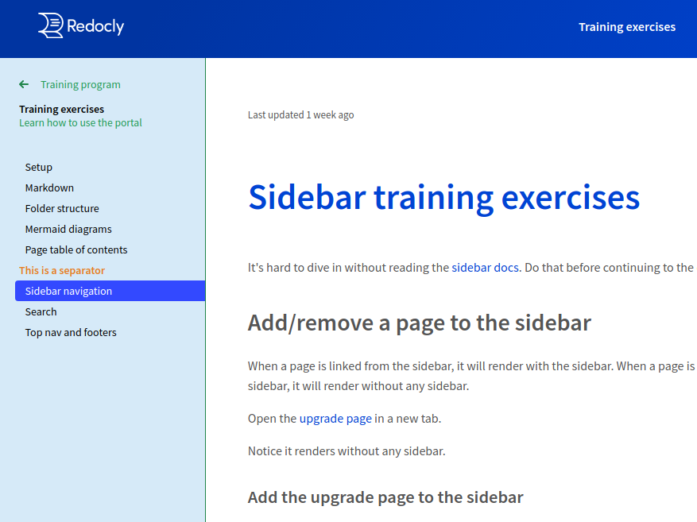
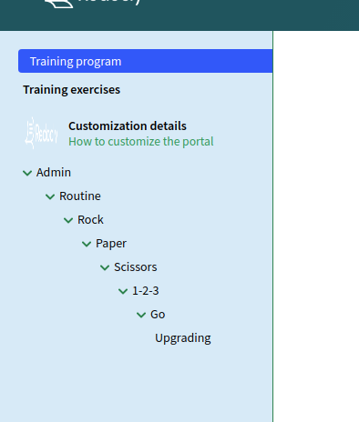

---
seo:
  title: Control your sidebar navigation
excludeFromSearch: true

---

# Sidebar configuration



To help your readers access content faster, set up a navigation sidebar for your developer portal. When configured, the sidebar is displayed on the left side of the portal.

You can add the following elements to the sidebar:

- links to [internal MD and MDX pages](#pages) and external URLs
- links to [API documentation](#api-documentation)
- [separators](#separators)
- [groups](#groups) of links for creating a nested navigation structure
- custom [labels](#labels) for pages

To configure your sidebar, modify the `sidebars.yaml` file in the root of your portal project.


Pay attention to the indentation in YAML files. YAML document structure is determined by indentation, so putting an item on the wrong indentation level can cause build failures. Instead of tabs, always use spaces to indent items in your `sidebars.yaml`.


## Sidebar structure

To create (or modify) your sidebar in the `sidebars.yaml` file, add one or more elements in order in which you want to show them in the portal.
Pages, groups, and separators follow the order defined in the `sidebars.yaml` file.
Generally, the order of options (such as `label,` `external,` `expanded`...) assigned to sidebar elements does not impact how they're displayed.


When a page is linked from the sidebar, it is rendered with the sidebar. Pages that are not included in the sidebar are rendered without the sidebar.

Do not include a page in more than one sidebar. However, you can include it in more than one group in the same sidebar.


**Example sidebar structure**

```yaml
- group: Expanded group
  expanded: true
  pages:
    - label: Overview
      page: developer-portal/overview.md
    - separator: Navigation
    - label: Top Nav
      page: developer-portal/top-navigation.md
      external: true
    - page: developer-portal/footer-navigation.md
      label: Footer Nav
    - label: Sidebar Nav
      page: developer-portal/sidebar-nav.md
- group: Closed group
  expanded: false
  pages:
    - group: Nested Group with duplicate page
      expanded: false
      pages:
        - page: reference.page.yaml
          label: API docs example
        - label: Sidebar Nav - Duplicate
          page: developer-portal/sidebar-nav.md
    - label: Quickstart
      page: developer-portal/quickstart.md
      separatorLine: true
    - label: Using Arguments
      page: developer-portal/arguments.md
```


Legacy `sidebars.yaml` configuration that uses the `sidebarName` is still supported. This name is not displayed in the portal, and is only used as the unique identifier for the sidebar.

Read the [migration guide](../guides/migration-guide-sidebars.md) to learn more about the changes in sidebar configuration.


### Pages

**Add MD(X) pages to the sidebar**

Your sidebar can contain links to pages within your portal project. Use the `page` key followed by the relative path to an MD(X) file.

```yaml
- page: developer-portal/quickstart.md
- page: developer-portal/index.mdx
```

**Make pages open in a new tab**

Pages support the `external` option that makes them open in a new browser tab or window. When you specify this option for a page, an indicator icon is displayed in the sidebar to the right of the page title.

```yaml
- page: developer-portal/quickstart.md
  external: true
- page: developer-portal/index.mdx
  external: true
```

**Add directory contents to the sidebar**

Appending `/*` at the end of a directory path adds all MD and MDX files in the directory (and subdirectories) to the sidebar in alphabetical order.

If the directory contains any subdirectories, they are automatically converted into groups. Pages inside each group are again sorted alphabetically by their filenames.

```yaml
- page: developer-portal/example-directory/*
```

Keep in mind that this option does not work like a regular expression pattern matcher. Trying to use it as `page: developer-portal/example-directory/a*` does not include only files starting with the letter `a`. It can only be used to include entire (sub)directories, not specific files.

### API documentation

To link to API documentation from the sidebar, provide the relative path to the `.page.yaml` file associated with the OpenAPI definition you want to include. The sidebar also supports the `external` option.

**Add API docs to the sidebar**

```yaml
- group: API docs
  pages:
    - page: developer-portal/openapi/reference.page.yaml
      external: true
```

The `.page.yaml` file contents influence how the OpenAPI definition is presented in the sidebar.

**Example reference.page.yaml file**

```yaml
type: reference-docs
definitionId: petstore
settings:
  pagination: section
  showConsole: true
  generateCodeSamples:
    languages:
      - lang: JavaScript
        label: JS
      - lang: Python
  hideDownloadButton: true
```

For more details, refer to the [Integrating API reference](../guides/reference-docs-integration.md) page.


An option similar to `/*` for MD(X) pages can be used with API documentation. Instead of including multiple OAS files, it controls the nesting level of API docs in the sidebar. Read our [API discovery blog post](https://redocly.com/blog/api-discovery/) for examples on how to use this option.


### Separators

Separators are useful for indicating section breaks or categorizing content in your sidebar without creating nested groups. They are static, non-interactive sidebar elements, and you cannot select, expand or collapse a separator.

The sidebar supports two separator types, and you can use both as many times as you want in the same sidebar:

- textual separator
- line separator

To insert a textual separator, add `separator: Custom text` as a standalone item between two pages or groups.

**Add a textual separator**

```yaml
- page: developer-portal/quickstart.md
- separator: This is a separator
- page: developer-portal/index.mdx
```

To insert a line separator, add `separatorLine: true` as an option assigned to a page or to a group. When assigned to a group, it is displayed after the last item in that group.

**Add a line separator**

```yaml
- page: developer-portal/quickstart.md
  separatorLine: true
- group: Group with separator
  expanded: true
  separatorLine: true
  pages:
    - label: Index
      page: developer-portal/index.mdx
    - label: Glossary
      page: developer-portal/reference/glossary.md
```

### Labels

Labels let you create optional custom titles for pages in the sidebar. By default, if a page is linked without a label, the sidebar uses the title from the linked file. Assigning a label to a page overrides this default behavior.

**Add labels to pages**

```yaml
- page: developer-portal/quickstart.md
  label: Get started with the portal
- separator: This is a separator
- label: API docs
  page: developer-portal/openapi/reference.page.yaml
```

The display order of pages in the sidebar is not affected if you set the label first and page second, or vice versa.

### External URLs

In addition to internal MD(X) pages and API documentation, your sidebar can link to external URLs.

To insert a link to an external page, use `href` followed by the URL of the page. The text added with `label` is used as the name of the link in the sidebar.

```yaml
- label: External URL example
  href: https://redocly.com/docs/
- label: Internal page example
  page: developer-portal/quickstart.md
```

### Groups

Use groups to organize pages into a nested navigation structure. Each group can contain multiple levels of pages, separators, and other (nested) groups. Your nested sidebar navigation can be at most 7 levels deep.

Groups are dynamic, interactive sidebar elements. You can control the default behavior of each group with the `expanded` option.

| Option             | Description                                            |
| ------------------ | ------------------------------------------------------ |
| `expanded: true`   | The pages are open (expanded) when the page loads.     |
| `expanded: false`  | The pages are collapsed when the page loads.           |
| `expanded: always` | The pages are open (expanded) and cannot be collapsed. |

There are two ways to create a group in the sidebar:

1. As a simple navigation item (expands, but does not link to any content when selected)

```yaml
- group: Simple group name
  expanded: true
  selectFirstItemOnExpand: true
  pages:
    - page: developer-portal/quickstart.md
      label: Get started with the portal
    - separator: Commands
    - page: developer-portal/commands.mdx
```

Add the `selectFirstItemOnExpand` option to automatically open the first item in the group when selecting the group in the sidebar. This option must not be used together with `page` (which makes the group behave as an expandable page).

2. As an expandable page (when selected, loads the contents of a page and expands to show nested pages)

```yaml
- group: Page group name
  page: developer-portal/example-page.md
  expanded: true
  pages:
    - page: developer-portal/quickstart.md
      label: Get started with the portal
    - separator: Commands
    - page: developer-portal/commands.mdx
```

Changing the nesting level in the sidebar does not affect the URLs of your pages. Groups are unrelated to original file paths, so your sidebar organization does not have to mirror the folders and subfolders in your project. For example, if your configuration guides are scattered into different folders, you can still link them in the same sidebar group.

**Create deep nesting levels**

```yaml
- group: Main group
  page: developer-portal/example-page.md
  expanded: always
  pages:
    - page: developer-portal/quickstart.md
      label: Get started with the portal
    - group: Group level 1
      expanded: true
      pages:
        - page: developer-portal/commands.mdx
          label: Commands
        - separator: Components
        - page: developer-portal/old/component-guide.md
        - page: developer-portal/advanced/components.mdx
        - page: developer-portal/custom/guides/create-components.md
        - group: Group level 2
          expanded: false
          pages:
            - page: developer-portal/advanced.md
              external: true
```

## Sidebar styles

By default, the sidebar is displayed as a tree-view hierarchy. All top-level navigation items are visible even when you expand deeply nested groups.


We also support an alternative sidebar style called `drilldown`. With this style, the sidebar uses a scoped view for groups. Instead of displaying each group as an expanded tree in a big list of items, it leads you to a separate "page" within the sidebar (the scope for the selected group).

The back button is automatically displayed at the top of the current scope, above the group name, so you can quickly return to the previous scope. Group names and separator names use bold text by default in the drilldown style.



To enable the drilldown style, specify it for one or more groups in your sidebar. You can use the default style and the drilldown style for different groups in the same sidebar.

Note the differences in supported options for sidebar styles:

- **only in drilldown:** `icon` (optional custom icon to the left of the group name) and `sublabel` (optional description text under the group name)
- **only in default:** `expanded` (automatically collapse or expand the group on page load)

**Use the drilldown sidebar style**

```yaml
- group: Main group
  page: developer-portal/example-page.md
  menuStyle: drilldown
  icon: ./images/custom-icon.png
  sublabel: The main group containing all pages
  pages:
    - group: Nested drilldown group
      menuStyle: drilldown
      icon: ./images/components.png
      sublabel: Learn more about components
      pages:
        - page: developer-portal/old/component-guide.md
          label: Understanding components
        - page: developer-portal/advanced/components.mdx
          external: true
        - page: developer-portal/custom/guides/create-components.md
          label: Create your own component
          separatorLine: true
    - group: Nested default group
      expanded: false
      pages:
        - page: developer-portal/advanced.md
          external: true
        - separator: This is a separator
        - page: developer-portal/commands.md
          label: Advanced commands
    - page: reference.page.yaml
```

## Set up multiple sidebars

The most common approach for portals is to configure a single sidebar for your developer portal. However, you can create multiple `sidebars.yaml` configuration files to set up different sidebars.

If a page is already included in one sidebar, do not include it in any other sidebars at the same time.

Your developer portal displays one of the configured sidebars contextually, based on the page that is being requested.
If a page is not included in any of the sidebars, it is displayed without the sidebar.

You can use default and drilldown styles in all your sidebars. If you decide to [theme the sidebar](#theme-the-sidebar), remember the configured theming options apply to all sidebars.

**Use multiple sidebars in the portal**

You should have the main `sidebars.yaml` file in the root of your portal project.

To configure multiple sidebars for your portal, manually create new `sidebars.yaml` files in different folders.

Every `sidebars.yaml` file should be in its own folder (ideally, in the same folder that contains pages listed in the file).

File paths for the pages must be relative to where the `sidebars.yaml` file is placed.


```yaml
- group: Main portal sidebar
  menuStyle: drilldown
  icon: ./images/custom-icon.png
  sublabel: Page group with drilldown style
  pages:
    - page: index.mdx
      external: true
    - group: Product docs
      menuStyle: drilldown
      pages:
        - page: documentation/saas-product/index.md
        - page: documentation/advanced/cli-product.mdx
          separatorLine: true
        - page: documentation/custom-solutions/index.md
```


```yaml
- label: Build custom solutions
  page: development-guide.md
  group: Code examples for custom solutions
  expanded: false
  pages:
    - page: custom-python.md
    - page: custom-javascript.md
    - page: custom-ruby.md
```



In the preceding example, you would place the main `sidebars.yaml` file into the root of the project, and the second `sidebars.yaml` file into the `documentation/custom-solutions` folder.
The `documentation/custom-solutions/index.md` page from the first sidebar can contain a link to the `documentation/custom-solutions/development-guide.md` page from the second sidebar to connect the content and seamlessly switch from one sidebar to the other.

## Theme the sidebar

You can style some visual aspects of your sidebar by modifying the developer portal theme.

In the root of your portal project, find the `theme.ts` file and edit the `sidebar` section within `export const theme = {`.

**Example sidebar customization in theme.ts**

```ts
  sidebar: {
   backgroundColor: '#d6eaf8',
   activeBgColor: ' #3349ff',
    width: '300px',
   textColor: '#000000',
   textColorSecondary: '#239b56',
   activeTextColor: '#ffffff',
   separatorLineColor: '#e67e22',
   separatorLabelColor: '#e67e22',
   rightLineColor: '#1e8449',
   caretColor: '#1e8449',
   fontFamily: '"Source Sans Pro", sans-serif',
   fontSize: '14px',
   spacing: {
     unit: 10,
     paddingHorizontal: 5,
     paddingVertical: 5
    }
  }
```



### Supported sidebar theming options

Note that some theming options apply only to the drilldown sidebar style.

| Option                      | Type   | Description                                                                                                                                                                              |
| --------------------------- | ------ | ---------------------------------------------------------------------------------------------------------------------------------------------------------------------------------------- |
| `backgroundColor`           | string | Changes the background color of the entire sidebar section.                                                                                                                              |
| `activeBgColor`             | string | Changes the background color of the active item (currently selected item) in the sidebar.                                                                                                |
| `width`                     | string | Controls the width of the entire sidebar section.                                                                                                                                        |
| `textColor`                 | string | Changes the text color of default sidebar items (page names, page labels, group names).                                                                                                  |
| `textColorSecondary`        | string | Changes the text color of drilldown sidebar items (group sublabels and scope links).                                                                                                     |
| `activeTextColor`           | string | Changes the text color of the active item (currently selected item) in the sidebar.                                                                                                      |
| `separatorLineColor`        | string | When the separator is used as a horizontal line, this option controls its color.                                                                                                         |
| `separatorLabelColor`       | string | When the separator is used as text, this option controls its color.                                                                                                                      |
| `rightLineColor`            | string | Changes the color of the vertical line dividing the sidebar section from the page contents.                                                                                              |
| `caretColor`                | string | Controls the color of the back button (<-) in drilldown style, and the V button for expanding groups.                                                                                    |
| `fontFamily`                | string | Changes the font family of all text in the sidebar.                                                                                                                                      |
| `fontSize`                  | string | Changes the font size of all text in the sidebar. Can be provided in any of the standard units (px, em, rem...).                                                                         |
| `borderRadius`              | string | Controls the border radius of the item. Default value is `4px`. Can be provided in any of the standard units (px, em, rem...).                                                           |
| `spacing`                   | object | Controls the spacing of items in the sidebar. The numbers set here are used to calculate the final positioning value of each item (in px).                                               |
| `spacing.unit`              | number | Controls the value for: textual separator margin-left; menu item margin-left; back button margin-right; drilldown menu icon width, height, and margin-right; version switcher padding.   |
| `spacing.paddingHorizontal` | number | Controls the value for horizontal spacing of items in the sidebar (textual separator padding; menu item padding-right and padding-left).                                                 |
| `spacing.paddingVertical`   | number | Controls the value for vertical spacing of items in the sidebar (textual separator padding; line separator margin; menu item padding-top and padding-bottom; back button margin-bottom). |
| `spacing.offsetLeft`        | number | Controls the value for left offset of items in the sidebar. Default value is `sidebar.spacing.unit * 2`.                                                                                 |
| `spacing.offsetNesting`     | number | Controls the value for nesting offset of items in the sidebar. Each nested group has this offset. Default value is `sidebar.spacing.unit * 2`.                                           |
| `spacing.offsetTop`         | number | Controls the value for top offset, which is the distance between the top of the sidebar and the first item. Default value is `sidebar.spacing.unit * 2`.                                 |
