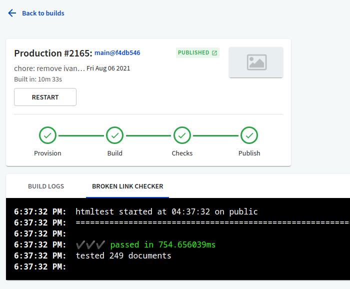
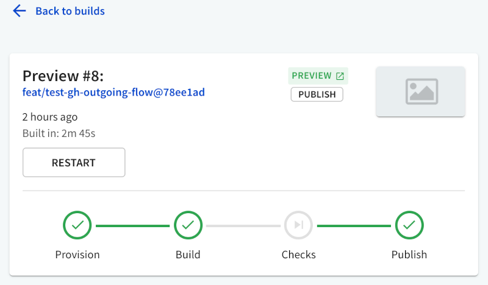
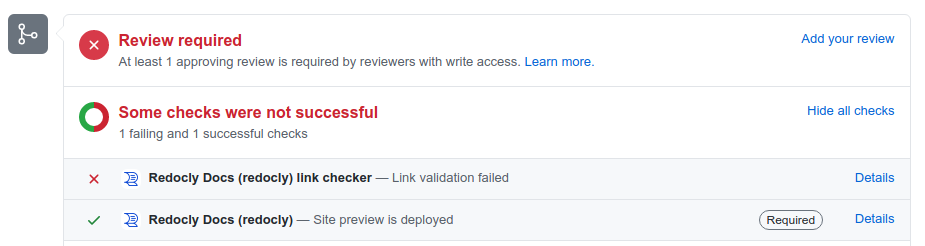

# `linkChecker`

## Usage

Use the `linkChecker` section to configure automated link checking for your portal.

Add it to the top level of the `siteConfig.yaml` file and specify supported configuration options inside it.

Depending on the configuration, the link checker can:

- validate internal references (links to pages in your portal),
- check whether external links are valid and using HTTPS,
- check if image links are correct and warn about missing images,
- ignore specific links and skip entire directories during the check,
- skip broken canonical links,
- check favicons, meta refresh tags, and more.

The link checker functionality is provided by the [htmltest](https://github.com/wjdp/htmltest) tool. All [basic configuration options](https://github.com/wjdp/htmltest#basic-options) from `htmltest` can be used in the `linkChecker` section.

When configured, the link checker runs after the portal build. Depending on the severity setting, it can either allow (`severity: warning`) or prevent (`severity: error`) the build from being deployed. By default, the severity is set to `warning`, which means even if you get warnings about detected issues in the link checker output, you are still able to deploy the portal.

### In Workflows

For Developer portal projects hosted in Redocly Workflows, you can access the output in the **Broken link checker** tab on the *Build* page for the selected portal build.



The **Checks** step in the status indicator refers to the link checker. If any issues are detected, it displays the status as failed, and either prevents or allows portal publishing based on severity configuration.

When the link checker is not configured for your portal (the `linkChecker` section is not present in `siteConfig.yaml`), the **Checks** step is skipped in the portal build entirely. In this case, the **Broken link checker** tab is visible, but doesn't contain any output.



If your Developer portal project was created from a GitHub source, you see link checker status as one of the checks on your pull requests.




## Options


| Option  | Description |
| ------------- | ------------- |
| `severity` | Enables the link checker and controls its sensitivity. Supported values are: `error`, `warning`. When set to `error`, detected issues are treated as severe and the portal build cannot be deployed. When set to `warning`, detected issues are logged and the portal deployment can continue. The default is `warning`. |
| `options` | Specifies the behavior of the link checker, and enables or disables various link checking functionalities. Refer to the [full list of supported options](https://github.com/wjdp/htmltest#basic-options) in `htmltest`, and add them to the `options` section according to their descriptions. The list of options indicates their default values, so you can override those defaults by specifying different values here in the `options` section. |


### Default configuration

By default, the Developer portal uses the following settings from the internal `htmltest` configuration file:

```yaml
DirectoryPath: "public"
IgnoreDirectoryMissingTrailingSlash: true
IgnoreAltMissing: true
```

You can override these settings in the `linkChecker > options` section of your `siteConfig.yaml` file.


## Examples

```yaml
seo:
  title: Example Developer Portal
  description: Learn how to work with Example APIs
linkChecker:
  severity: error
  options:
    DirectoryPath: "public"
    EnforceHTTPS: true
    CheckExternal: false
    IgnoreURLs:
      - "example.com"
```
