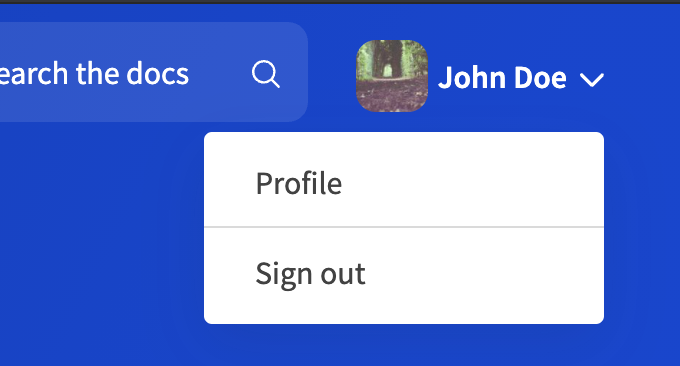
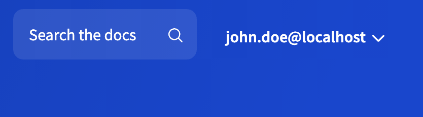

# `login`



Requires an OpenID Connect Identity Provider configured.



## Usage

If your portal content is protected behind a login, you can add a login component to the portal navbar. The login component is disabled by default. To enable it, add the `login` section to the top level of the `siteConfig.yaml` file.



Portal login and authentication settings must be configured in the [auth section](auth.md) for on-premise deployments.
Workflows deployments must have an OIDC SSO identity provider configured and attached to the project's access controls.
You can customize some elements of the login component in the `components > login` section of the [developer portal theme](../theme.md)



## Options

| Option  | Description |
| ------------- | ------------- |
| `label`  | Specifies the default login text displayed in the portal navbar when the user is not logged in. |
| `menu`  | Defines the contents of the menu that opens when the login button is selected in the portal navbar. The `menu` object accepts a structure similar to the [nav section](nav.md), where every item must have a name (defined by `label`) and a link (either to a `page` in the portal project or to an external resource as `href`). <br />An optional `separatorLine` property is supported in the `menu` object. Set it to `true` to display a horizontal line between menu items. <br />To allow users to log out of the portal, you must add `logout: true` to a menu item. The logout item can have an optional `link` property. Use the `link` property to specify a custom URL where the users are redirected after they log out. By default, the only item in the menu is the logout item (labeled "Sign out"). |
| `userAvatar`  | Sets the user avatar image displayed in the portal navbar when the user is logged in. If set to `false`, then `userLabel` must be configured. Both options can be configured at the same time. <br />The `userAvatar` object accepts two options: `claim` (must map to a claim from the IDP token that is used as the avatar image) and `fallbackLettersClaim` (must map to a claim from the IDP token that is used to show a two-letter text version if the avatar image is undefined or unavailable). |
| `userLabel`  | Sets the text that displayed instead of `label` when the user is logged in. If set to `false`, then `userAvatar` must be configured. Both options can be configured at the same time. <br />The `userLabel` object accepts two options: `claim` (must map to a claim from the IDP token that is used to indicate which user is logged in) and `fallback` (any custom text that is used if the information from the token is unavailable). |


## Examples

```yaml
seo:
  title: Example Developer Portal
  description: Learn how to work with Example APIs
login:
  label: Sign in
  userAvatar:
    claim: picture
    fallbackLettersClaim: fullName
  userLabel:
    claim: email
    fallback: '<unknown user>'
  menu:
    - label: Profile
      page: profile.mdx
    - separatorLine: true
    - label: Sign out
      logout: true
      link: 'https://your_domain/v2/logout?client_id=YOUR_CLIENT_ID&returnTo=LOGOUT_URL'
```






```yaml
seo:
  title: Example Developer Portal
  description: Learn how to work with Example APIs
login:
  label: Sign in
  userAvatar:
    claim: picture
    fallbackLettersClaim: fullName
  userLabel: false
  menu:
    - label: Sign out
      logout: true

```


```yaml
seo:
  title: Example Developer Portal
  description: Learn how to work with Example APIs
login:
  label: Sign in
  userAvatar: false
  userLabel:
    claim: email
    fallback: '<unknown user>'
  menu:
    - label: Sign out
      logout: true
```



**Login component with userAvatar only**


**Login component with userLabel only**


