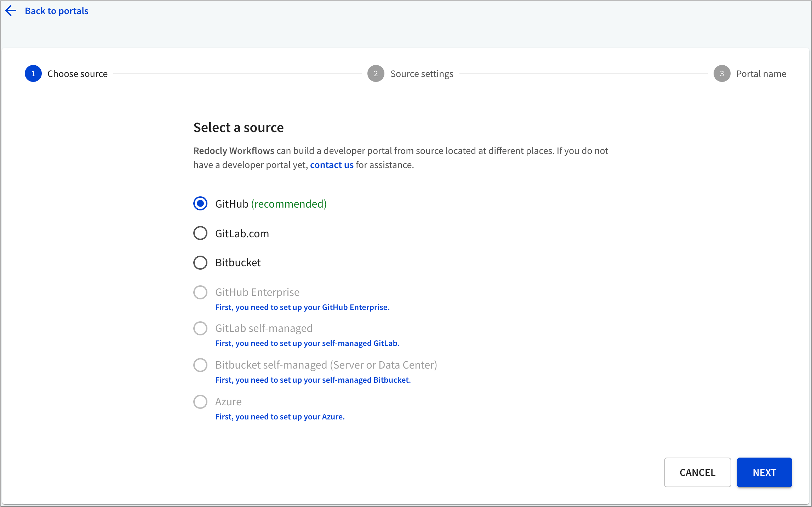
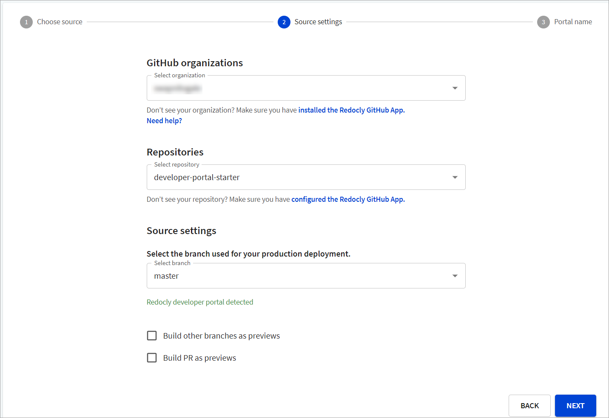
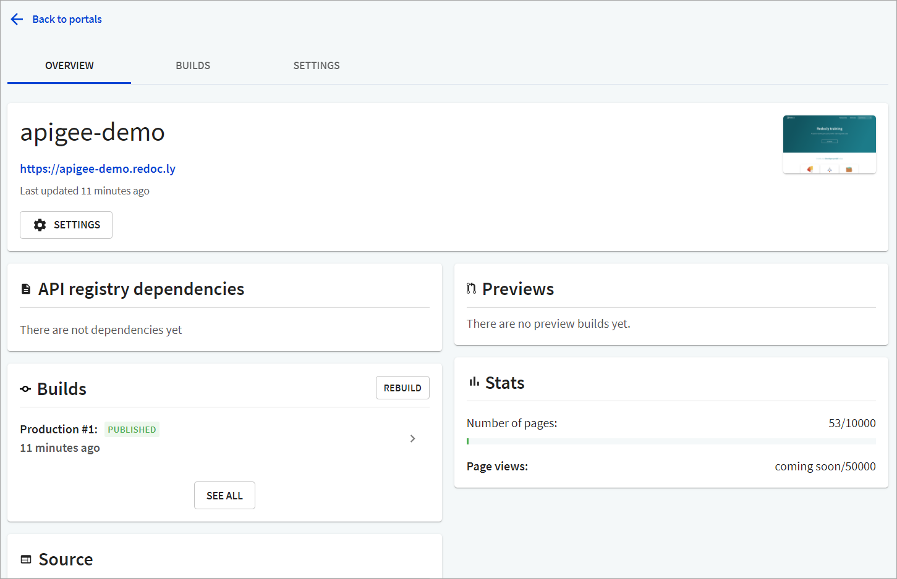

---
seo:
  title: Add a Developer portal to Workflows
excludeFromSearch: true

---

# Connect a portal




Create your [developer portal repository](./installation.md) before connecting your developer portal.


## How to add a new Developer portal

1. Log in to [Workflows](https://app.redocly.com), navigate to **Portals**.
2. Select **Create Developer Portal** (if you do not have any existing Portals) or **Add New** (if you have other existing portals). The _Choose source_ page displays.
3. Select your source control from the list of options, and select **Next**. In this example, we use GitHub as the source.
   
4. On the _Source settings_ page:

   - From _GitHub organizations_ dropdown, select the organization you want to use for this Developer portal.
   - From _Repositories_ dropdown, select the source control repository you want to use in your Developer portal.
   - Under _Source settings_, select the branch you want to use for your production site. Depending on the branch selected, a success message displays indicating that a Developer portal has been detected.
   - If you select **Build other branches as previews**, it triggers a build when a new branch is pushed or a new commit is pushed to an existing non-default branch. If a commit is pushed to your default branch, it triggers a production build.
   - If you select **Build PRs as previews**, it triggers a build when a new pull request (PR) is opened, or a new commit is pushed to any open PR.
     

5. Select **Next** to continue.
6. On the _Portal name_ page, enter a name for your portal, and select **Finish** to add the portal. The portal is now created and the _Overview_ page displays.
   

### How to use private npm packages in Developer portals

You can use private npm packages in Developer portal builds.

**npmjs.com**

To use private packages from the npmjs.com registry, [create a new access token](https://docs.npmjs.com/using-private-packages-in-a-ci-cd-workflow#create-a-new-access-token).

In your portal project, go to **Settings > Environment variables** and add a new secret variable with the name `NPM_TOKEN`.
Use the token value from the previous step.

Private packages are available on the next portal build.

**Other registries**

To support other registries (e.g. GitHub or GitLab) create a `.npmrc` file in the root of your portal repository:

```shell
# Auth for private GitHub Packages registry for modules with `@my-scope` scope 

@my-scope:registry=https://npm.pkg.github.com/OWNER
//npm.pkg.github.com/:_authToken=GH_TOKEN

# Optional auth for private npm modules (if needed) 

//registry.npmjs.org/:_authToken=${NPM_TOKEN}
```

Make sure to set up all the environment variables used in `.npmrc` file. To find out how to add environment variables, see [Using environment variables](./guides/environment-variables.md).
