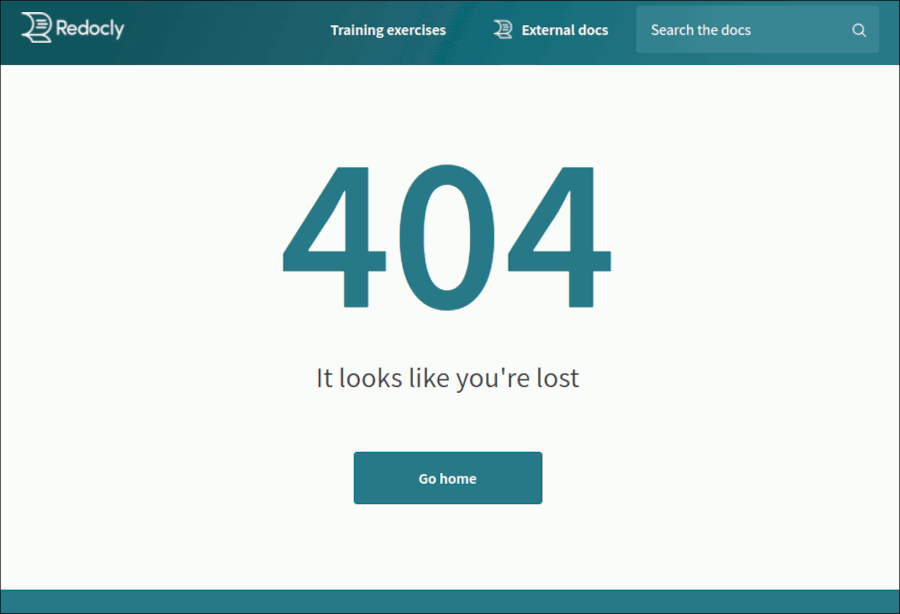
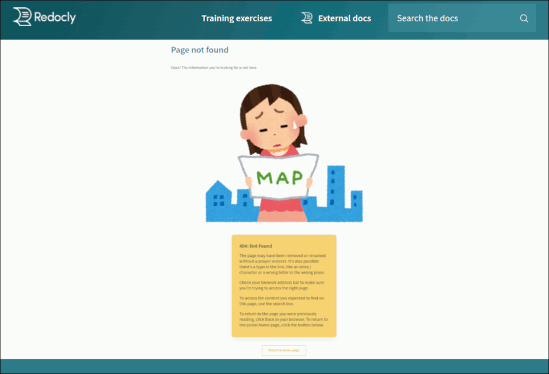

---
seo:
  title: Add a custom 404 page to your Developer portal
excludeFromSearch: true

---

# Create a custom 404 page for your Developer portal



When visitors try to access a link that doesn't exist in your Developer portal, they are automatically redirected to a "Not found" error page, also known as the 404 page.

By default, the Developer portal displays the basic built-in 404 page.



To give your visitors more information in a style that's consistent with your portal branding, you can create a custom 404 page.

The custom 404 page is supported in the Developer portal regardless of how you're hosting it (on-premise or in Workflows).

1. In the root of your portal project, create a file called `404.md`. It must be an MDX file (not a plain Markdown file), and there can only be one such file in the root of your project.
```jsx
import { Button, H1, WideTile, Flex } from '@redocly/developer-portal/ui';

<H1>Page not found</H1>

Oops! The information you're looking for is not here.


<Flex justifyContent="center" alignItems="center" flexDirection="column">
<WideTile to="#" header="404: Not Found" bgColor="#f5d271" disableArrow>
  The page may have been removed or renamed without a proper redirect.
  It's also possible there's a typo in the link, like an extra / character or
  a wrong letter in the wrong place.

  Check your browser address bar to make sure you're trying to access the right page.

  To access the content you expected to find on this page, use the search box.

  To return to the page you were previously reading, click Back in your browser.
  To return to the portal home page, click the button below.
</WideTile>

<Button to="/" variant="outlined" color="warning" size="large">
  Return to home page
</Button>
</Flex>
```

The example 404 page would look like the following screenshot.



3. Save the changes to the `404.md` file and rebuild the portal.

4. When the build is successfully completed, navigate to a link that doesn't exist in your portal. The custom page you added should load instead of the default 404 page.

