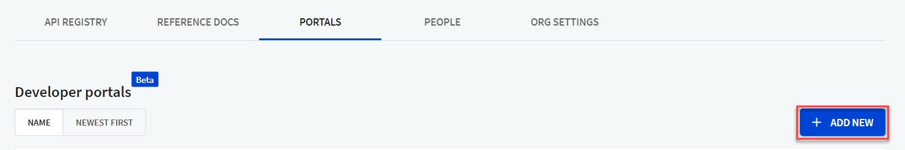
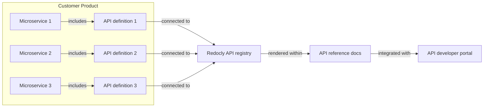

---
seo:
  title: How to document microservices APIs with the developer portal
excludeFromSearch: true

---

# Document microservices APIs with the developer portal



Microservices are commonly organized into multiple git repositories. This guide describes how to create a developer portal (using Redocly) with multiple microservices documented together.

**Note:** These are Redocly recommendations for documenting multiple microservices. You may choose to implement your microservices differently to this method.

## Step 1: Organize your microservices API definitions
Set up your microservice APIs so that each microservice API is responsible for its own API definition.

The OpenAPI definition would typically live within the same `git` repository as the microservice itself.

## Step 2: Connect each microservices API to Redocly's API registry
Redocly's preferred option is connecting the microservices APIs to git repos for three reasons:

- Automated linting
- Automated bundling (into what we call snapshots)
- Automated links to previews of the microservices API reference (useful for normal change management process such as GitHub flow, Gitflow, or trunk-based development)


If Redocly's git app cannot be installed due to security reasons (connectivity is blocked due to firewalls, etc.), you are unable to use this preferred option. Redocly has a CLI tool which can ["push" APIs](/docs/cli/commands/push) into our registry.


## Step 3: Set up a developer portal repo (that Redocly can access)
Redocly expects the developer portal source to be stored in a git repository. We recommend starting with the [developer portal starter repo](https://github.com/Redocly/developer-portal-starter), which you can use as a template.

If you do not use GitHub, you can download the template and create a repository in your preferred git provider.

## Step 4: Connect the repo to Redocly
To set up the developer portal connection in Redocly Workflows, navigate to  **Portals > Add new**.

Follow the steps to connect to your repository.


We recommend enabling previews from PRs (not for branches).


## Step 5: Add microservices APIs to your developer portal
To add microservices APIs to the developer portal, reference the external OpenAPI definitions within the developer portal by using Redocly's API registry.
For more information, see [API Registry](../../api-registry/overview.md).

Redocly's API registry keeps a record of all usages, so when you update an API (in its production branch), the developer portal is updated automatically.

Once you have added your microservices API, complete these tasks to build your developer portal content:
1. Find your [snapshot URLs](../../api-registry/guides/snapshots.md).
1. Declare your [API definitions](./reference-docs-integration-advanced.md#step-1-declare-your-api-definitions).
1. Add your `.page.yaml` file. For more information, see [Adding pages manually](./reference-docs-integration-advanced.md#step-2-add-pages-that-reference-the-definitions).
1. Define what to display in the [left navigation](../configuration/sidebar-nav.md).
1. [Customize your top navigation](./navbars-footers.md) in the `siteConfig.yaml` file.

## Diagram: Microservices API with developer portal

