---
seo:
  title: How to embed the portal into an existing website
excludeFromSearch: true

---

# Embed the developer portal into an existing website's subdirectory




This guide applies to the developer portal.


Use one of these three hosted deployment options for your developer portal.
Enterprises can also deploy it on-premise, but that's out of scope for this topic.

1.  **Whole website** - Redocly builds and hosts the entire website. For example, <https://www.rebilly.com>.

2.  **Subdomain website**- The developer portal exists on its own subdomain. For example, <https://developers.willowinc.com/>.

3.  **Subdirectory website**. The embedded developer portal displays within an existing website.
    This seamless approach makes the portal appear as if it's part of the website at a subdirectory. For example, <https://auspost.com.au/developers/>.

This guide describes how to embed the developer portal into an existing website's subdirectory.

## How the proxy request works

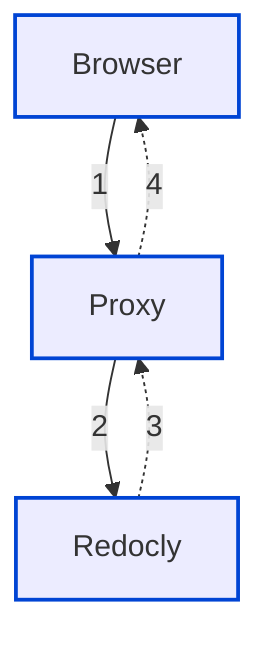

1.  The web browser makes a request to the proxy.
2.  The proxy, in turn, makes a request to Redocly, while keeping the connection open.
3.  Redocly responds to the proxy with content (HTML, CSS, JS, images, and more).
4.  The proxy forwards that response onward to the web browser.

This guide uses `https://example.com/docs/` as the example path you want the developer portal to display to users.
And this guide uses `https://example-docs.redoc.ly` as the Redocly project URL.

## Configuration in Redocly


Confirm that your content in the developer portal repository is at the root path of your repository.
The root folder behaves as if it was the `/docs` path.

In your `sidebars.yaml` and `siteConfig.yaml`, you must define relative paths to the files (for example, `./docs/my-file.md` and not `/docs/my-file.md`).

Your Portal doesn't function if you try to access the Redocly project URL directly (it works via the proxy).


### Set up the custom domain

1. In the [Redocly app](https://app.redocly.com/), open the Developer portal you want to embed and select **Settings**.
2. From the left, select General and under Custom domain, fill in your custom domain and include the subdirectory path.
   You should enter the full path that you wish to proxy to (for example, `www.example.com/docs`).

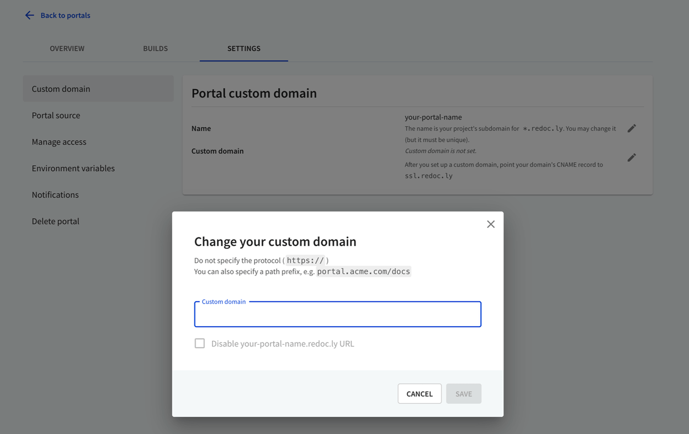

If you are using a proxy, don't change the CNAME details.

## Configure your proxy

The following section shows how to configure a proxy using these services:

- nginx
- Netlify
- AWS API Gateway
- AWS CloudFront

### nginx

Add the following code to your `nginx` configuration file.

```nginx
location /docs/ {
  proxy_ssl_server_name on;
  proxy_pass https://example-docs.redoc.ly/; # trailing slash is important here
  proxy_set_header X-Forwarded-For $proxy_add_x_forwarded_for; # X-Forwarded-For is required if you want to disable redoc.ly URL access
}
```

### Netlify

[Proxying](https://docs.netlify.com/routing/redirects/rewrites-proxies/#proxy-to-another-service) is part of Netlify's [redirects support](https://docs.netlify.com/routing/redirects/).

To configure redirect and rewrite rules for your Netlify site, create and save a plain text file named `_redirects` to your Netlify site's `publish directory`.

Add the following rewrite rule in the `_redirects` file for letting parts of your Netlify site proxy to your Redocly developer portal.

```shell
/docs/*  https://example-docs.redoc.ly/docs/:splat 200
```

This example proxies the `/docs/` path and it's important that the same exact path segment is also added to the proxy destination path `https://examples-docs.redoc.ly/docs/:splat`.

All requests to `/docs/...` proxy through to <https://example-docs.redoc.ly/docs/> straight from Netlify's CDN servers without an extra connection from the browser.

**Note**: You can't access proxied URLs during local development.

### AWS API Gateway

To configure AWS API Gateway:

1. Navigate to your gateway resources page and under Actions, select **Create Resource**.
   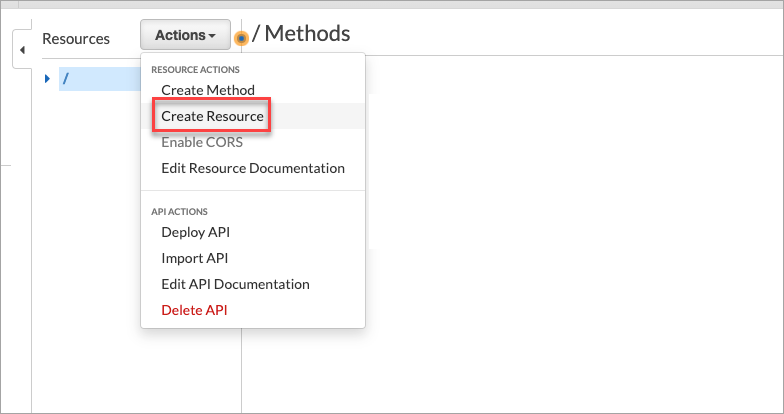
2. On the **Child Resource** page, enter `docs` in the Resource Name field, at the resource path `/docs`, and select **Create Resource**.
   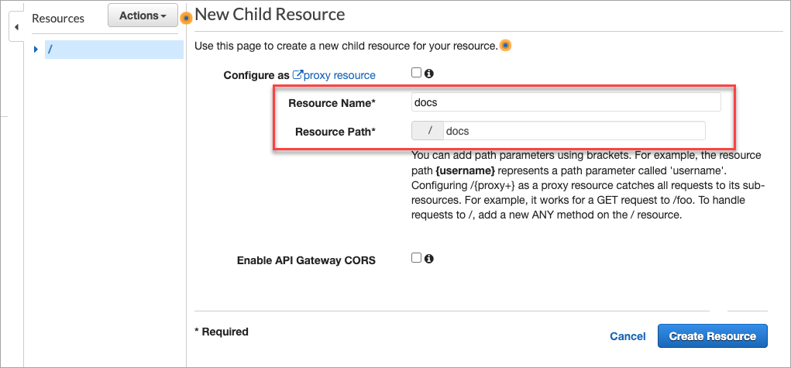
3. Select the `docs` resource and create a child resource for it.
   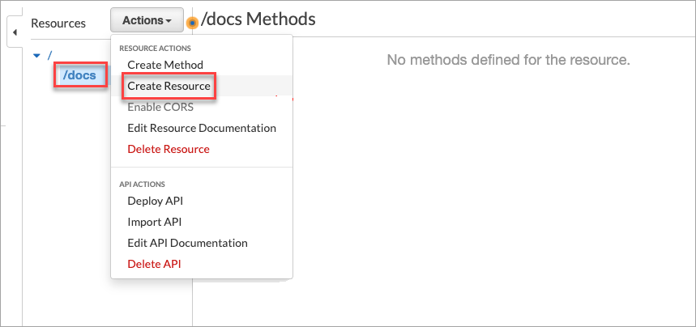
4. On the New Child Resource page:
   - Check the `proxy resource` option.
   - Enter `proxy` as the resource name.
   - In the Resource path, add `{proxy+}`.
     This catches all requests to its sub-resources, which is required for the developer portal.
     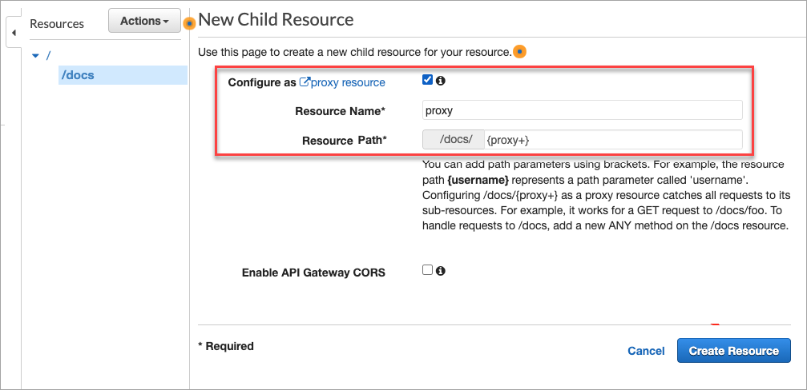
5. Once you have created the child resource, navigate to the `/docs/{proxy+}-ANY-Setup`page.
6. Under Integration type, select HTTP Proxy, and add the Redocly project URL `https://example-docs.redoc.ly/{proxy}` (with the `{proxy}` at the end). Ensure the content handling is set to **Passthrough**.
   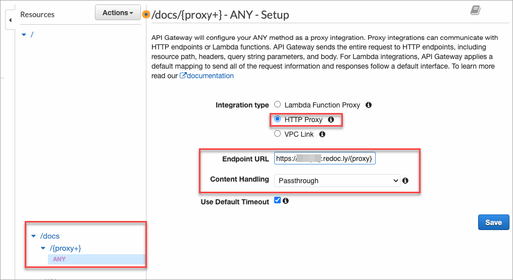
7. **Save** your changes.
8. Select the `/docs` resource, and from the **Actions** menu, select **Create Method**.
   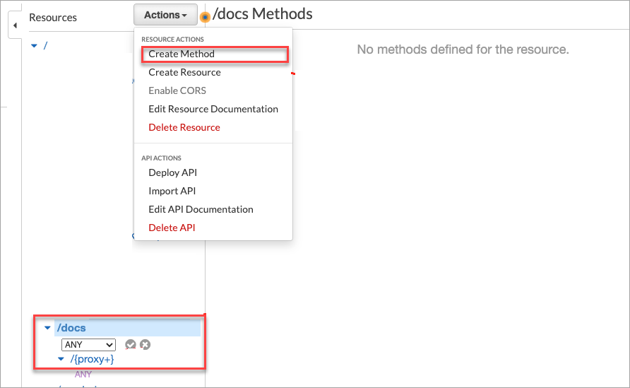
9. On the `/docs-ANY-Setup` page,
   - Select the integration type as `HTTP`,
   - Add your Redocly project URL (`https://example-docs.redoc.ly/` in this guide) with a trailing slash, and
   - Set content handling to `Passthrough`.
     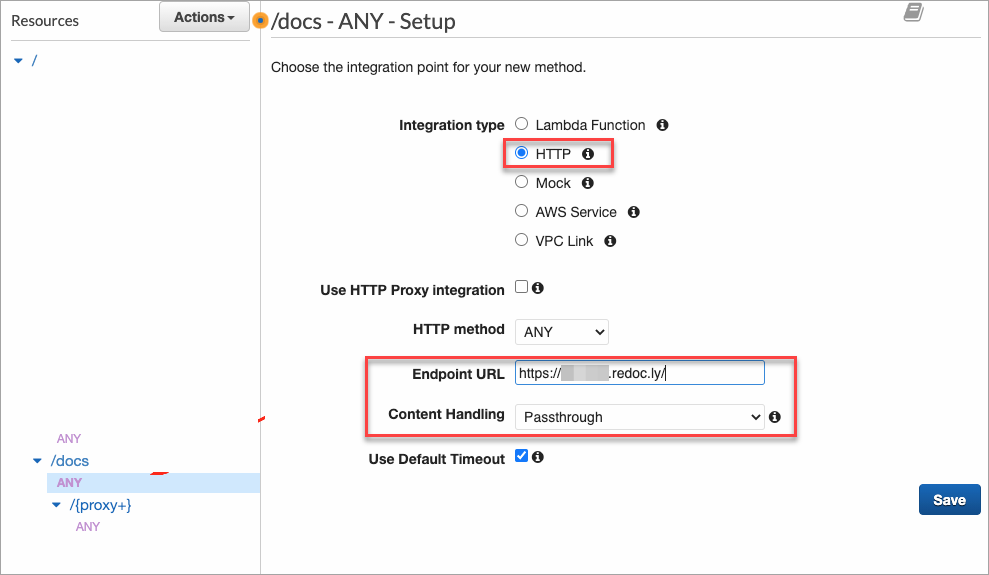
10. **Save** your changes.


Re-deploy your gateway for these changes to take effect, before you use it with Redocly.


### AWS CloudFront

To configure AWS CloudFront:

1. On the CloudFront Distributions page, select **Create Distribution**.
   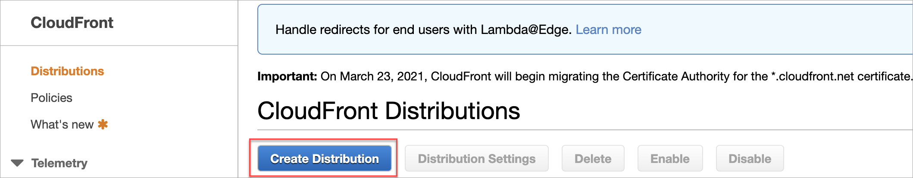
   The **Select a delivery method for your content page** displays.
2. On the **Select a delivery method for your content** page, select **Get Started**. The **Create Distribution** page displays.
3. Under Origin Settings, complete the following:
   - In the **Origin Domain Name**, enter `example.com`.
   - From **Origin Protocol Policy**, select `HTTPS Only`.
4. Under Default Cache Behavior Settings, select the following:
   - From the **Viewer Protocol Policy**, select `Redirect HTTP to HTTPS`.
   - From **Allowed HTTP Methods**, select `GET, HEAD, OPTIONS, PUT, POST, PATCH, DELETE`.
     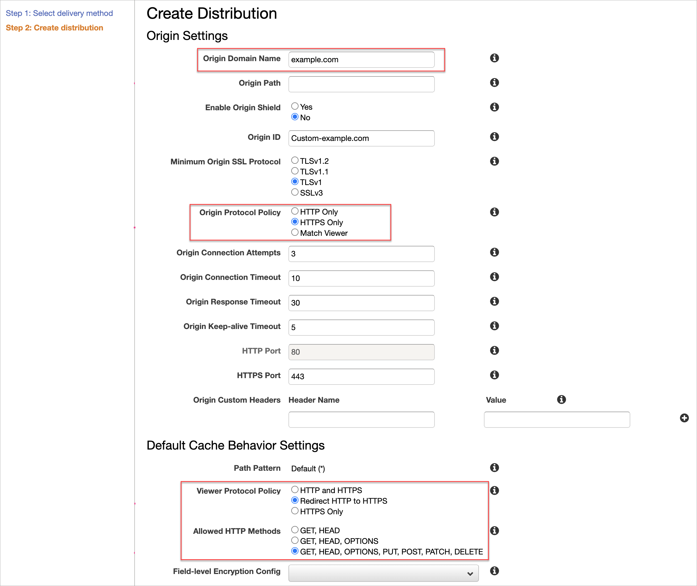
5. **Save** your changes. The new distribution is added to the CloudFront Distributions page.
   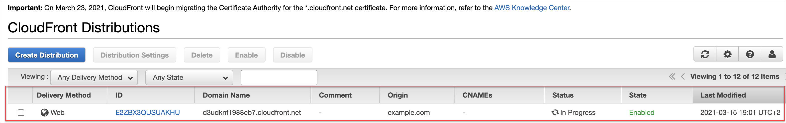
6. Select to view the Distribution details. On the Distribution details page, from the **Behaviors** tab, select **Create Behavior**.
   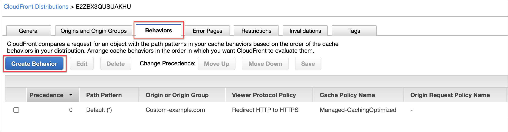
7. On the Create Behavior page, complete the following:
   - In the Path Pattern field, enter `/docs*`
   - From Cache and origin request settings, select **Use legacy cache settings**.
   - From Object Caching, select **Customize**.
   - In the Minimum TTL field, enter **86400**.
     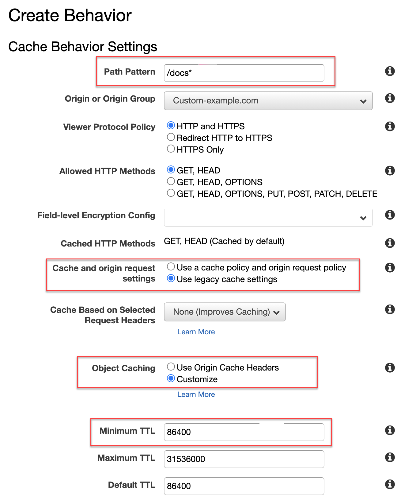
8. **Save** your changes. The CloudFront Distributions page is updated with a CloudFront Domain Name.
   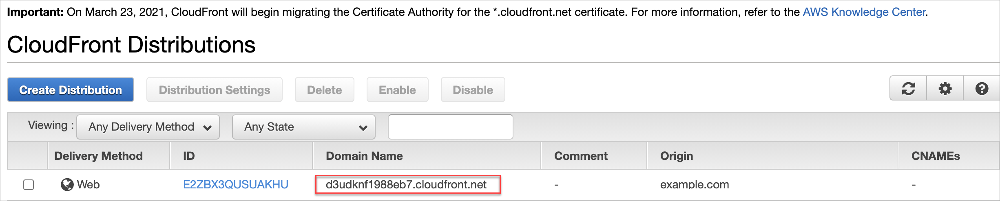
9. Navigate to Portal settings in [Redocly Workflows](https://app.redocly.com/) to add the custom domain details to the Portal.
   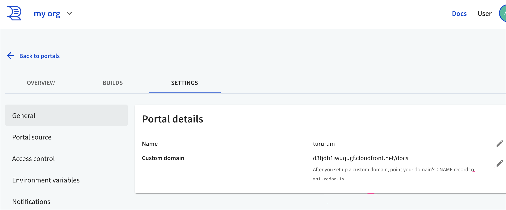
   There are two ways you can do this:
   - On the Change your custom domain dialog, in the Custom domain field, enter the **CloudFront Domain name**.
     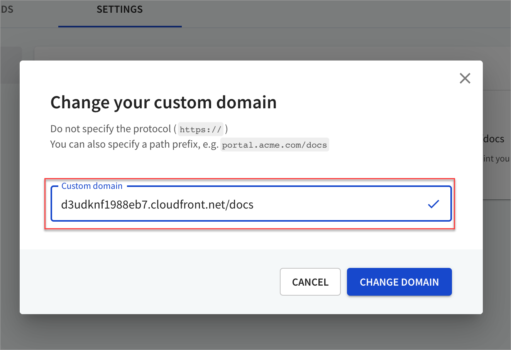
   - On the Change your custom domain dialog, in the Custom domain field, enter `example.com/docs`.
     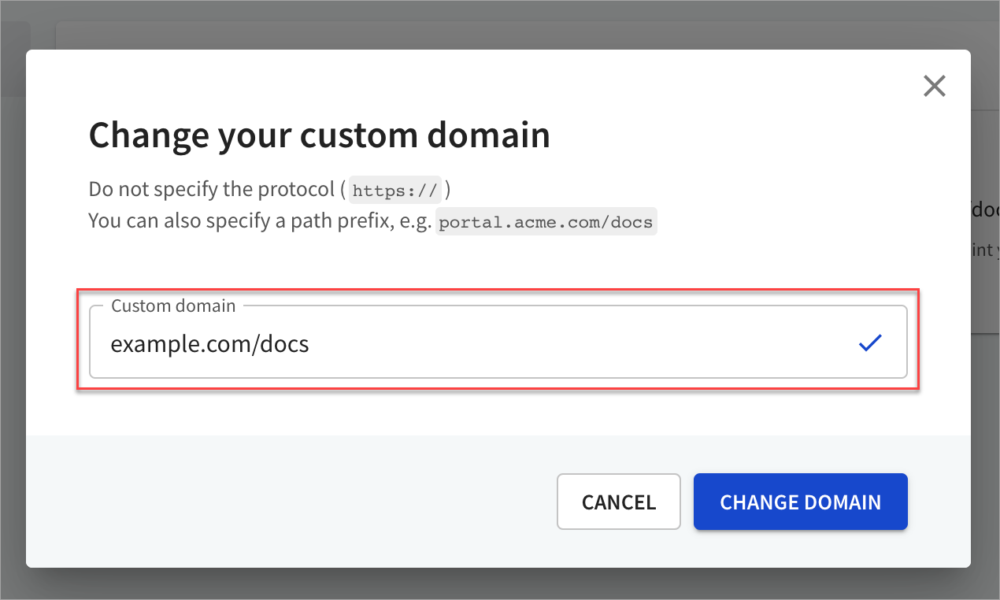

## Questions

Have questions? Using a different proxy? [Contact us.](../../../pages/contact-us/contact-us.page.tsx)
