---
seo:
  title: Set up navbars and footers
excludeFromSearch: true

---

# Customize navbars and footers



Redocly Developer portal supports optional navbar and footer elements that you can customize to help your readers access the information they need. You can control the two main aspects of these elements:

1. **Navbar and footer contents** - by modifying the [siteConfig.yaml file](../configuration/siteconfig/index.md)
2. **Navbar and footer appearance** - by modifying the [theme.ts file](../configuration/theme.md)

This guide covers the basic customization steps for your portal navbar and footer.

## Portal navbar

To display a top navigation bar in your portal, you must define its contents in the [`nav` section of the siteConfig.yaml file](../configuration/siteconfig/nav.md). If this section is not present in your `siteConfig.yaml` file, the navbar is not visible in the portal.

### Modify navbar contents

The contents of your portal navbar are displayed in the same order as they are listed in the `siteConfig.yaml` file, from left to right.

Your portal navbar can contain links to internal portal pages or to any external resource. To create internal links, use the `page` key with the path to an internal file as the value. For external links, use the `href` key with the external page URL as the value. It's recommended to enclose the URLs in quotation marks.

Every link in the navbar must have a `label` assigned to it. The `label` contents are displayed in the navbar as the link text.

**Example siteConfig.yaml file with a `nav` section**

```yaml
seo:
  title: Example Developer Portal
  description: Learn how to work with Example APIs
nav:
  - label: Training exercises
    page: developer-portal/index.md
  - label: Example page
    page: developer-portal/markdown.md
  - label: External docs
    href: 'https://google.com'
```

The result looks as follows:

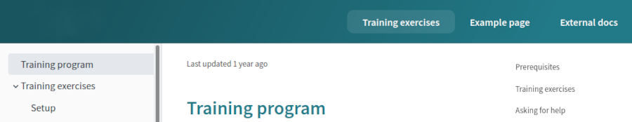

### Enable portal search

To enable the search functionality in your portal, set `search` to `true` anywhere within the `nav` section. Removing this option or setting it to `false` disables the search functionality altogether.

```yaml
nav:
  - label: Training exercises
    page: developer-portal/index.md
  - label: Example page
    page: developer-portal/markdown.md
  - label: External docs
    href: 'https://google.com'
  - search: true
```

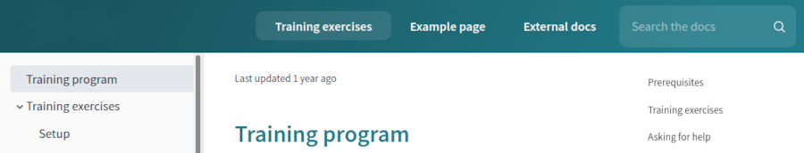

In the example above, `search` is placed at the end of the `nav` list, so that it is shown to the right of the links in the navbar.

Place it in the beginning for it to appear on the left:

```yaml
nav:
  - search: true
  - label: Training exercises
    page: developer-portal/index.md
  - label: Example page
    page: developer-portal/markdown.md
  - label: External docs
    href: 'https://google.com'
```

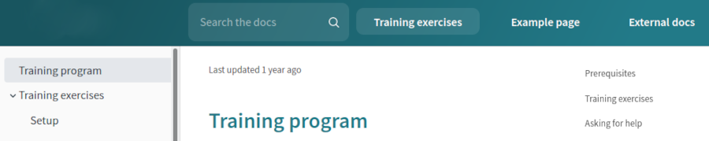

### Add custom icons to navbar links

Every link in the navbar can have an optional custom icon. This icon is displayed inline in the navbar, before the link text.

To add a custom icon to a link, use the `icon` key and provide the path to the icon file in `siteConfig.yaml` like in the following example:

```yaml
nav:
  - label: Training exercises
    page: developer-portal/index.md
  - label: Example page
    page: developer-portal/markdown.md
  - label: Example with an icon
    page: developer-portal/search.md
    icon: images/redocly-icon-white.png
  - label: External docs
    href: 'https://google.com'
  - search: true
```

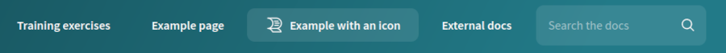

### Add a logo to the navbar

To display your logo in the portal navbar, you must:

- add some links to the navbar [in the `nav` section of the siteConfig.yaml file](../configuration/siteconfig/nav.md)

- provide the path to the logo image file [in the top level of the siteConfig.yaml file](../configuration/siteconfig/logo.md)

By default, the logo is displayed in the left side of the navbar, above the sidebar.

**Example siteConfig.yaml file with a logo and `nav` section**

```yaml
seo:
  title: Example Developer Portal
  description: Learn how to work with Example APIs
logo:
  image: ./images/logos/logo-example.png
nav:
  - label: Training exercises
    page: developer-portal/index.md
  - label: Example page
    page: developer-portal/markdown.md
  - label: Example with an icon
    page: developer-portal/search.md
    icon: images/redocly-icon-white.png
  - label: External docs
    href: 'https://google.com'
  - search: true
```

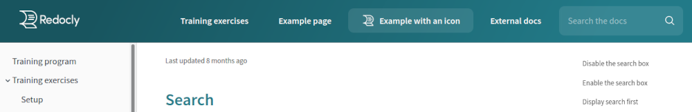

### Customize the navbar theme

To change the appearance of your portal navbar, modify the theming options [in the theme.ts file](../configuration/theme.md) in the root of your developer portal project.

All color values in the `theme.ts` file can be provided in any of the common color formats (hexadecimal value, RGB, HSL, human-friendly color names).

#### Change the navbar background color

The portal navbar supports three types of background color customization:

- plain color
- single-color gradient
- two-color gradient

For a plain navbar background, set the same value for `colors.navbar.main` and `colors.navbar.gradient` theming options. This disables the gradient.

```ts
export const defaultTheme = {
  colors: {
    tonalOffset: 0.2,
    navbar: {
      main: '#227a88',
      gradient: '#227a88',
    },
  },
};
```

For a single-color gradient, set only the `colors.navbar.main`. This generates a left-to-right linear gradient from the specified color.

For a gradient transition from one color to another, set different values for `colors.navbar.main` and `colors.navbar.gradient`. Specified colors are used as color stops in a left-to-right linear gradient.


```ts
export const defaultTheme = {
  colors: {
    tonalOffset: 0.2,
    navbar: {
      main: '#227a88',
    },
  },
};
```


```ts
export const defaultTheme = {
  colors: {
    tonalOffset: 0.2,
    navbar: {
      main: 'black',
      gradient: 'blue',
    },
  },
};
```



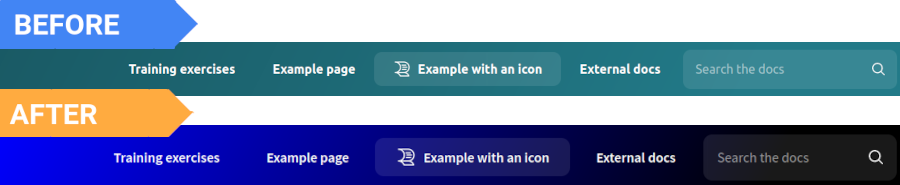

#### Change the color and font of navbar items

The option `colors.navbar.contrastText` controls the color of navbar links. Use the options `navbar.activeBgColor` and `navbar.activeTextColor` to change the background and text colors of active (selected) links in the navbar.

The `navbar.activeTextDecoration` option lets you add emphasis to selected links in the navbar by using [standard text-decoration CSS property syntax](https://developer.mozilla.org/en-US/docs/Web/CSS/text-decoration).

```ts
export const defaultTheme = {
  colors: {
    navbar: {
      main: 'black',
      contrastText: 'white',
    },
  },
  navbar: {
    activeBgColor: 'orange',
    activeTextColor: 'white',
    activeTextDecoration: 'dashed underline',
  },
};
```

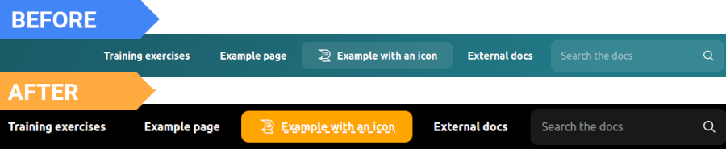

Navbar links don't have dedicated font-related theming options, so you can't control their fonts directly. By default, navbar links inherit the font family from the `typography.headings.fontFamily` option. Modifying this option changes the navbar link font, but it also affects other elements in the portal.

```ts
export const defaultTheme = {
  typography: {
    headings: {
      fontFamily: 'Ubuntu',
    },
  },
};
```

#### Adjust the spacing between navbar items

The options `navbar.marginHorizontal` and `navbar.marginVertical` control the spacing between items in the navbar (links, search bar - if enabled).

Use the option `navbar.borderRadius` to set rounded corners for selected navbar links and for the search bar.

To add more space between the navbar and the text in the main content area, use the `components.contentWrapper.paddingVertical` option. Keep in mind that this option also controls the spacing between the main content area and the footer.

```ts
export const defaultTheme = {
  components: {
    contentWrapper: {
      paddingVertical: '70px',
    },
  },
  navbar: {
    borderRadius: '20px',
    marginHorizontal: '10px',
    marginVertical: '10px',
  },
};
```


#### Modify the search icon

The `components.search` object lets you change the search icon color and replace the default search icon with a custom one. You must format your custom icon as a set of SVG properties inside `<svg> ... </svg>` tags. The search functionality must be enabled in the portal for these theming options to apply.

```ts
export const defaultTheme = {
  components: {
    search: {
      icon: '<svg xmlns="http://www.w3.org/2000/svg" fill="#000" viewBox="0 0 451.847 451.847" width="12px" height="12px" ><path d="M225.923 354.706c-8.098 0-16.195-3.092-22.369-9.263L9.27 151.157c-12.359-12.359-12.359-32.397 0-44.751 12.354-12.354 32.388-12.354 44.748 0l171.905 171.915 171.906-171.909c12.359-12.354 32.391-12.354 44.744 0 12.365 12.354 12.365 32.392 0 44.751L248.292 345.449c-6.177 6.172-14.274 9.257-22.369 9.257z" /></svg>',
      iconColor: 'orange',
    },
  },
};
```

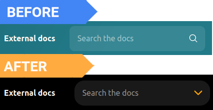

#### Adjust the logo image size

The `logo` object lets you control how the logo image scales within the navbar. Note that modifying these options may result in distortion of the logo image. Changing the logo image height also affects the total height of the navbar.

```ts
export const defaultTheme = {
  logo: {
    height: '100px',
    maxHeight: '100%',
    maxWidth: '120%',
    }
  }
}
```

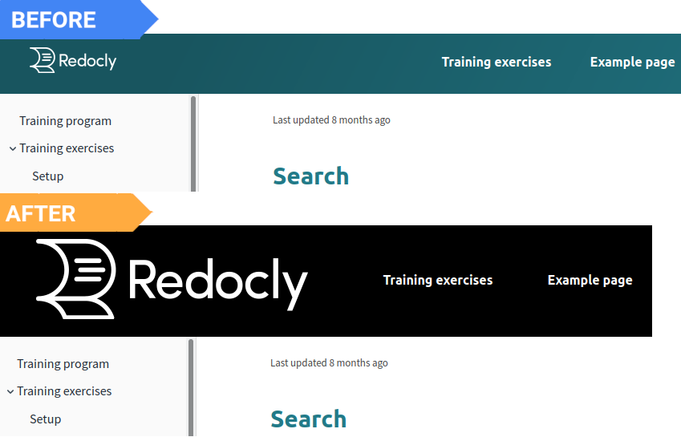

## Portal footer

To display a footer (bottom navigation bar) in your portal, you must define the footer contents in the [`footer` section of the siteConfig.yaml file](../configuration/siteconfig/footer.md). If this section is not present in your `siteConfig.yaml` file, the footer is not visible in the portal.

### Modify footer contents

The contents of your portal footer are displayed in the same order as they are listed in the `siteConfig.yaml` file.

Your portal footer can contain:

- links to internal portal pages or to any external resource.
- custom copyright text. By default, this text is always displayed at the very bottom of the footer, under the links.

To create internal links, use the `page` key with the path to an internal file as the value. For external links, use the `href` key with the external page URL as the value. It's recommended to enclose the URLs in quotation marks.

Every link in the footer must have a `label` assigned to it. The `label` contents are displayed in the footer as the link text.

Footer links should be grouped into columns. Each `group` is displayed as one column, and can have a custom title.

**Example siteConfig.yaml file with a `footer` section**

```yaml
footer:
  copyrightText: Copyright © Redocly 2019-2021. All rights reserved.
  columns:
    - group: Legal
      items:
        - label: Terms of Use
          href: 'https://redocly.com/subscription-agreement/'
        - label: Privacy Notice
          href: 'https://redocly.com/privacy-policy/'
        - label: Cookie Notice
          href: 'https://redocly.com/privacy-policy/'
    - group: Support
      items:
        - label: FAQ
          page: faq.md
        - label: Contact us
          page: contact.md
```



Custom icons for links are supported only in the portal navbar, not in the footer. You cannot use the `icon` key with footer links.


### Customize the footer theme

To change the appearance of your portal footer, modify the theming options [in the theme.ts file](../configuration/theme.md) in the root of your developer portal project.

All color values in the `theme.ts` file can be provided in any of the common color formats (hexadecimal value, RGB, HSL, human-friendly color names).

#### Change the footer background color

Use the `colors.footer.main` option to set a custom background color for the footer.

```ts
export const defaultTheme = {
  colors: {
    footer: {
      main: 'black',
    },
  },
};
```

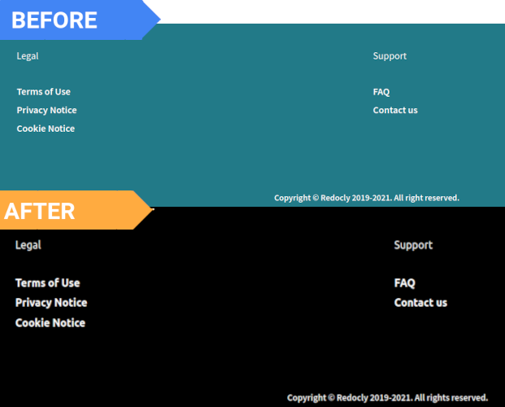

#### Change the color and font of footer items

The `colors.footer.contrastText` option controls the color of all items in the footer, including links, column names, and copyright text.

```ts
export const defaultTheme = {
  colors: {
    footer: {
      contrastText: 'orange',
      main: 'black',
    },
  },
};
```

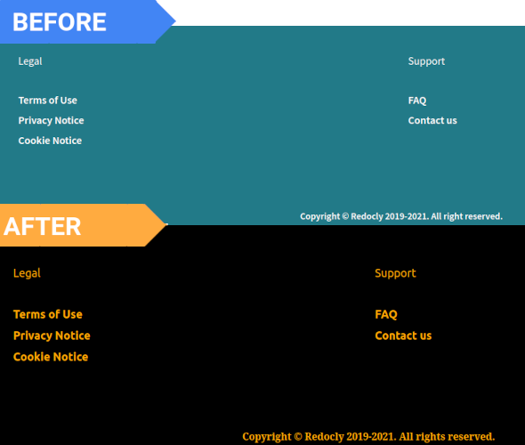

Footer items don't have dedicated font-related theming options, so you can't control their fonts directly. By default, footer links inherit the font family from the `typography.headings.fontFamily` option, and the size from `typography.fontSize`. Copyright text inherits the font family from `typography.fontFamily`, and the size from `typography.fontSize`.

Modifying these options changes the footer text, but it also affects many other elements in the portal.

```ts
export const defaultTheme = {
  typography: {
    fontFamily: 'serif',
    fontSize: '18px',
    headings: {
      fontFamily: 'Ubuntu',
    },
  },
};
```

## Open navbar and footer links in a new tab or window

You can make navbar and footer links open in a new browser tab or window by adding special properties to each link in the `siteConfig.yaml` file.

For internal links (`page` key), add the `external: true` property. For external links, use either `external: true` or the `target: _blank` property.

Links with `external: true` automatically get an indicator icon displayed next to the link text. This applies to internal and external links, in navbar and footer alike.

**Example siteConfig.yaml file with `nav` and `footer` sections**

```yaml
nav:
  - label: Example with an icon
    page: developer-portal/search.md
    icon: images/redocly-icon-white.png
  - label: External docs
    href: 'https://google.com'
    external: true
  - search: true

footer:
  - group: Legal
      items:
        - label: Terms of Use
          href: 'https://redocly.com/subscription-agreement/'
          target: _blank
        - label: Privacy Notice
          href: 'https://redocly.com/privacy-policy/'
          external: true
        - label: Cookie Notice
          href: 'https://redocly.com/privacy-policy/'
          external: true
```

In the screenshots below, note how the link with `target: _blank` doesn't have the indicator icon, while all links with `external: true` have the icon.

**Portal navbar with a link that opens in a new tab**

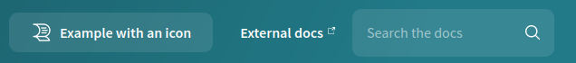

**Portal footer with a link that opens in a new tab**

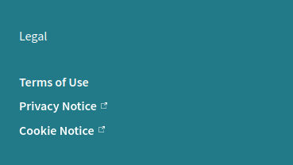


If your link is created as a JSX element in the React component, you can add inline style: target="\_blank".

Example:
`<Link target="_blank" to={item.link}>{item.label}</Link>`



## Further customization

The navbar and footer can be completely customized by creating React components that override the default components.

If you're interested, contact us.
