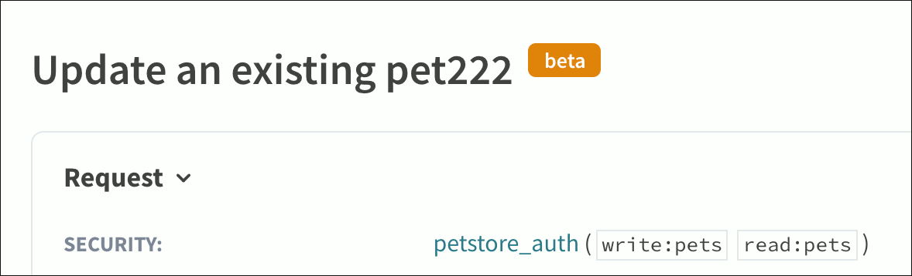

# API docs hooks




API docs hooks are supported from version `1.1.0-beta.28`.



Hooks give you greater control over some parts of integrated API docs in your developer portal.

Use API docs hooks to:

- [API docs hooks](#api-docs-hooks)
  - [Steps](#steps)
  - [Example 1: Install the "Try it" request interceptor](#example-1-install-the-try-it-request-interceptor)
  - [Example 2: Preset values of "Try it" parameters based on user claims](#example-2-preset-values-of-try-it-parameters-based-on-user-claims)
  - [Example 3: Override the "Try it" console Security panel](#example-3-override-the-try-it-console-security-panel)
  - [Example 4: Install analytics on "Try it" panel events](#example-4-install-analytics-on-try-it-panel-events)
  - [Example 5: Add the Beta badge to operations](#example-5-add-the-beta-badge-to-operations)


## Steps

1. Create a folder called `_override` in the root of your portal project (if it doesn't already exist).
The underscore at the beginning of the folder name means the folder is treated as "hidden", and the content inside the folder is not accessible to your portal visitors.

2. In the `_override` folder, create a file called `ReferenceDocsHooks.tsx`.
Define your hooks in this file.
The examples in this guide contain working code that you can add to your `ReferenceDocsHooks.tsx` file.

3. Save changes to the `ReferenceDocsHooks.tsx` file.

4. Make sure to restart your portal development server (or rebuild your portal project) for changes to apply.


## Example 1: Install the "Try it" request interceptor

```tsx _override/ReferenceDocsHooks.tsx
export function requestInterceptor(req, operation) {
  console.log('Request:', req, rawOperation);

  // you get the operation model with raw operation info from the OAS definition
  const rawOperation = operation.operationDefinition;

  // you can manipulate headers, e.g. inject header based on req body
  req.headers['x-body-length'] = req.body?.length;

  // you can also change the req URL
  req.url = '/proxy' + req.url;

  return req;
}
```

## Example 2: Preset values of "Try it" parameters based on user claims

In addition to parameter values, this example shows how to preset security details in the *Try it* console.

```tsx _override/ReferenceDocsHooks.tsx
import { setParameterValue, setSecurityDetails, getUserClaims } from '@redocly/developer-portal/ui';

export function onInit() {
  const claims = getUserClaims(); // you can use user claims if login is enabled or get value from other place

  // setParameterValue(in, name, value)
  setParameterValue('path', 'petId', 25);
  setParameterValue('header', 'x-user-email', claims?.email);

  setSecurityDetails('api_key', 'sk_123123'); // 'api_key' is the security scheme id from the OAS definition
  setSecurityDetails('my_oauth2', {
    client_id: 'user1',
    client_secret: 'secret123'
  });
}
```

## Example 3: Override the "Try it" console Security panel

This is a basic example of the custom Security panel which loads a list of apps with API keys based on user identity, and lets the user choose between them.

Add any React component to the `_override/ReferenceDocsHooks.tsx` file.

The key is to call `onChange` callback to provide auth details back to Reference docs *Try it* panel.

```tsx _override/ReferenceDocsHooks.tsx
import * as React from 'react';
import { useState } from 'react';
import { SecurityPanelHookProps, getIdPJwt, getUserClaims, Dropdown } from '@redocly/developer-portal/ui';

export function ReplaceTryItSecurityPanel({ operation, server, onChange, OAuth2 }: SecurityPanelHookProps) {
  const [error, setError] = useState(null);
  const [apps, setApps] = useState([]);
  const [loading, setLoading] = useState(false);
  const [tokenLoading, setTokenLoading] = useState(false);
  const [selectedAppIdx, setSelectedAppIdx] = useState<any>(-1);

  // let's take the first scheme for example
  const authScheme = operation.security[0].schemes[0];

  const userIdPJwt = getIdPJwt();
  const userClaims = getUserClaims();

  React.useEffect(() => {
    run();
    async function run() {
      setLoading(true);
      try {
        // fetch apps based on user token
        const apps = fetch('...', {
          headers: { Authorization: userIdPJwt }
        });

        setApps(apps);

        setSelectedAppIdx(-1);
        setLoading(false);
      } catch (e) {
        setError(e.message);
        setLoading(false);
      }
    }
  }, []);


  const handleSelect = item => {
    setSelectedAppIdx(item.idx);

    // call onChange to pass auth details back ot reference docs
    // pass string for API Key
    onChange({
      [authScheme.id]: item.accessKy
    });

    // for basic auth
    // onChange({
    //   [authScheme.id]: { username: 'xxx', password: 'xxx' },
    // });

    // for oauth2
    // onChange({
    //   [authScheme.id]: { token: { access_token: 'test' } },
    // });
  };

  if (loading) {
    return 'Loading apps...';
  }

  const options = apps.map((app, idx) => ({ idx, value: app.name, key: app.accessKey }));

  return (
    <div>
      <h4 style={{marginTop: 0}}> Select app: </h4>
      <Dropdown
        fullWidth
        variant="dark"
        onChange={handleSelect}
        value={options[selectedAppIdx]?.value}
        options={options}
      />
      {error}
    </div>
  );
}
```

Simplify the OAuth2 token exchange with our helper library.


```js
OAuth2.authorizeClientCredentials({
  tokenUrl: authScheme.flows.clientCredentials.tokenUrl,
  clientId: apps[selectedAppIdx].client_id,
  clientSecret: apps[selectedAppIdx].client_secret,
  scopes: [],
  successCallback: token => {
    setTokenLoading(false);
    onChange({
      [authScheme.id]: { token },
    });
  },
  errorCallback: e => {
    setTokenLoading(false);
    setError(e.message);
  },
});
```


```js
OAuth2.authorizeAuthorizationCode({
  authorizationUrl: authScheme.flows.clientCredentials.authorizationUrl,
  tokenUrl: authScheme.flows.clientCredentials.tokenUrl,
  clientId: apps[selectedAppIdx].client_id,
  clientSecret: apps[selectedAppIdx].client_secret,
  scopes: [],
  successCallback: token => {
    setTokenLoading(false);
    onChange({
      [authScheme.id]: { token },
    });
  },
  errorCallback: e => {
    setTokenLoading(false);
    setError(e.message);
  },
});
```


```js authorizeImplicit
OAuth2.authorizeImplicit({
  authorizationUrl: authScheme.flows.clientCredentials.authorizationUrl,
  clientId: apps[selectedAppIdx].client_id,
  scopes: [],
  successCallback: token => {
    setTokenLoading(false);
    onChange({
      [authScheme.id]: { token },
    });
  },
  errorCallback: e => {
    setTokenLoading(false);
    setError(e.message);
  },
});
```


## Example 4: Install analytics on "Try it" panel events



To use this hook, you must enable corresponding [analytics plugins](../configuration/siteconfig/analytics.md) in `siteConfig.yaml` of your portal.




```tsx
declare global {
  // make Typescript happy
  interface Window { ga: any; }
}
export const events = {
  tryItOpen: (event) => { // both left and right panels
    console.log('Event:', event);
    // Google Analytics available only in prod mode
    if (!window.ga) return;
    window.ga(`send`, `event`, {
      eventCategory: event.eventType,
      eventAction: event.action,
      eventLabel: event.resource,
    });
  },
  tryItSent: (event) => {
    console.log('Event:', event);
    // Google Analytics available only in prod mode
    if (!window.ga) return;
    window.ga(`send`, `event`, {
      eventCategory: event.eventType,
      eventAction: event.action,
      eventLabel: event.resource,
    })
  },
  // ...
}
```


```tsx
declare global {
  // make Typescript happy
  interface Window { amplitude: any; }
}

export const events = {
  tryItOpen: (event) => { // both left and right panels
    console.log('Event:', event);
    // Amplitude Analytics is available only in prod mode
    if (!window.amplitude) return;
    const { eventType, ...eventProps } = event;
    window.amplitude.getInstance().logEvent(eventType, eventProps);
  },
  tryItSent: (event) => {
    console.log('Event:', event);
    // Amplitude Analytics is available only in prod mode
    if (!window.amplitude) return;
    const { eventType, ...eventProps } = event;
    window.amplitude.getInstance().logEvent(eventType, eventProps);
  },
  // ...
}
```



For the full list of available events refer to [Reference docs configuration for events](/docs-legacy/api-reference-docs/configuration/functionality.md)


## Example 5: Add the Beta badge to operations

This example shows how to add a "Beta" badge to an operation in your Reference docs.

Before setting up the hook in your `ReferenceDocsHooks.tsx` file, you must first add the `x-beta: true` property to the operation in your OpenAPI document.

The following excerpt from an OpenAPI document shows an operation with the `x-beta: true` property.

```yaml
paths:
  /pet:
    put:
      summary: Update an existing pet222
      description: 'This operation is currently in beta - work in progress!'
      operationId: updatePet
      x-beta: true
      security:
        - petstore_auth:
            - 'write:pets'
            - 'read:pets'
      responses:
        '400':
          description: Invalid ID supplied
        '404':
          description: Pet not found
        '405':
          description: Validation exception
      requestBody:
        $ref: '#/components/requestBodies/Pet'
```

You can add this property to multiple operations in your OpenAPI document.
Make sure you're adding it to the correct OpenAPI file - the one that's [integrated into your portal](reference-docs-integration.md).

Next, set up the hook by adding the following code to `ReferenceDocsHooks.tsx`.

```tsx
import * as React from 'react';
import styled from 'styled-components';

export function AfterOperationSummary({ operation }) {
  // you get the operation model with raw operation info from the OAS definition
  const rawOperation = operation.operationDefinition;
  if (rawOperation['x-beta']) {
    return <Badge> beta </Badge>;
  } else {
    return null;
  }
}

const Badge = styled.span`
  background: #e1850f;
  border-radius: 5px;
  margin-left: 10px;
  padding: 2px 10px;
  font-size: 14px;
  vertical-align: super;
  color: white;
`;
```

The "Beta" badge is displayed in your API docs next to the operation summary.



To change the appearance of the "Beta" badge, modify the CSS values under `const Badge = styled.span`.
In this example, we used `background` to set the color of the badge to orange, and `color` to make the "Beta" text white.

To change the text displayed on the badge, modify the contents of the `<Badge></Badge>` tag.
In this example, we used `beta` as the text, but you might want to make it uppercase (`Beta`).

