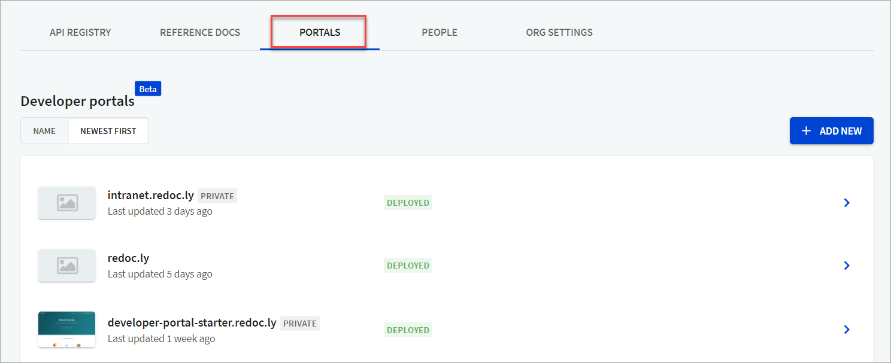
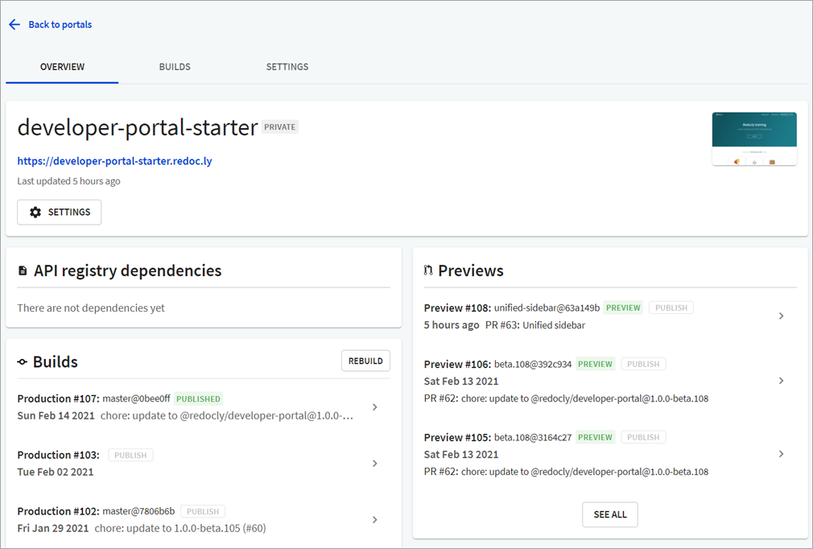
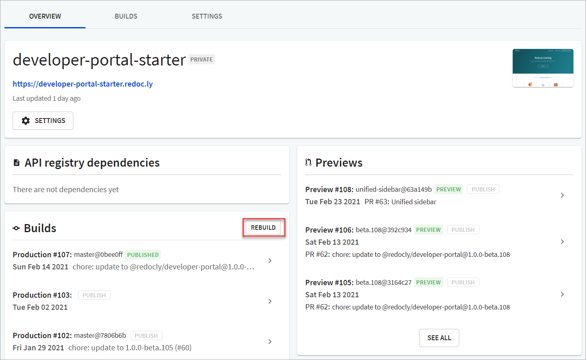
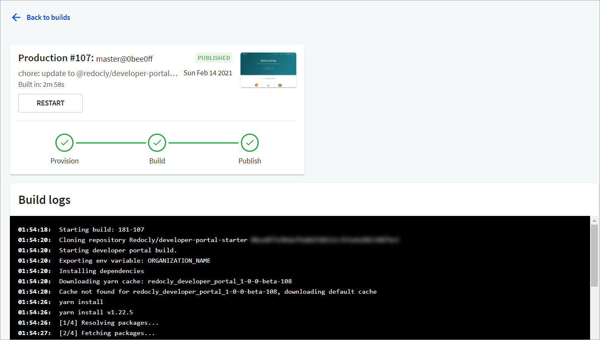

---
seo:
  title: Restart portal builds using the Redocly app
excludeFromSearch: true

---

# Restart portal builds



Redocly provides automated builds when you make and commit changes to your OpenAPI definition via Pull Requests, so you can preview these changes before you publish them on your live site.

Once you have set up your Developer Portal using [Redocly Workflows](https://app.redocly.com), you can manage and view these previews from the **Portals** tab.

Sometimes, there could be errors that may prevent you from building the production site or your builds could fail for various reasons. You can restart portal builds from the Overview page.

## How to restart portal builds

1. From [Redocly Workflows](https://app.redocly.com), select **Portals** to view a list of your Developer portals.

2. Select the portal you want to rebuild. The **Overview** page displays.

3. On the **Overview** page, under **Builds**, select **Rebuild** to restart the portal build.

## About the portal build logs


Every portal build has associated build logs that you can use to troubleshoot or rectify any errors before you restart the build.


To view the build page, on the **Overview** page, under **Builds**, select the production build you want to view details. The Production build page displays the build information, and detailed build logs.

You can use these logs to:
- Track warnings,
- Troubleshoot errors, and
- View the status of the build.
