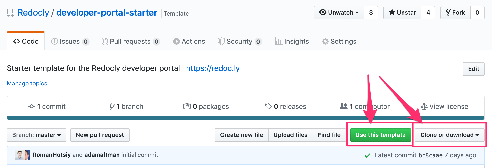

---
seo:
  title: How to install the developer portal
excludeFromSearch: true

---

# Install the developer portal



## Prerequisites

* Install [`yarn`](https://yarnpkg.com/getting-started/install).
* Choose a terminal application to work with command line. It can either be a built-in one or third-party tools like [Git Bash](https://gitforwindows.org/) or [iTerm2](https://iterm2.com).
* Learn [common git techniques](https://docs.gitlab.com/ee/gitlab-basics/start-using-git.html) (create a branch, commit changes, create a pull request, etc.)
* Get familiar with [Markdown](https://commonmark.org/help/).
* Choose an application to work with source files. We recommend using [Visual Studio Code](https://code.visualstudio.com).

<!-- If any of these assumptions are incorrect, please let us know and we can find resources to help you acquire that knowledge. -->

## Install the portal

1. Create a repository based on the [template](https://github.com/Redocly/developer-portal-starter).

    

    The template includes a tutorial for you to familiarize with the features and functionality.

1. Install the project.

    ```bash
    yarn install --ignore-optional
    ```

    

    We recommend using the `--ignore-optional` flag to prevent possible issues with the installation of dependencies in the latest versions of the developer portal (Apple Mac users with M1 chips are mostly affected). For more information, please refer to [Redocly/developer-portal-starter#61](https://github.com/Redocly/developer-portal-starter/issues/61).

    

## Run the development server

```bash
yarn start
```

Wait for the terminal to show the following lines:

```bash
You can now view portal-template in the browser.

  http://localhost:3000/
```

After that, you can navigate to the specified address in the browser to preview your files on the local server.

## Troubleshoot installation

If an error occurs during installation, delete the `yarn.lock` file, and then try to install it again.

```bash
rm yarn.lock
yarn install
```
If the installation problem persists, please contact us.

### Set up package resolutions

When installing the portal, you may get warning messages in the log about detected vulnerabilities.
Similarly, if you are using any security auditing tools or dependency scanning utilities, they may indicate a large amount of vulnerable packages in the portal.

This issue is caused by one of our core dependencies, `gatsby`, which by default requires a lot of packages, even though many of them are not used at all in the Developer portal.
Many of the vulnerabilities reported in those packages are not exploitable, but they still get reported as security issues.
To understand why this happens, read more about problems with [npm package auditing](https://overreacted.io/npm-audit-broken-by-design/).

Because Redocly doesn't have control over the majority of those packages, we can't fix the reported vulnerabilities in them directly.
Instead, we recommend setting up [package resolutions](https://yarnpkg.com/configuration/manifest#resolutions).
With this approach, you can override package versions that are reported as problematic.



Changing package resolutions may cause unexpected behavior in your portal.


To set up package resolutions and avoid vulnerability warnings, add the following `resolutions` section to your `package.json` file:

```json
"resolutions": {
    "styled-components": "5.3.3",
    "immer": "9.0.12",
    "xmlhttprequest-ssl": "1.6.3",
    "axios": "0.21.4",
    "object-path": "0.11.8",
    "prismjs": "1.26.0",
    "postcss": "8.4.6",
    "css-what": "6.0.1",
    "trim-newlines": "3.0.1",
    "glob-parent": "5.1.2",
    "ws": "7.5.5",
    "dns-packet": "1.3.4",
    "browserslist": "4.19.1",
    "trim": "0.0.3",
    "sanitize-html": "2.7.0",
    "engine.io": "4.1.2",
    "normalize-url": "4.5.1",
    "semver-regex": "3.1.3",
    "path-parse": "1.0.7",
    "ansi-regex": "5.0.1",
    "nth-check": "2.0.1",
    "url-parse": "1.5.4",
    "simple-get": "4.0.1",
    "follow-redirects": "1.14.8",
    "marked": "4.0.12",
    "tar": "6.1.9"
}
```


**Redocly tests all recommended resolutions and updates this list regularly.** Make sure to check this documentation page for updates.

As this is only a short-term solution, we're working on the long-term one.
Our long-term solution includes replacing the current Developer portal codebase with a more modern, improved one controlled by Redocly.
