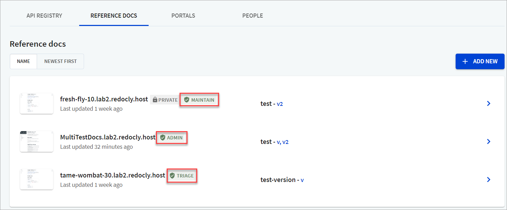

# Roles and permissions

Redocly allows customers to customize access for their organization users (known as `People` in Redocly) with granular permission levels.

You can set roles at two levels in Redocly:

- **Organization**: When you sign up for a plan with Redocly, you create an organization to access our products via the [Workflows](https://app.redocly.com) app.
- **Project**: A project refers to any API in API registry, Reference docs or Developer portal you create using the [Workflows](https://app.redocly.com) app.

In one particular organization, users can have one organization-level role and several project-level roles (one per project within an organization).
The same user can have another organization-level role in another organization.

## Organization-level roles

Using [Workflows](https://app.redocly.com), administrators can set these roles at the organization level for each person in the organization:

- **Owner**: Has permissions to do everything, including inviting people, changing access controls for other members, and closing the organization's account.
- **Member** - By default, has permissions to create new APIs, Reference, and Portals, but is not allowed to change access controls, invite people or manage other organization settings.
- **Participant** - By default, has permissions only to read the APIs, Reference, and Portals.
  Access is restricted to everything else.


You can change default permissions for **Member** and **Participant** organization-level role with enterprise plans only. For more details, refer to the [Role privileges](../settings/role-privileges.md) topic.


### Organization-level permissions

Here is a table highlighting the permissions for these roles at the organization level.

| Permission                                            | Owner | Member | Participant |
| ----------------------------------------------------- | ----- | ------ | ----------- |
| Has access to organization settings                   | ✔️    |        |             |
| Can invite other people (members) to the organization | ✔️    |        |             |
| Can change people (member) roles                      | ✔️    |        |             |
| Can see other users in the People list                | ✔️    | ✔️     |             |
| Can see teams and team members                        | ✔️    | ✔️     |             |
| Can see Member invites                                | ✔️    | ✔️     |             |
| Can create new projects                               | ✔️    | ✔️     |             |

## Project-level roles

Using the [Workflows](https://app.redocly.com) app, people can be assigned roles at a project level:

- **Admin**: Has permission to do everything across projects they have created, but have limited access to features across other projects where they may just have a `Maintain` role assigned.
- **Maintain** - Has permission to create new APIs, Reference docs, and Developer portals, but is not allowed to change project settings.
- **Triage** - Has permission to access logs, but is not allowed to change project settings.
- **Read** - Has restricted access to projects.

Depending on your role within a project, you have access to specific features in the Workflows app. This is indicated by the `Admin`, `Maintain`, `Triage`, or the `Read` labels displayed on the Projects list.

### Project-level permissions

| Permission                       | Admin | Maintain | Triage | Read |
| -------------------------------- | ----- | -------- | ------ | ---- |
| **API Registry**                 |       |          |        |      |
| View API                         | ✔️    | ✔️       | ✔️     | ✔️   |
| Edit API                         | ✔️    |          |        |      |
| Manage individual API settings   | ✔️    |          |        |      |
| Manage API labels                | ✔️    |          |        |      |
| View logs                        | ✔️    | ✔️       | ✔️     |      |
| Rebuild from branch              | ✔️    | ✔️       |        |      |
| Edit source                      | ✔️    |          |        |      |
| **Reference docs**               |       |          |        |      |
| View Reference docs              | ✔️    | ✔️       | ✔️     | ✔️   |
| Manage Reference docs settings   | ✔️    |          |        |      |
| View production level build      | ✔️    |          |        |      |
| View preview build               | ✔️    |          |        |      |
| View logs                        | ✔️    | ✔️       | ✔️     |      |
| **Developer portal**             |       |          |        |      |
| View Developer portal            | ✔️    | ✔️       | ✔️     | ✔️   |
| Manage Developer portal settings | ✔️    |          |        |      |
| Rebuild from branch              | ✔️    | ✔️       |        |      |
| View preview build               | ✔️    |          |        |      |
| Edit source                      | ✔️    |          |        |      |
| View builds                      | ✔️    | ✔️       | ✔️     |      |

## Map an organization to a project level

| Organization level role | Default project level role |
| ----------------------- | -------------------------- |
| Owner                   | Admin                      |
| Member                  | Maintain                   |
| Participant             | Read                       |

- An organization `Owner` is considered to have the `Admin` role for every project.
- An organization `Member` is considered to have the `Maintain` role for every project. If an organization `Member` creates a new project, they will be assigned an `Admin` role for that project.
- An organization `Participant` is considered to have a `Read` role for every project.
