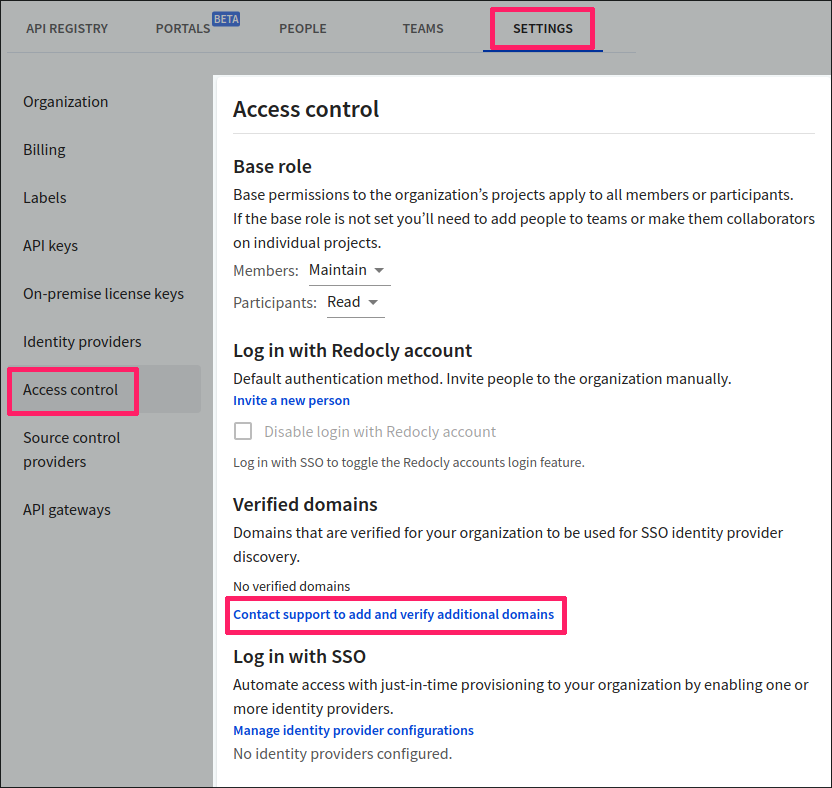

# Access control

People with the **Owner** role can manage what their organization users can access in the Workflows app from the **Settings > Access control** tab.

This page allows you to set up access control at both the organization and project level. A project refers to any APIs and versions, Reference docs or Developer portals you create using [Workflows](https://app.redocly.com).


Only people with the `Owner` role have access to **Settings**. You will not see this option if you are logged in with any other role. To find out more, refer to the [Roles and permissions](../people/roles-permissions.md) topic.


## Set up access to Workflows

1. Log in to your organization in [Workflows](https://app.redocly.com/) and select **Settings**.

2. From the left, select **Access control**:

   - **Base role**: You can set the base role for people with `Member` and `Participant` role across all projects within the organization. For more information, refer to the [Project level roles](../people/roles-permissions.md) topic.
   - **Log in with Redocly account**: This is the default authentication method. `Owners` can also invite people to the organization manually, using the `Invite a new person` link.
   - **Disable login with Redocly account**: When Single Sign-On (SSO) login is configured for an organization, `Owners` can select this checkbox to turn off the Redocly login completely. When Redocly login is disabled, all users who try to log in with their Redocly Workflows account are automatically redirected to a page that notifies them about mandatory SSO login and provides a link to access the SSO login page.

   Note that `Owners` must be logged into Workflows with SSO in order to disable Redocly account logins.

   - **Verified domains**: Before using Single Sign-On (SSO), customers must verify that they own the domain associated with people's accounts. To add or verify domains for SSO, under **Verified domains**, select `Contact support to add and verify additional domains`. This will initiate a chat with the Redocly Support team who can assist with adding or verifying a domain.

   

   - **Log in with SSO**: Allows you to automate user access via SSO, by using one or more identity providers.

   **Note**: Before you use this option, you will need to set up your identity provider, and choose a default role for just-in-time provisioning. JIT provisioning is a method of automating the user account creation process. (When your user tries to log in to Redocly, it will automatically map them to a role recognized by the Redocly app).

   For more information on how to do this, refer to the [Configuring multiple identity providers (IdPs)](./identity-providers.md) topic.

   Once your identity providers have been set up, they are displayed under **Log in with SSO**.

3. Select **Save selection** to save your changes.
