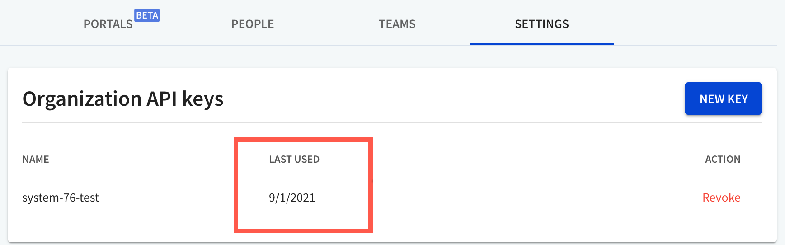
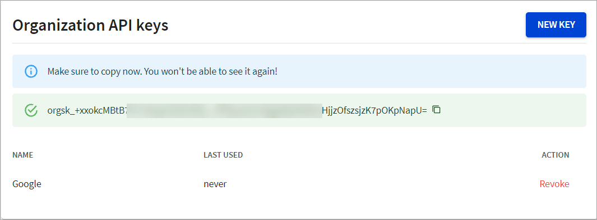

# API keys

An API key is a unique identifier used to authenticate a user, developer, or an application to an API.

You can manage your organization's API keys from the **API keys** page.

This page displays the API key and information on when it was last used.

## Create a new key

1. Log in to Workflows, and navigate to the **Settings > API keys** page.
2. Select **New key**. The _Add a new API Key_ dialog displays.
3. Enter a name for the API key, and select **Save**. Typically, you would type in the name of the application you want to associate with the API key. For example, Google. The API key is created, along with your key value.
4. Copy the value for your API key. You'll need those to access your organization later.


Make sure you store these values in a safe place, as we won't show them to you again.


## Revoke API key

To review an API key, select **Revoke** next to the API key. The API key is permanently revoked.
