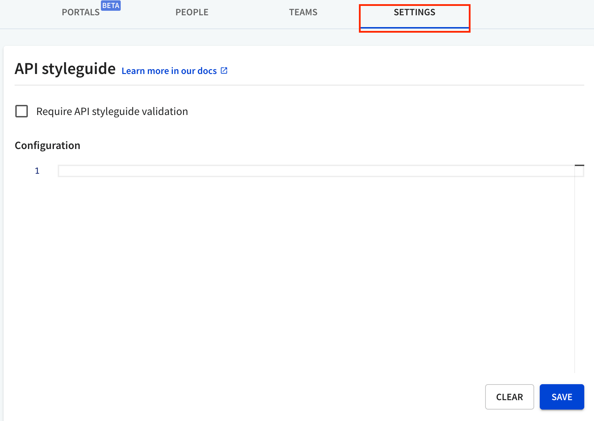
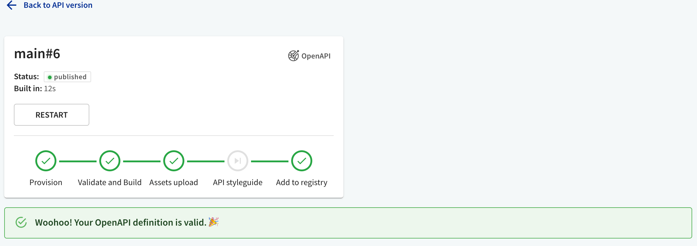
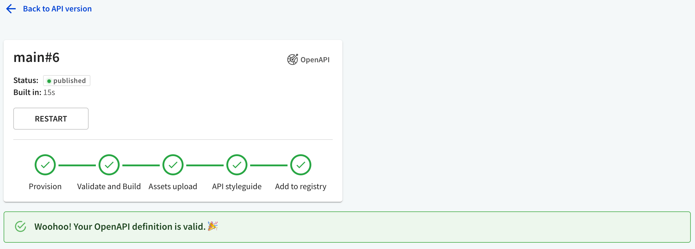
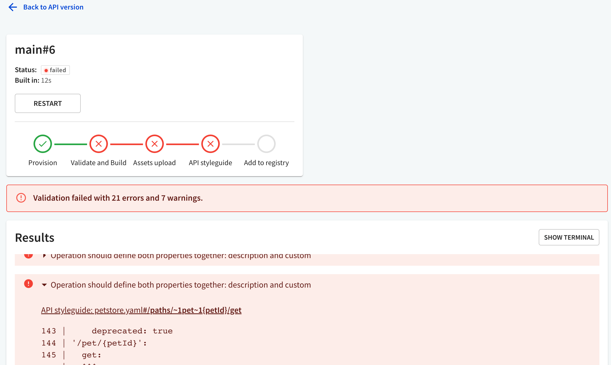

# API style guide

With API style guides, you can ensure all APIs in your Redocly Workflows organization are consistent and compliant with your API design principles.

In the context of Redocly tools, an API style guide is a custom configuration that defines rules for validating your API definitions.

The advantage of using API style guides in Redocly Workflows is that you can quickly apply the same rules across all your APIs in the registry, instead of having to manually modify separate configuration files for each API.

Additionally, you can enforce API governance by making it required for API registry builds to pass API style guide validation.

Organization **owners** can manage their organization's style guide from the **API style guide** page.



## Create a new style guide

1. Log into Workflows, and navigate to the **Settings > API style guide** page.
2. The **Configuration** section on the page is a code editor. Add your style guide into the code editor. The style guide must be structured like the `rules` object of the [Redocly configuration file](/docs/cli/configuration). The only allowed configuration objects are `extends` and `rules`, like in the following example:

```yaml
extends:
  - recommended
rules:
  no-ambiguous-paths: error
  paths-kebab-case: error
```

Any other properties will cause validation errors.



```yaml
apis:
  main:
    root: ./petstore.yaml
plugins:
  ./custom-plugin.js
rules:
  tag-description: off
  no-server-trailing-slash: error
  operation-summary: error
```


```yaml
extends:
  - recommended
rules:
  tag-description: off
  no-server-trailing-slash: error
  operation-summary: error
```



3. Optionally, select the `Require API style guide validation` checkbox to prevent API registry builds for APIs that don't conform to your style guide.

4. Select **Save** to finish creating the style guide.


## Modify an existing style guide

1. Log into Workflows, and navigate to the **Settings > API style guide** page.

2. The **Configuration** section should contain an existing style guide. To remove its contents altogether, select **Clear** at the bottom of the page.

3. To modify parts of the style guide, make changes to it in the **Configuration** section.

4. Select **Save** to apply your changes.


## Integrate API style guide in the registry

Every build page in the API registry contains information about the API style guide validation status.

To access the build page, select an API version in the registry. On the **Overview** page, go to **Logs** and select a build. **API style guide** should be visible as one of the build process steps.

By default, if you don't have any API style guide configuration, the **API style guide** step is skipped in the build.



When your API definition is valid, the **API style guide** step indicates a pass, and the build is successful.



When `Require API style guide validation` is selected in the API style guide configuration, the build will fail if your API definition doesn't conform to the style guide.



In this case, validation errors caused by the API style guide will be attached to the **Results** section. You can distinguish them from other errors by the prefix `API style guide:` that indicates their source.
