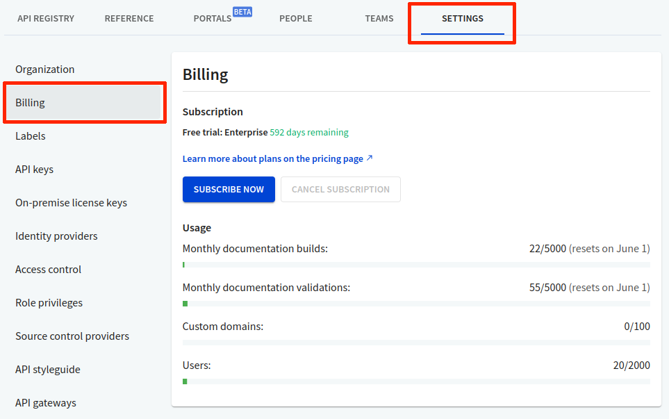

# Billing

The `Billing` page displays your current subscription details, along with usage data across your docs, APIs, and users.

## What is displayed on the Billing page?

Item | Description
---------|--------
 Monthly documentation builds | Current usage of builds and deployments of your docs (API and Portals) per month. This includes previews and production level docs.
 Monthly documentation validations | Current usage of your API definition validations in the registry. Note that validation and bundle count as one.
 Custom domains | Shows how many custom domains you are currently using from your plan allocation.
 Users | Shows the number of users (viewers, members and owners) allocated to your plan. SSO users from different IDPs are counted per email.

For more information on plan inclusions, refer to the [Pricing](../../pages/pricing/pricing.page.tsx) page.

## Start a free trial

You can start a free 14-day trial of a different subscription level from this page.

1. Log in to Workflows, and navigate to the **Settings > Billing** page.
2. Under **Subscription**, select **Start Free Trial**. The _Subscription_ page displays.
3. For the plan you want to trial, select **Try it free**. Your new subscription plan is activated and displayed on the Billing page. You will also receive an email confirmation.

To try out the Enterprise plan, select **Contact us** to get in touch with Redocly support.


## Upgrade your subscription

You can subscribe and pay for the subscription level you are trialing or select a new plan, from this page.

1. Log in to Workflows, and navigate to the **Settings > Billing** page.

2. Under **Subscription**, select **Subscribe Now**. The _Change your organization's plan_ page displays.
3. For the plan you are currently trialing:
   - Select **Add Payment Method**, and complete the payment details.
   - Enter a Purchase Order (PO) number if applicable.
   - Select **Review and Pay** to complete the transaction.
4. For a new plan:
   - Select **Pick a plan**
   - Select **Add Payment Method**, and complete the payment details.
   - Enter a Purchase Order (PO) number if applicable.
   - Select **Review and Pay** to complete the transaction.

Your new subscription plan is activated and displayed on the Billing page. You will also receive an email confirmation.


To purchase an Enterprise plan, select **Contact us** to get in touch with Redocly support.


## Cancel subscription

If you have an active subscription for a plan, you can cancel the subscription from this page.

1. Log in to Workflows, and navigate to the **Settings > Billing** page.

2. Under **Subscription**, select **Cancel Subscription**. _What happens next_
