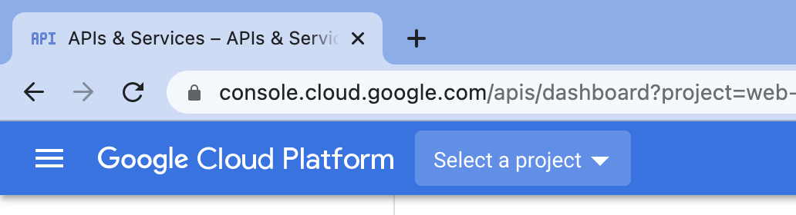
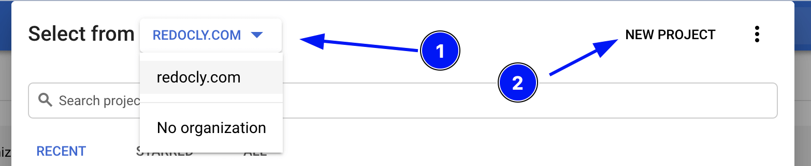
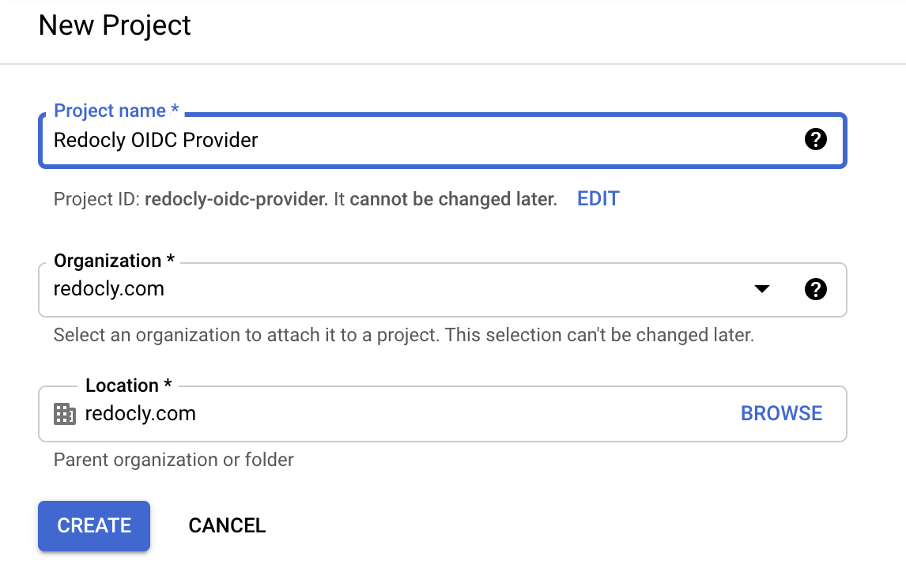
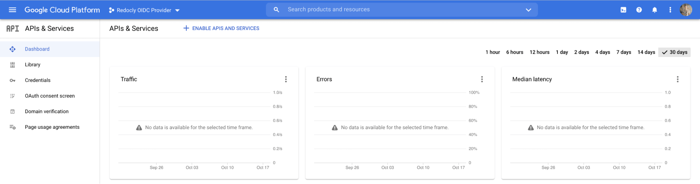
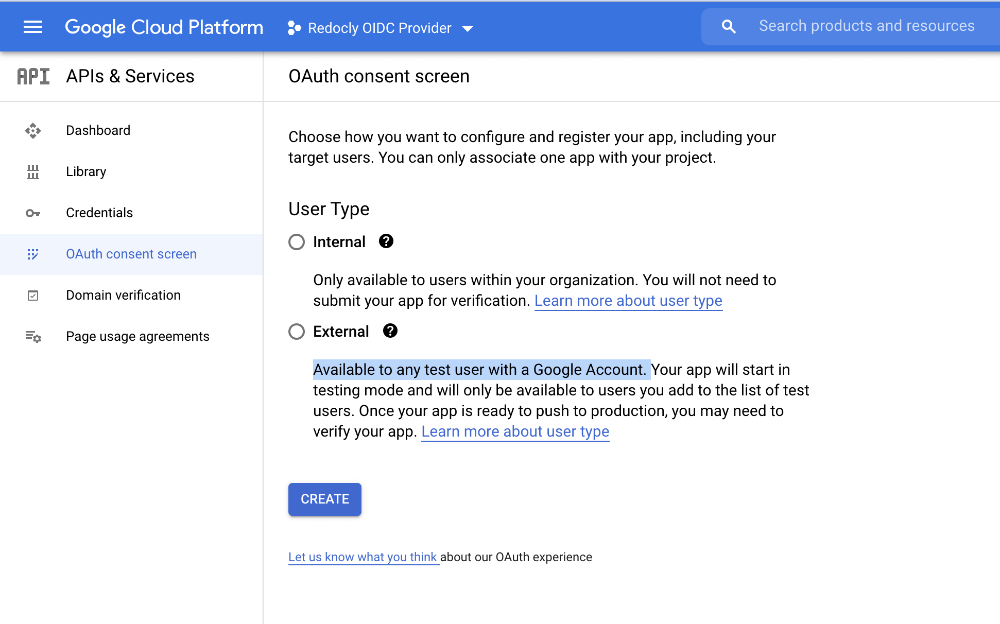
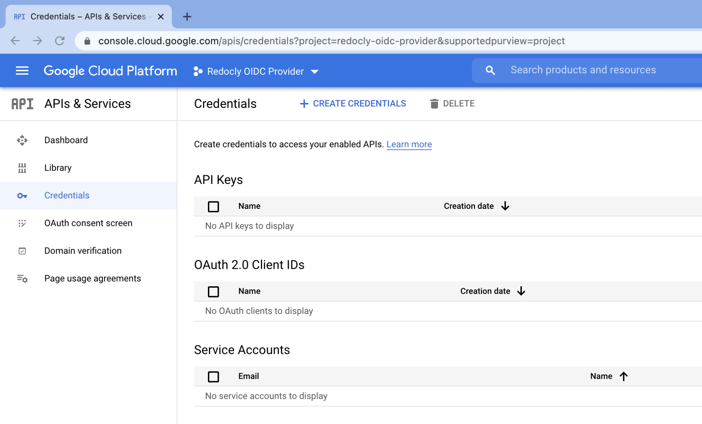
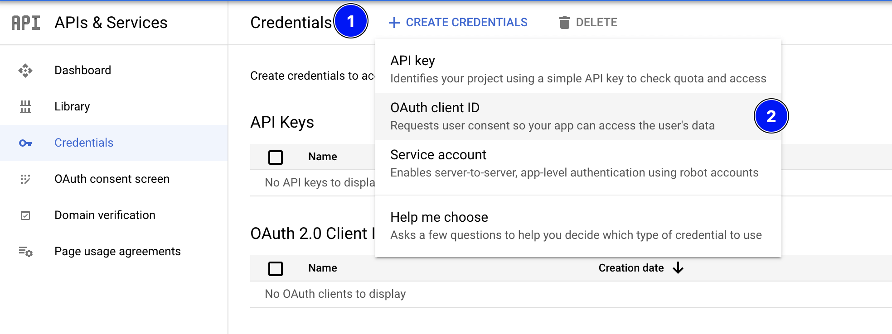
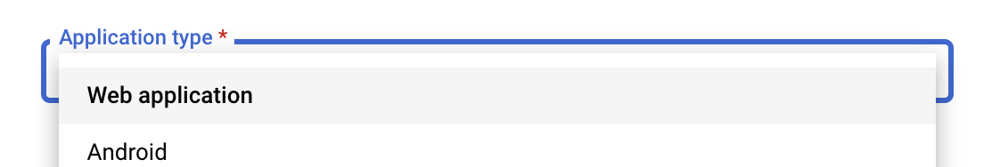

# Set up Google Workplace identity provider

Set up Google Workplace (formerly known as G Suite) as an identity provider in Redocly using OpenID Connect.

## Prerequisites

- You have administrative access to the [Google Workplace Developer Console](https://console.cloud.google.com/apis/dashboard).


## Configure Google Workplace OAuth 2.0

Before Redocly can use a Google’s OIDC Provider via the OAuth 2.0 authentication protocol for user login, you must:

- set up an API project in the Google API Console to obtain OAuth 2.0 credentials
- set a redirect URI to Redocly
- and (optionally) customize the branding information that your users see on the user-consent screen when logging.

The steps below are simplified from Google’s instructions [listed here](https://developers.google.com/identity/protocols/oauth2/openid-connect?authuser=3).

### Step 1. Create a new API project

After logging into https://console.developers.google.com create a new project unless you wish to reuse an existing API project.

Click **Select a project** from the Google API console.



In the pop-up window select your organization and click **New Project**.



Define Project name and click **Create**.



Ensure the newly created project is selected.

Go to the API dashboard by either [visiting this link](https://console.cloud.google.com/apis/dashboard) or clicking **Go to APIs overview**.



### Step 2. Configure consent screen (recommended)

Select **OAuth consent screen** from the left sidebar to go to the page.



Select **Internal** (limits availability to users within your organization) or **External** (available to any user with a Google Account) in the screen above and configure your consent screen.

### Step 3: Create OAuth credentials

Select **Credentials** from the left sidebar to go to the **Credentials** page.



Then click **+ CREATE CREDENTIALS** from the top menu bar and choose **OAuth client ID**.



Choose **Web application** from the dropdown.



Fill in the OAuth 2.0 client name and specify the following URL for Authorized redirect URIs:

- <https://app.redocly.com/callbacks/sso>
- <https://app.redocly.com/callbacks/sso>

Click **Create**.

A popup will display 2 OAuth related IDs that you will need to copy and save to be used for setting up the identity provider in Redocly.

## Set up identity provider in Redocly

Follow our docs to set up an [OpenID Connect identity provider](../identity-providers.md).

Use the following values for fields:

- Configuration URL: <https://accounts.google.com/.well-known/openid-configuration>
- Client ID: Copy value from the popup in Google Admin Console
- Client Secret: Copy value from the popup in Google Admin Console

## Set up SSO for Redocly Workflows

Follow the [access control guide](../access-control.md) to enable SSO access for Redocly Workflows.

## Set up SSO for Portal

Follow the [manage access](../../developer-portal/settings/manage-access.md) topic to set up SSO.


Copy the URL from the portal access control settings page and add it to the **Authorized redirect URIs** in **Google OAuth2 App** settings (see previous step 3).


You can either make the portal public and allow login with SSO or request SSO login to access the portal.


### Custom claims in Google Workplace

Unfortunately Google Workplace doesn’t support custom claims for OIDC providers.
Only SAML apps can contain custom attributes.

By default Redocly will assign the `authenticated-user` role to any logged-in user and guest to any anonymous user.

You can configure `authenticated-user role` in your `rbac.yaml` file:

```yaml
roles:
  authenticated-user:
    permissions: read-private-docs
```

Then you can require `read-private-docs` permission on the docs you need to protect.
