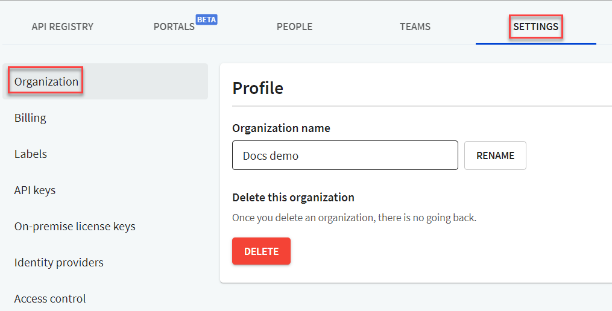

# Organization

People with the `Owner` role can manage their organization settings in Workflows from the **Settings > Organization** tab.

From this page, you can:

- Change organization name
- Delete organization

## Change organization name

1. Log in to Workflows, and navigate to the **Settings > Organization** page.
2. Under Profile, in the _Organization Name_ field, enter the new name for your organization, and select **Rename**. If your name is successfully updated, a blue tick is displayed. Your organization name is displayed next to the Redocly logo (top left of the screen).

## Delete organization


Once you delete an organization, all associated projects (APIs, docs and portals) will be deleted, so be careful before you delete an organization.


1. Log in to Workflows, and navigate to the **Settings > Organization** page.
2. Under _Delete this organization_, select **Delete**. The organization will be deleted and all associated projects are removed from Workflows.
