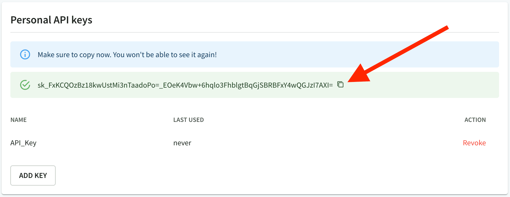

# Personal API keys

Generate a personal API key to use some of our products:

- The [`@redocly/cli` `login` command](../../docs/cli/commands/login) (where you can subsequently use the [preview-docs](../../docs/cli/commands/preview-docs) or [push](../../docs/cli/commands/push) commands)
- Our [VS Code extension](https://marketplace.visualstudio.com/items?itemName=Redocly.openapi-vs-code)
- Access-protected API snapshots

You will also be able to reference your members-only API definitions.

## Generate a personal API key


You may generate multiple API keys.


1. Go to your [profile](https://app.redocly.com/profile).
1. Select "Add key" in the "Personal API keys" section.
1. Assign it any name, such as the name of your device.
1. Copy the key value. You won't be able to see it again.

## Revoke a personal API key

1. Go to your [profile](https://app.redocly.com/profile).
1. Find the key you wish to revoke and select the revoke link.
