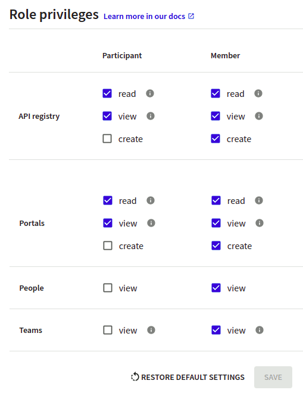
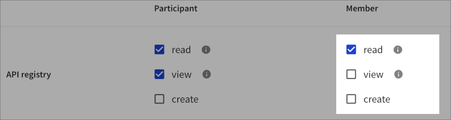
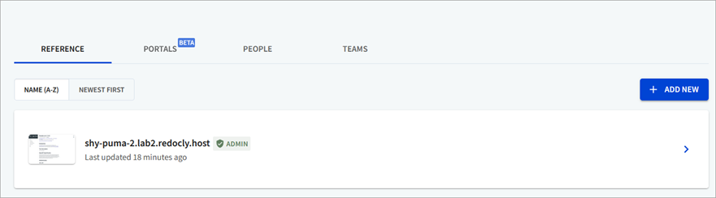
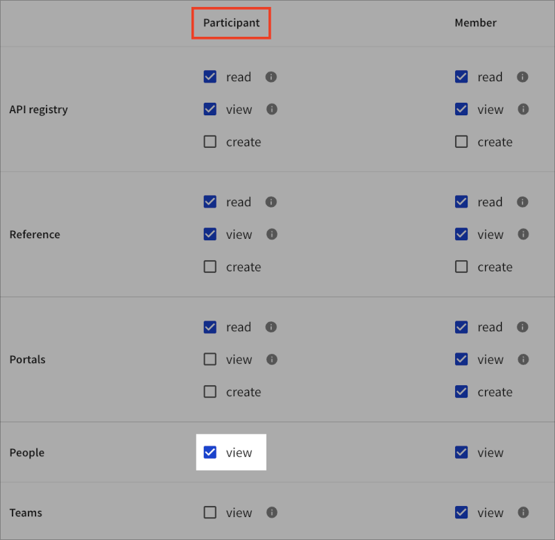
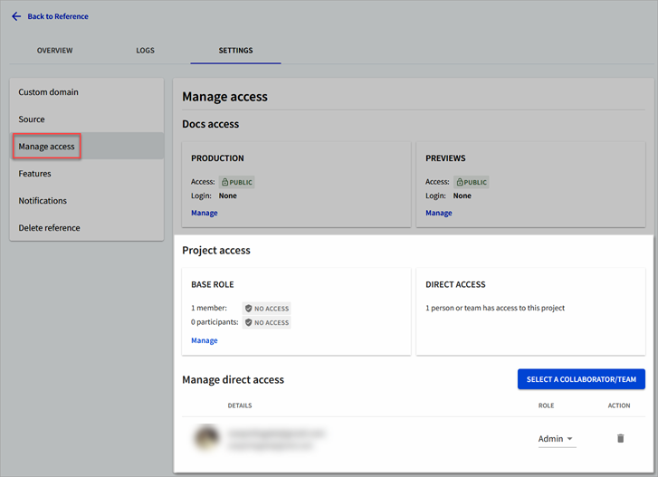
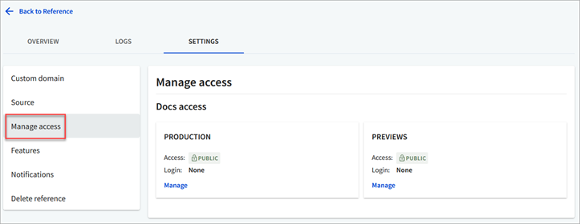

# Role privileges

Any user in Workflows has an `Owner`, `Member` or `Participant` organization-level role assigned to them. For more details, refer to the [Roles and permissions](../people/roles-permissions.md) topic.

People with the `Owner` role can change default privileges for the `Member` and `Participant` roles, including the ability to view top-level tabs and create new content (APIs, references and portals) within these tabs.


Setting up and changing role privileges is only available to **Enterprise** customers. For all non-enterprise organizations, the role privileges are set by default and are not editable.


There are currently four tabs (other than **Settings**), available in the Workflows app:

- API Registry
- Portals
- People
- Teams

Changing any privilege affects displaying these tabs or related content and buttons inside these tabs.

## How to configure role privileges

1. Log in to Workflows, and navigate to **Settings > Role privileges**.

   

2. Select/deselect `read`, `view` and `create` checkboxes for the `Participant` and `Member` roles.
3. Select **Save** to confirm your changes.


Role privileges are hierarchical.
The `create` privilege requires the corresponding `view` and `read` privileges.


### `read`

The `read` privilege allows you to make a particular project type accessible or inaccessible to users when it is protected by authorization.
If deselected for a project type (API registry, Portals), users will not be able to log in to access those projects regardless of any project-level permissions assigned to them.

For example:

- If you remove `read` privilege for `API registry` for some role, users with this role will not be able to log in to API docs.
- If you remove `read` privilege for `Portals` for some role, users with this role will not be able to log in to portals.

### `view`

The `view` privilege allows you to hide or show a particular tab.
If deselected, the tab is hidden from view, regardless of any project-level permissions assigned to user.
All other content related to deselected privilege is also hidden in all other tabs.

For example:

- If you remove `view` privilege for `API registry` for some role, users with this role will not be able to see links to API docs from the API overview page.
- If you remove `view` privilege for `People` for some role, users with this role will not be able to see any info related to people on any page.

### `create`

The `create` privilege controls the ability to add new content.
If deselected, all buttons related to creating content will be hidden (APIs, Portals).

For example:

- If you remove the `create` privilege for `API registry` for some role, users with this role will not be able to create new API versions.

## Restore default settings

To restore privileges to default settings, select the **Restore default settings** button and **Save**.

## Examples

### View API registry privilege

To hide the **API registry** tab for people with `Member` role, deselect the `view` checkbox for **Member** column in **API registry** row and select **Save**.

The `create` privilege will be automatically deselected due to privilege hierarchy.

**Result of the modified `Member` role**

- The API registry tab is not displayed in Workflows.

### View people privilege

To make user accounts with project and direct access visible on the Reference settings page to users with `Participant` role, select the **Participant > People** `view` checkbox.

**Result of the modified `Participant` role**

- Participants can see people in the **Project access** section. Participants with the `Admin` base or project role can also see the **Manage direct access** section.

If you deselect the `view` privilege for **Member** in **People** row, they will only see the Docs access options.

