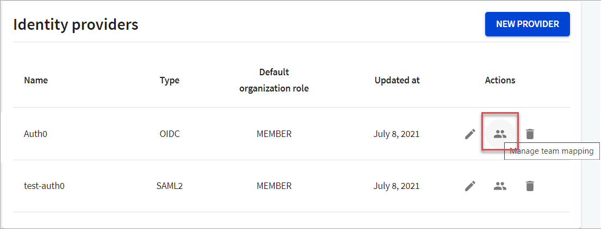

# Manage team mapping

If you have set up [teams](index.md) in your organization, you can map teams to the relevant IdPs so that organization administrators (people with `Owner` role) can automatically map the people in their organization to different teams based on some of their attributes (claims).

## Add team mapping

This section describes how to map a team to your identity provider using mapping rules.

1. Log in to [Workflows](https://app.redocly.com/), and select the **Org Settings** tab.

2. To add a team mapping rule, select the **Manage team mapping** option for your identity provider.
   
   The _Team mapping_ page displays.

3. On the Team mapping page, select **Add Mapping Rule**. The Create team mapping rule displays.
   

4. Enter the following information for the mapping:

   - **Claim path**: Specify the claim path associated with the person. This can be a string or a URL.
   - **Match condition**: Select the match condition from the dropdown. For a list of what the mapping conditions mean, refer to the [Mapping conditions](#how-to-map-conditions) table.
   - **Claim value**: Enter the value of the claim for the claim path.
   - **Assigned team**: Select the team you want to assign the person to.

5. Select **Create** to add the mapping rule for the selected identity provider.

### How to map conditions

| Condition        | Description                                                                              | How would you use it?                                                                                                                                                                |
| ---------------- | ---------------------------------------------------------------------------------------- | ------------------------------------------------------------------------------------------------------------------------------------------------------------------------------------ |
| Contains         | Map to selected team only if the claim path contains a part of the specified claim value | If `claim path: email` contains `manager`, then people with `email` claim that have `manager` in the email address will be added to the selected team.                               |
| Default          | Mapped to this team by default                                                           | All users are added to the selected team by default.                                                                                                                                 |
| Equals           | Map to selected team only if the claim path matches the specified claim value exactly    | If the `claim path: role` is `isAdmin`, people who have this exact `role` in the claim will be added to the selected team.                                                           |
| Exists In        | Map to selected team only if the claim path exists in the specified claim value          | If the `claim path: role` is `isMaintain`, people who have `isMaintain` as part of their claim, they will be added to the selected team.                                             |
| Does Not Contain | Map to selected team only if the claim path does not contain the specified claim value   | Set as an exclusion. If `claim path: email` contains `developer`, then people with any `email` claim other than `developer` in the email address will be added to the selected team. |
| Does Not Equal   | Map to selected team only if the claim path does not match the specified claim value     | Set as an exclusion. If the `claim path: role` is `isAdmin`, people with any `role` other than `isAdmin` in the claim will be added to the selected team.                            |


While you can add multiple mapping rules for teams, you can only add one mapping rule of a kind per identity provider. For example, if you have added a mapping rule with condition `default` with one team, you cannot use the same condition `default` with any other team for that identity provider.


## Update team mapping rule

You can update an existing team mapping rule from the team mapping page.

1. On the Identity providers page, select the **Manage team mapping** option for the identity provider you want to update.
   
   The Team mapping page displays.
2. On the Team mapping page, select the **Update team mapping rule** icon for the rule you want to update.
   The _Update team mapping_ dialog displays.
   
3. Select the match condition you want to update, and select **Update** to save your changes.

## Remove a team mapping rule

You can remove an existing team mapping rule from the team mapping page.

1. On the Identity providers page, select the **Manage team mapping** option for the identity provider you want to remove a team mapping rule.
   
   The Team mapping page displays.
2. On the Team mapping page, select the **Remove team mapping rule** icon for the rule you want to remove,.
   The _Remove team mapping_ dialog displays.
   
3. Select **Remove** to remove this team mapping rule for the identity provider configuration.
