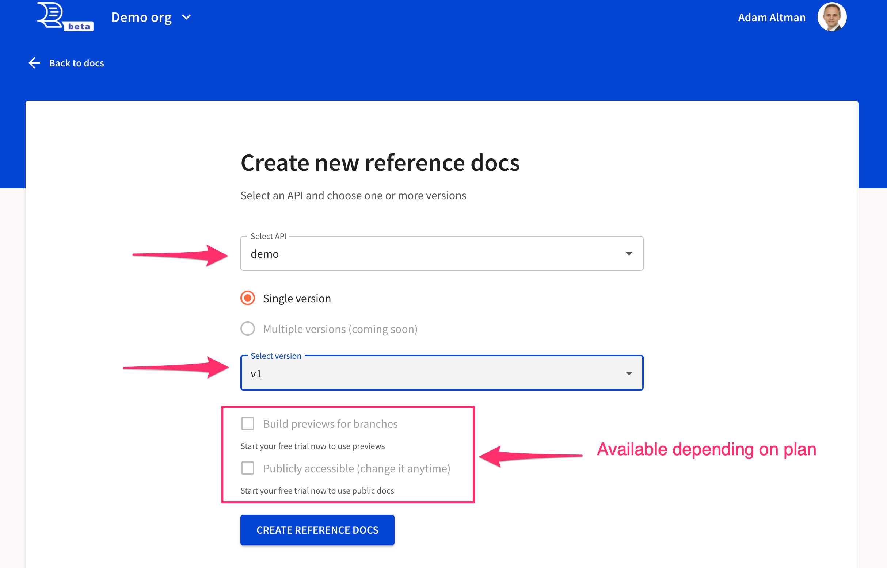
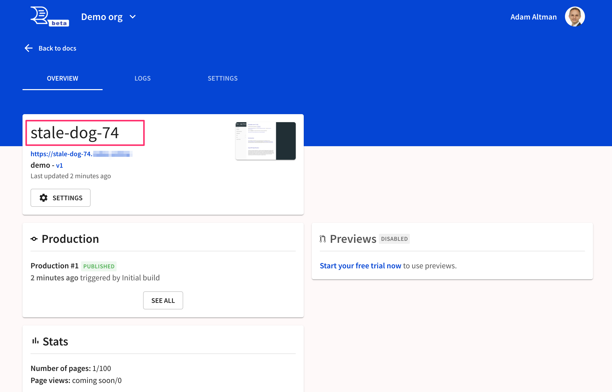
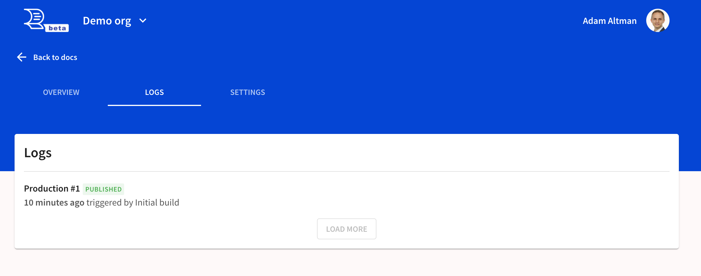
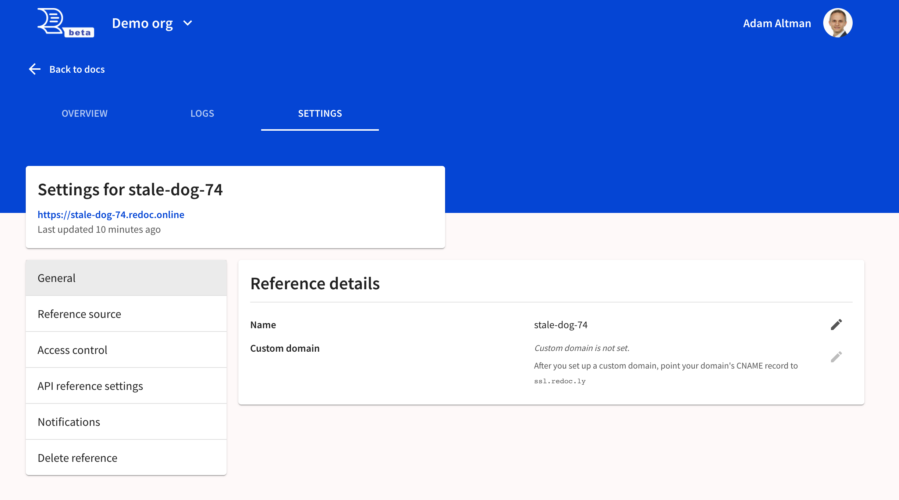
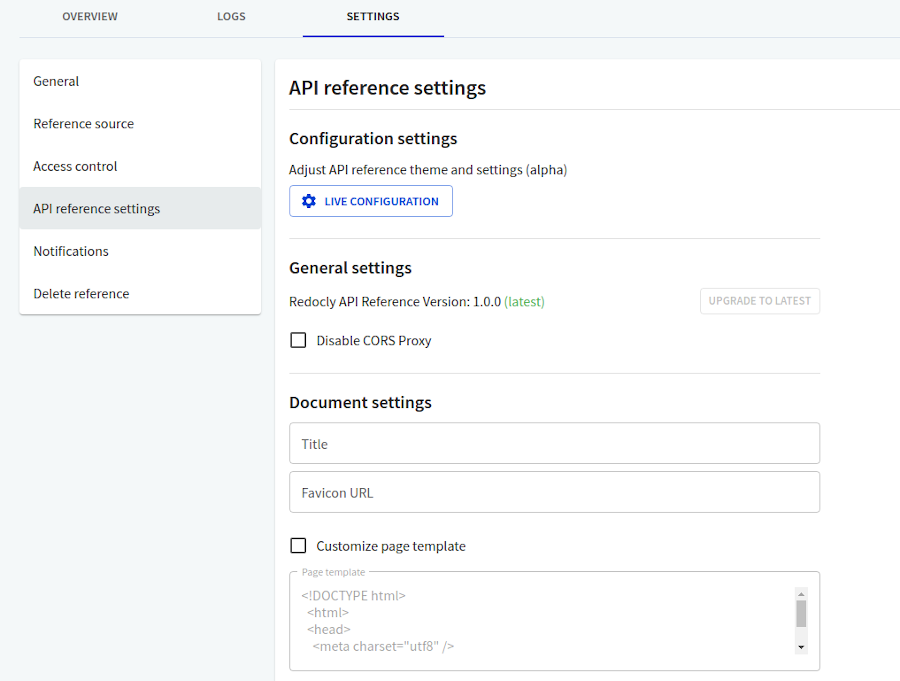
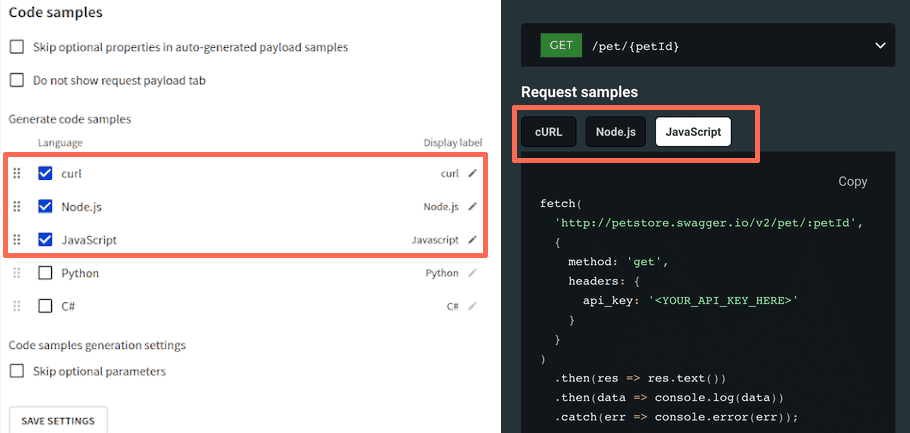
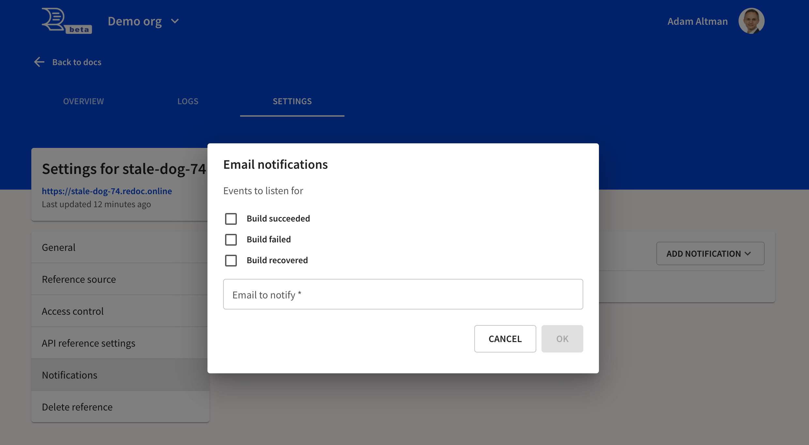

# Reference docs

You can build API reference docs using Redocly Workflows. Reference docs render your OpenAPI definition(s) as interactive API documentation, so they are always connected to API definitions.

## Add new

## Choose your API and version

After you fill the form, your docs will build.

If you want to display multiple versions, join our [multiple versions beta](./multiple-versions.md).

## Docs overview

After submitting the form to create your reference docs, you'll be redirected to the docs overview.
Your docs will start to build.
Notice that the project was given a random name "stale-dog-74."
You may edit it in the settings.

Also, notice the production tile with the log of recent production builds.
The page also shows some limited stats.

## Docs logs

## Docs settings

The Settings page contains options for customizing your project.

**General > Reference details**

Select the pencil button to the right of the **Name** field to rename your project. If your plan permits, you may also set a custom domain here.

**Reference source**

Change the source of the API definition by selecting it from the drop-down menu. Available sources correspond to the APIs you have previously added to the registry.

You can also choose whether the API reference docs should display only a single version or multiple versions for the selected API. If your API has multiple versions, you can assign a custom display label to each version, and set one of the versions as the default.

If **Build previews for branches** is selected, previews are automatically built when a new branch is pushed, and when a new commit is created in an existing non-default branch. If a commit is pushed to your default branch, it triggers a production build. You can access all previews built in this way from the Overview page.

**Access control**

Configure which types of users have the permission to access the current API reference docs project. Permissions for the production can be different from those for the previews.

Read more about [managing user access](https://redocly.com/docs-legacy/workflows/access-control/).

**API reference settings**

Under **Configuration settings**, select **Live configuration** to access our experimental theme, feature and template configuration tool.
Alternatively, we recommend following the docs-like-code approach and including the theme settings in your [Redocly configuration file](/docs/cli/configuration).

Under **General settings**, you can upgrade to the latest version of the Reference docs product (if available).

Selecting **Disable CORS Proxy** turns off the Redocly CORS Proxy feature in the API console. Read more about [CORS](https://redocly.com/docs-legacy/api-reference-docs/guides/try-it-console/#cors) and why it's required for reliable functionality of the API console in your reference docs.

Under **Document settings**, you can set a title and favicon for the reference docs project.

For additional customization options, select **Customize page template**. This enables the text field where you can enter your own HTML to modify the layout of the reference docs page.

Under **Code samples**, you can control the contents of the **Request samples** section in your reference docs, and enable auto-generated code samples for [supported languages](../../api-reference-docs/resources/code-samples-languages.md).

When **Skip optional properties in auto-generated payload samples** is selected, only required fields are included in auto-generated code samples and in request payload samples.

When **Do not show request payload tab** is selected, the code sample for the request payload is not displayed in the Request samples section of your reference docs.

The **Generate code samples** section lists currently supported languages for auto-generating code samples in your reference docs. Select the desired language(s) in this list. You can change their order by dragging them up or down in the list. This order affects the order of tabs (from left to right) in the **Request samples** section of your reference docs.

Read more on [how to configure auto-generated code samples](../../api-reference-docs/guides/generate-code-samples.md) in Redocly Workflows, Developer portal and Reference docs.

<b>Note</b>

Custom code samples directly added to the API definition using the `x-codeSamples` specification extension have precedence over auto-generated ones. For instance, if your API definition already contains a JavaScript sample, and you select the JavaScript checkbox here, the reference docs will only show the custom sample from the API definition.

**Notifications**

Select **Add notification > Email notification** to choose which events you want to be notified about. Notifications are sent to the specified email address when the selected events are detected.

**Delete reference**

Selecting **Delete** removes the reference from the project. This is a destructive action that can't be reverted, and can only be performed by the project owner.

Note that the corresponding API registry item for a deleted reference does not get removed automatically when this option is selected. Project owners must remove the item separately.
