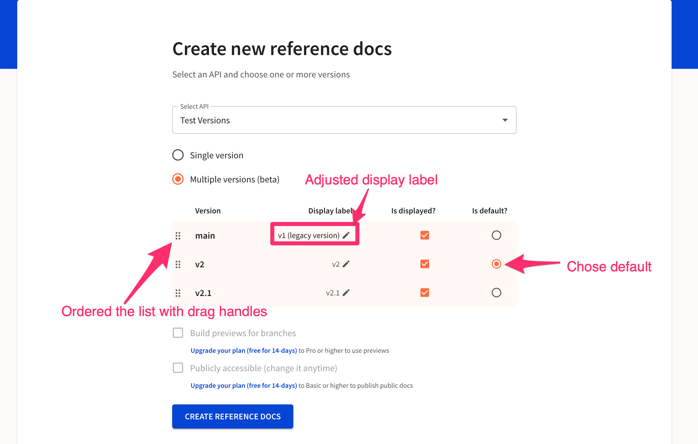
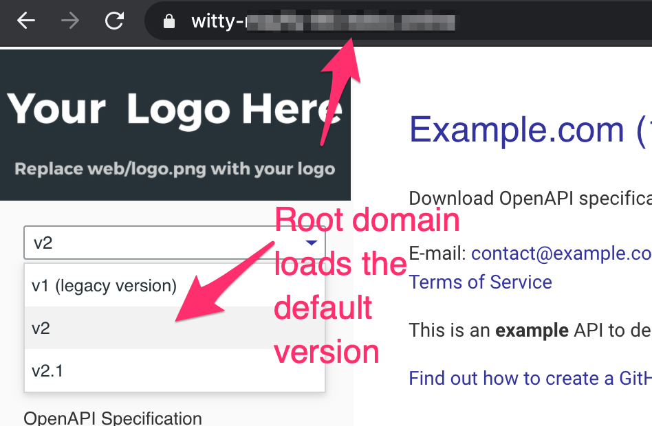
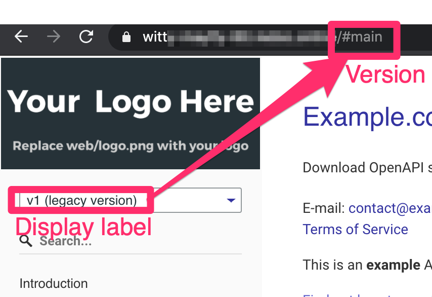
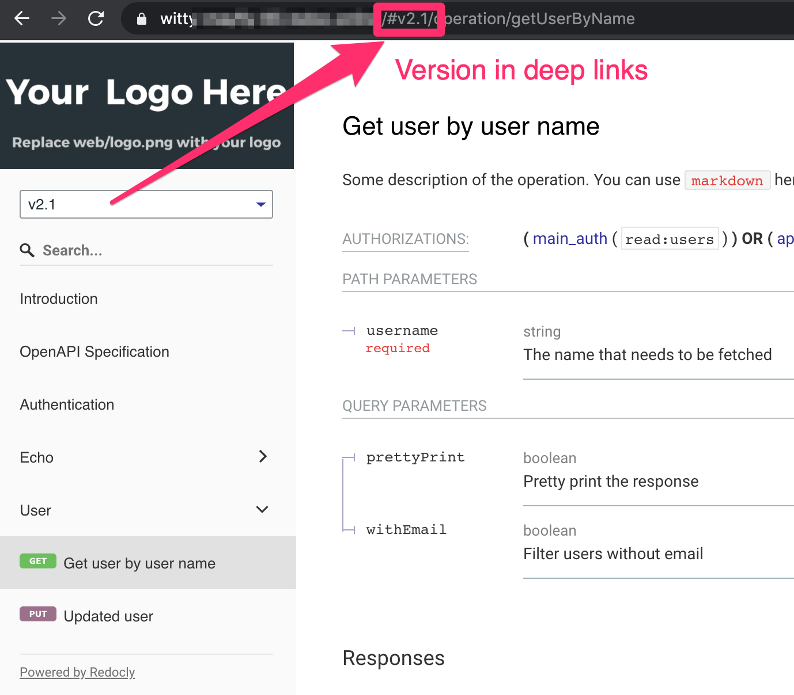
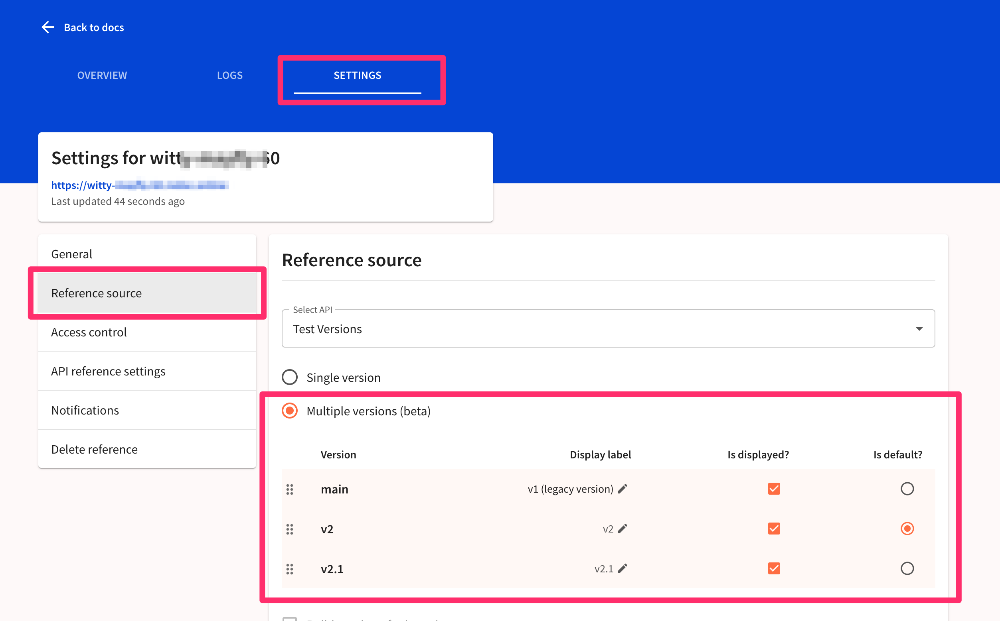

# Multiple versions for API reference docs

## Prerequisites

1. You must have multiple versions of an API added to the registry.

## Create reference docs

When you have multiple versions of an API, you will see an option to create multiple versions within your reference docs.

1. Select the versions you wish to display in the docs.
1. Select the default version, which loads when the docs are accessed without explicitly specifying a version.
1. Adjust any display labels.
  Your labels appear in the documentation select menu.
  The actual version appears within the docs URL in a path segment.
1. Order the versions using the drag handles to the order they will display within the select menu.
  Notice the top version doesn't need to be the default version.

The configurations shown above will result in the following version selection within the documentation.

The root url loads the default version.

Upon selecting another version with a display label that differs from the version name, the display label shows in the select menu and the version name displays in the URL.

You may deep link to any version.
Switching versions will attempt to switch to the same operation of the different version, if it exists (or it will load the beginning of the docs).

## Configuration settings

Redocly uses the Redocly configuration file associated with the default version as the metadata which will control the reference docs features and styles.
You may read all about the [configuration file](../../../docs/cli/configuration), or the [docs-specific settings](/docs-legacy/api-reference-docs/configuration/functionality).

### Recommended settings

We recommend settings to use with the multiple versions feature.
These must be within your default version's configuration file.

## Edit multiple versions

Edit the versions displayed at any time from the docs' settings.

