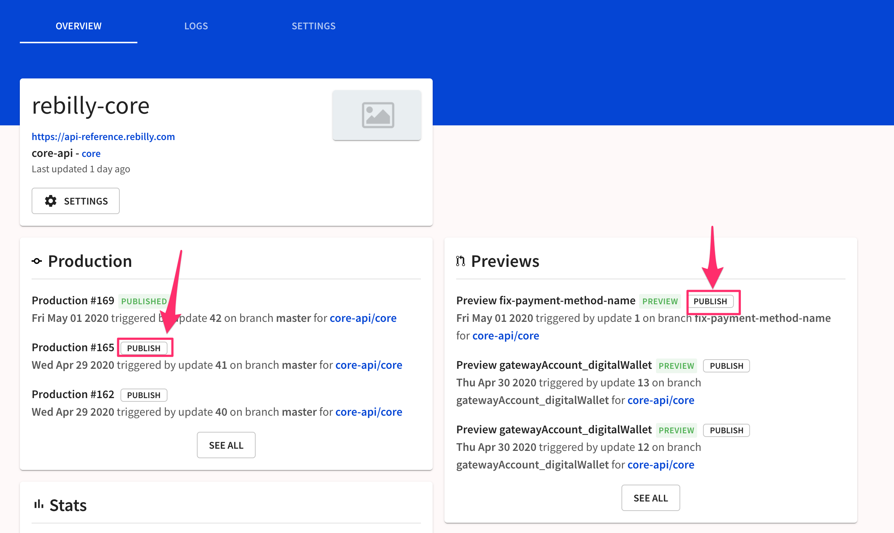
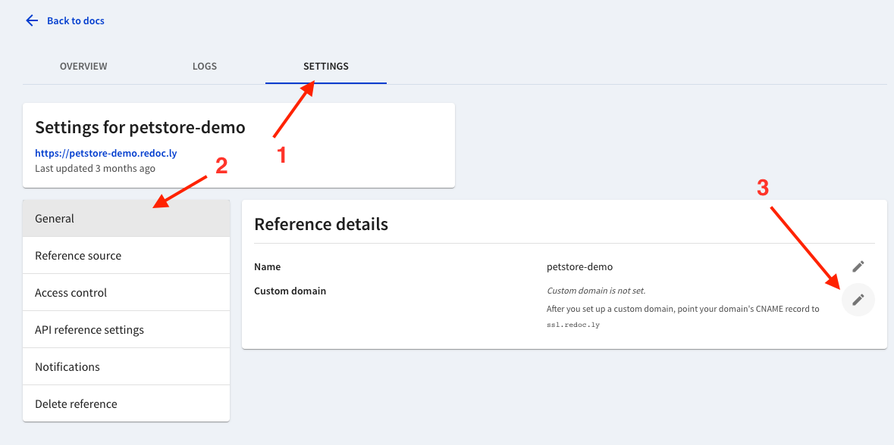

# Hosting

Redocly hosts:
- Bundled API definition snapshots
- Reference docs
- Developer portals

All hosting is done on our global CDN powered by AWS CloudFront.
All deployments utilize real-time cache invalidations so changes are reflected instantly.

## Git Ops

A deployment to production is triggered upon a commit to your default branch.
A deployment to a preview URL is triggered upon a commit to another branch, depending on your source configuration settings.

You may also publish any prior version or publish a preview to production.

## Access control

Access control is available, depending on the plan, to grant or restrict access to the application.

Access control is set per project, and per environment (production and previews).

## Custom domains

Custom domains may be used in the professional or enterprise plans.
Point the domain's CNAME record to `ssl.redoc.ly` and configure the domain in the project's settings.

Host your entire website or host your developer portal at a subdomain.

You can also embed it seamlessy into an existing website using a [proxy deployment](../developer-portal/guides/embedding-portals.md).
