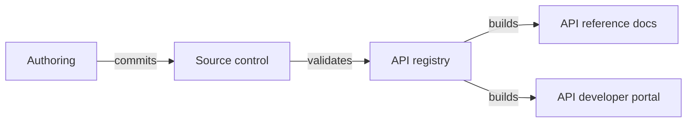

---
seo:
  title: Workflows, a modern CI/CD for the API lifecycle
excludeFromSearch: true

---
# Workflows

Workflows is our web-based application hosted at <https://app.redocly.com> that includes:
- Your own API registry (with linting and bundling)
- Integration with your source control software
- Builds (and preview builds) of reference docs and developer portals
- Fast hosting on a global CDN with instant cache invalidation
- Access control

Workflows brings a powerful set of doc-ops to your docs-like-code practice, helping throughout the API lifecycle.

We recommend starting with the [API registry](../api-registry/overview.md).
