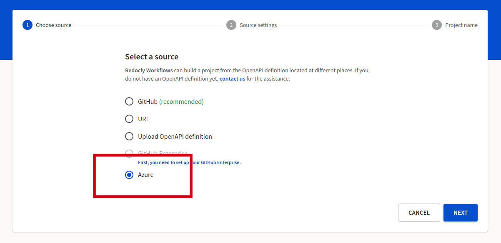
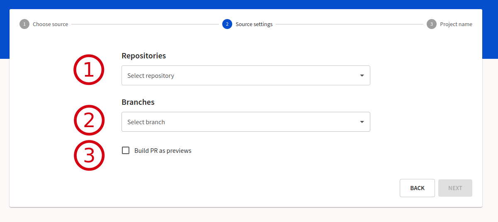
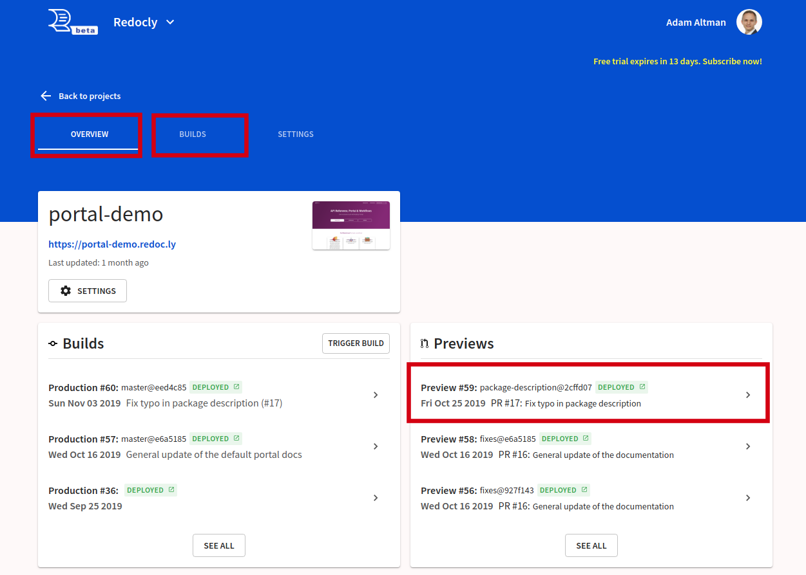
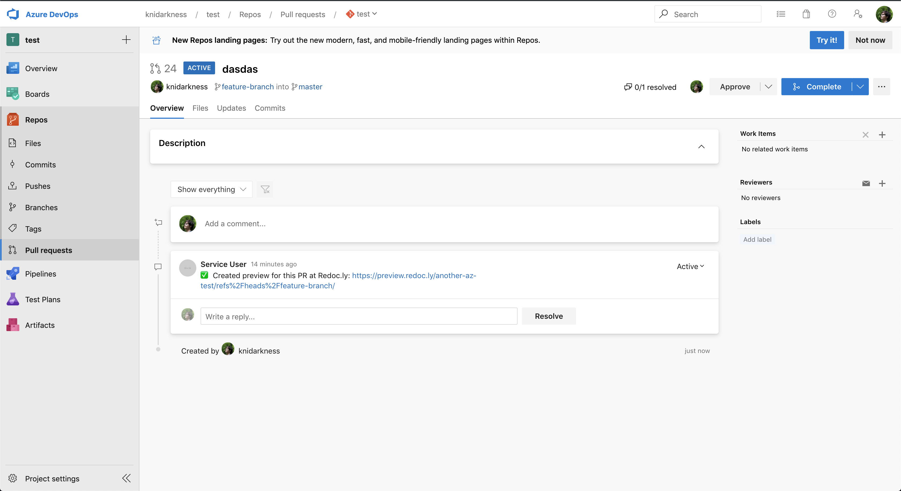
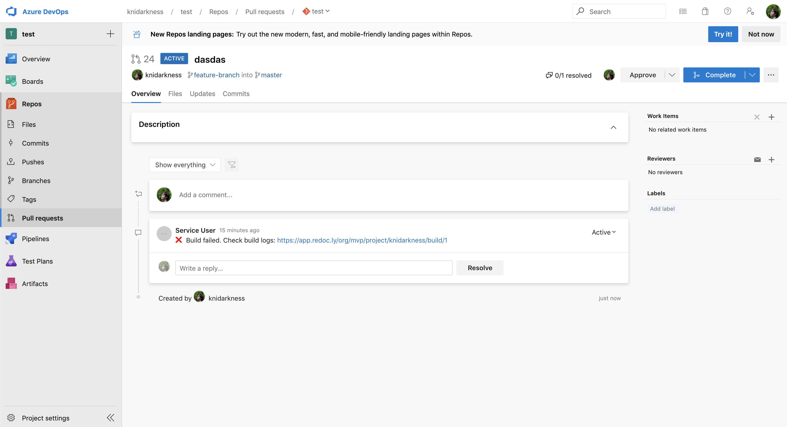

# Azure Repos

Redocly is integrated with Azure Repos (which is part of Azure DevOps). You can trigger workflows in Redocly automatically when you commit or open a pull request in Azure Repos.



## Create a project

Once you have set up Azure integration, you can create a new project and select Azure as a source for your registry.

1. Using Workflows, from the API registry screen, select **Add API**.
2. Enter a name and version for your API, and select **Next** to continue.
3. On the _Choose source_ page, select **Azure** as your source.
   
4. Select **Next** to continue to the next screen, where you select your **Repository**.
5. On the _Source settings_ page, select the repository, and your production branch.
   We recommend selecting the \*_Build PR as previews_, which will trigger workflows to build a preview of your docs.
   
6. Select **Next** to save your changes.

## Test Azure Repos with your project

This section provides a follow-along demo of using the Azure Repos connection.

### Prerequisites

- An Azure Repo with a valid OpenAPI definition or Developer portal.
- A project, configured with the \*_Build PR as previews_, as described above.

### Trigger a preview

1. Using your existing Azure tools, clone your repo.
2. Create a branch, and make a minor change.
3. Commit and push to the Azure Repos origin.
4. Open a pull request.
5. Using Redocly, navigate to the **Project overview** or the **Project builds** screen. A preview build should be triggered.

   

6. Upon completion you should see a comment on your pull request with a link to the preview of your docs.

**Service user accounts**

In the example, we used a service user account. A service user is a user created in Azure Repos whose primary purpose is to generate a personal access token for use by a 3rd party service (like Redocly). It is considered a good practice to create a service user.

- When the build completes and is successful, Redocly posts a comment from the service user with the link to the preview.
  

- If the build fails, Redocly posts a comment from the service user with a link the build logs where you can find more details for the cause of the failure (such as an invalid API definition).
  
