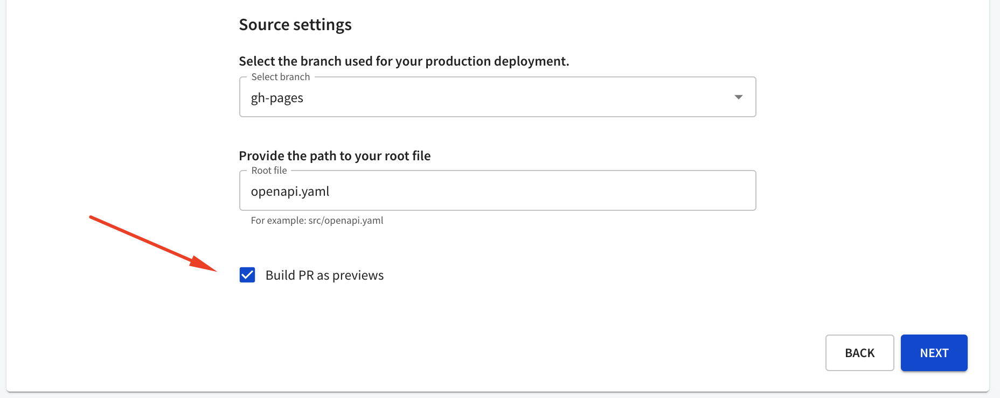

# Bitbucket self-managed

Use **Bitbucket Server** or **Bitbucket Data center** as a source for your API definitions and developer portal projects.





## Build PRs as previews

Selecting the **Build PR as previews** checkbox will trigger a build in the selected branch when:

- a new pull request is opened
- an existing pull request is updated, or a new commit is pushed to any open pull request

If your API version has other usages, selecting this checkbox will trigger subsequent cascading preview builds of other APIs, reference docs, and developer portals.

