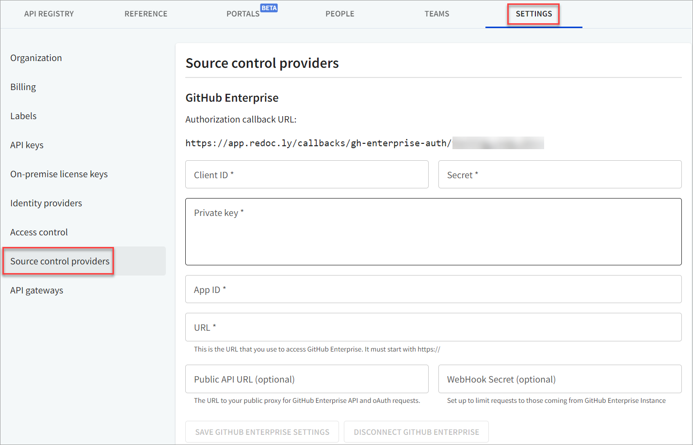

# GitHub Enterprise


You will need an enterprise-level Redocly plan to connect to GitHub Enterprise.


## Connect your GitHub Enterprise account

1. Using Workflows, navigate to **Settings > Source control providers**.

2. On the Source control providers page, under GitHub Enterprise, complete the detials to connect to your GitHub Enterprise account.
    

3. Select **Save Github Enterprise Settings** to save your changes and connect your account.

Once you have connected your account, it works similar to the [GitHub integration source](./github.md).
