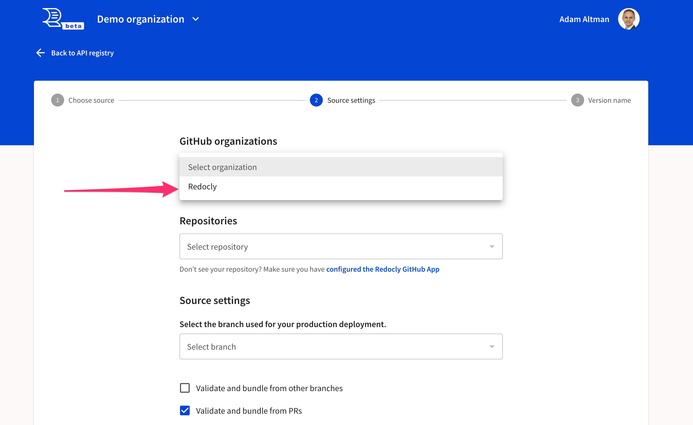
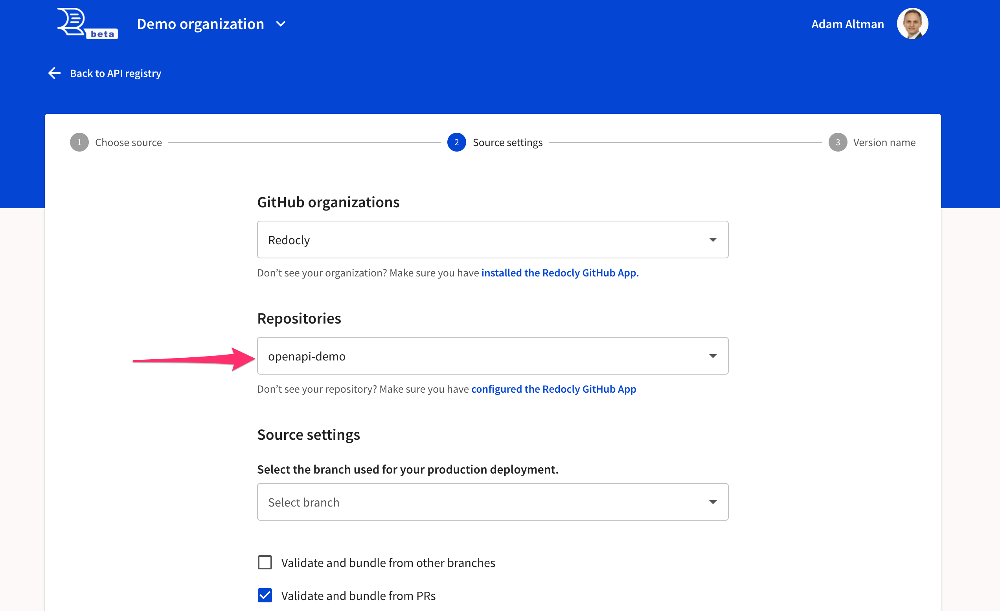
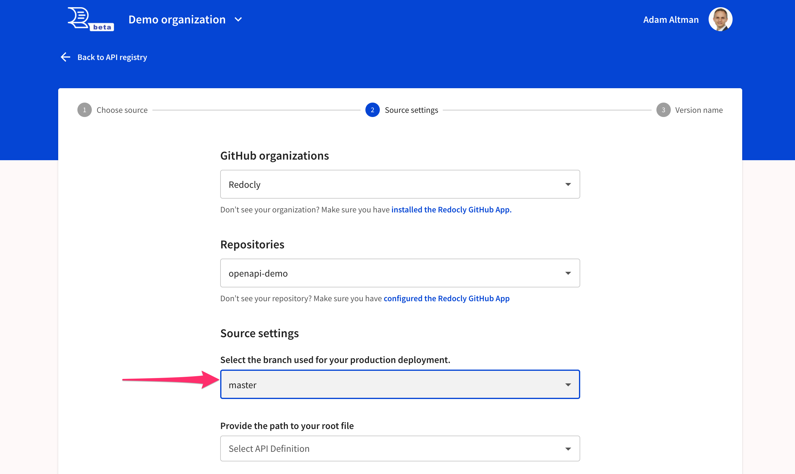
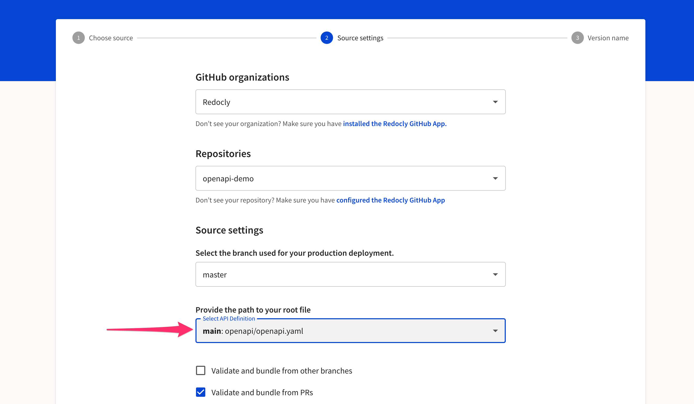
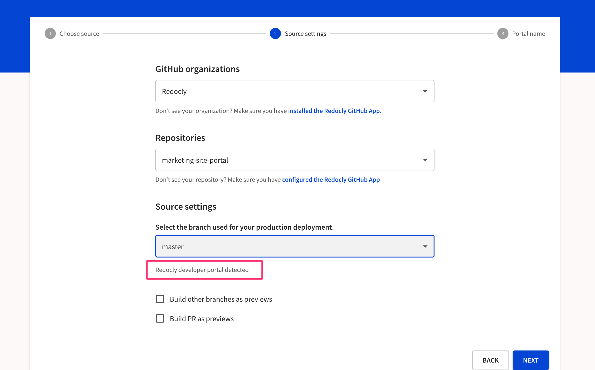
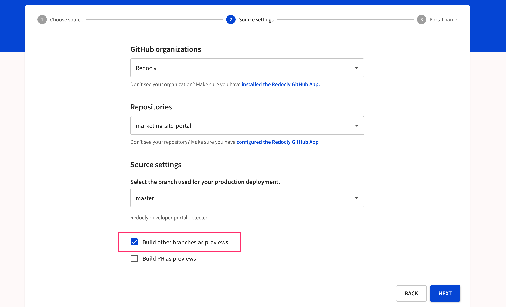
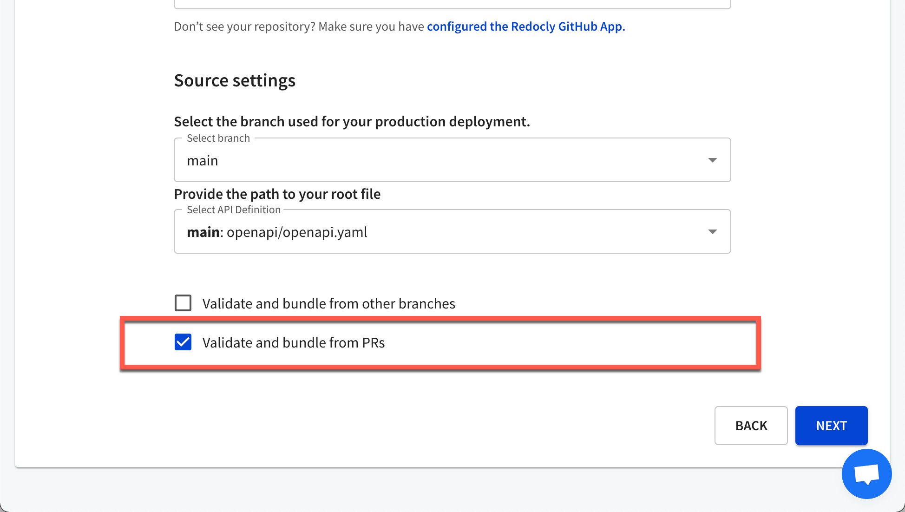

# GitHub

Use GitHub as a source for your API definitions and developer portal projects.



## Set up the connection

Select your organization.

Select from the list of repositories available to the Redocly Workflows app for the selected organization.

Select from the list of branches available.

If you are using a `redocly.yaml` file, there will be options of to select your root file based on the `apis` configuration within the file.

Note: Redocly Workflows app will detect a developer portal repo automatically and provide you with appropriate feedback.

<!-- We should consider removing this feature

## Build other branches as previews

When you select to build other branches as previews, it will trigger a build when a new branch is pushed or a new commit is pushed to an existing non-default branch.
If a commit is pushed to your default branch, it will trigger a production build.

If your API version has other usages, it will trigger subsequent cascading preview builds of other APIs, reference docs, and developer portals.

 -->



## Lint and bundle previews

When you select to validate and bundle PRs as previews, it will trigger a build when:

- a new pull request (PR) is opened
- a new commit is pushed to any open PR

If your API version has other usages, it will trigger subsequent cascading preview builds of other APIs, reference docs, and developer portals.

