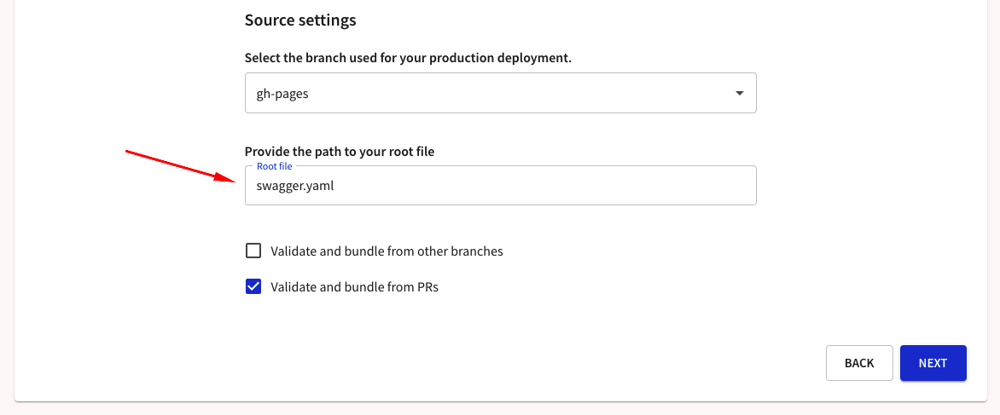
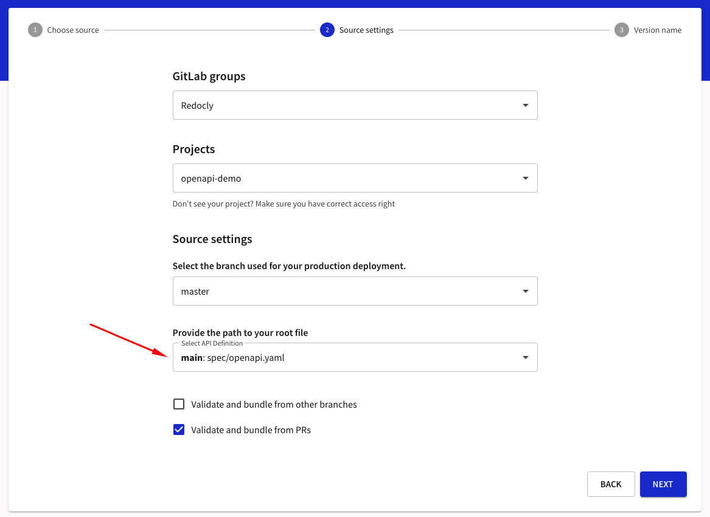
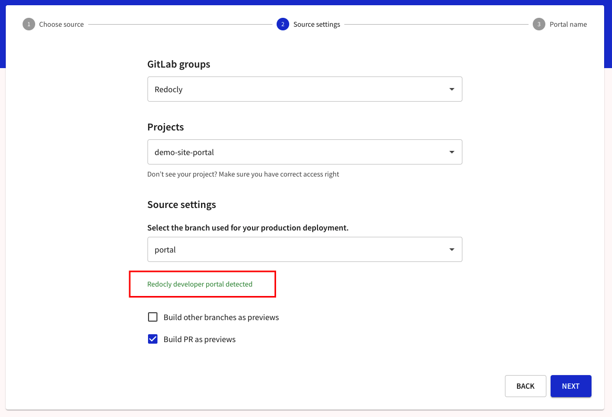
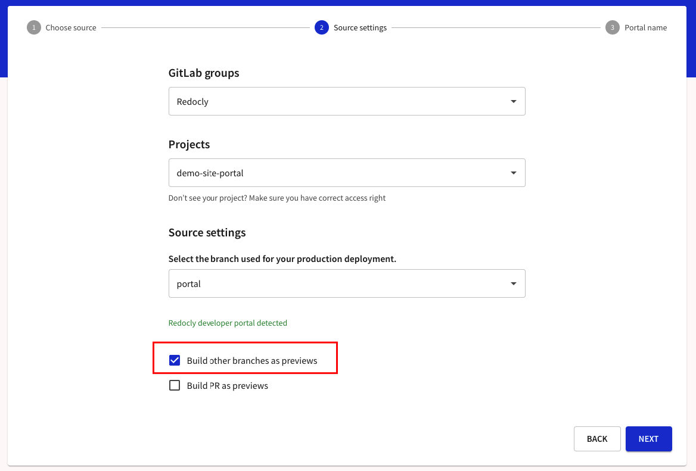
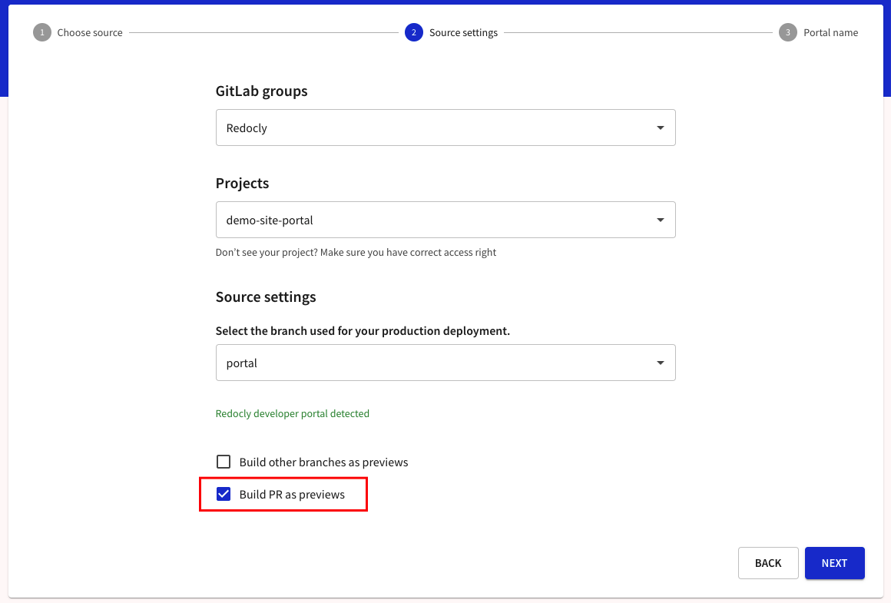

# GitLab.com

Use GitLab.com as a source for your API definitions and developer portal projects.



Provide the path to your root file, e.g. `swagger.yaml`

If you are using a `redocly.yaml` file, there will be options of to select your root file based on the `apis` configuration within the file.

For a developer portal, it will detect it automatically and provide you with appropriate feedback.

## Build other branches as previews

When you select to build other branches as previews, it will trigger a build when a new branch is pushed or a new commit is pushed to an existing non-default branch.
If a commit is pushed to your default branch, it will trigger a production build.

If your API version has other usages, it will trigger subsequent cascading preview builds of other APIs, reference docs, and developer portals.

## Build PRs as previews

When you select to build PRs as previews, it will trigger a build when:

- a new merge request (MR) is opened to your default branch (which you use for production build)
- a new commit is pushed to any open MR

If your API version has other usages, it will trigger subsequent cascading preview builds of other APIs, reference docs, and developer portals.

