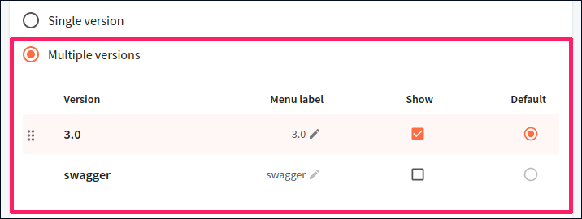

# Source

Every API in the registry has API documentation associated with it, and the API definition is the documentation source.
On the **Settings > Source** page, you can modify the source settings for your API version and the API documentation generated for it.

The contents of the **Version source** section depend on the [source type](#triggers-by-source-types) configured for your API.
Consult the specific source type pages for more details on what you can configure.

In the **Docs source** section, you can choose how many versions of documentation to generate for your API. Not all source types support this option.

- To create documentation for one API version, select the **Single version** option.

- If the API has multiple versions in the registry and you want to display them in your API docs with the version switcher, select the **Multiple versions** option. In the list that displays, select one of the versions as the default. Select the **Show** checkbox next to the versions you want to include in the version switcher, or leave it deselected to hide the version from the switcher. For versions that will be included in the switcher, you can modify the label text by selecting the pencil icon in the **Menu label** column. This text is used to identify the version in the switcher dropdown.

- Select **Update docs** to confirm your changes to the docs source. A new build is automatically triggered. When the build is published, access your API docs to check that your changes have been applied.

## How it works

Redocly connects to your source control to offer continuous validation and delivery of your:

- API definitions and documentation
- Developer portals

[Contact us](https://redocly.com/contact-us) to learn about what else we can automate.

Redocly integrates with popular version control services such as GitHub, GitLab, Bitbucket, and Azure Repos. When you open a pull request, or commit and push to these services, Redocly can be notified automatically and perform an action. For example, we can validate your API definition and build a preview of your API reference docs.

While we recommend following a git-ops docs-like-code workflow, we also support other non-git-based sources such as file uploads, URLs, and CI/CD.

## Triggers by source types

### Version control services (preferred)

Redocly can trigger workflows based on pushed commits, and on opened or changed pull requests.

You can connect to:

- [GitHub](github.md)
- [GitHub Enterprise](github-enterprise.md)
- [Azure Repos](azure.md)
- [GitLab.com](gitlab-com.md)
- [GitLab self-managed](gitlab-self-managed.md)
- [Bitbucket Cloud](bitbucket-cloud.md)
- [Bitbucket self-managed (Server or Data Center)](bitbucket-self-managed.md)

#### Security settings for version control services

When you connect your source to Redocly Workflows, our app will send requests to your version control service from specific IP addresses.



Allowing these addresses will ensure that Redocly Workflows can access your project repositories and run builds based on changes you and your contributors make.

### CI/CD with Redocly CLI push

To maintain your API definitions from the CI without allowing Redocly to access your repositories, you can integrate our Redocly CLI `push` command into your pipeline and [use it as a source](./upload-cicd.md).

### File upload

Redocly can run the workflows on demand, when you [upload the file(s)](./upload-files.md).

### URL source

Redocly can [poll a URL](./url-source.md) at regular intervals. If there is a change, Redocly will validate, bundle, add it to the registry, and trigger the workflow.
